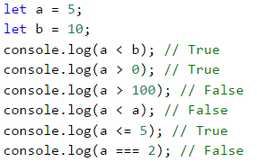
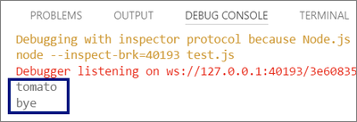
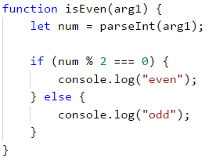
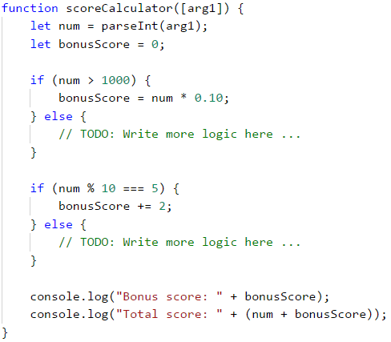
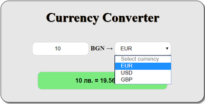

# Chapter 3.1. Simple Conditions

In the present chapter, we will take a look at the **conditional constructs in the JavaScript programming language**. By implementing these constructs, our program can produce a different output based on a given specific input. We will explain the syntax of the conditional operators (**`if`** and **`if-else`**) by implementing appropriate examples and also we will take a look at the range in which a variable lives (its **scope**). Finally, we will go over different **debugging** techniques, to follow the programming steps through which our program goes during its run.

## Conditional Operators

In programming, we can compare values through the use of the following **operators**:

* operator **`<`** (less than)
* operator **`>`** (greater than)
* operator **`<=`** (less than or equals)
* operator **`>=`** (greater than or equals)
* operator **`===`** (equals)
* operator **`!==`** (not equal; different than)

The result from a comparison is the so-called Boolean value, which can be either **`true`** or **`false`** depending on the evaluated result being either true or false.

It is important to note that in **JavaScript** there are further comparison operators - for **comparison** **`==`** and **difference** **`!=`**. The implementation of these operators without having intimate knowledge of their evaluation may lead to unexpected results and problems, for the moment we will not take look at them in detail.

Additional information on the differences between the two types of comparison operators can be found on the following link: [https://developer.mozilla.org/en-US/docs/Web/JavaScript/Reference/Operators/Comparison_Operators](https://developer.mozilla.org/en-US/docs/Web/JavaScript/Reference/Operators/Comparison_Operators)

### Problems of Number Comparisons



### Problems of comparing "text" (string) type variables


It is important to note that the case of the letters **upper case** or **lower case** is important for the comparison. If the compared values are not **completely identical**, the output will always be **`false`**.

### Comparison Operators

In **JavaScript** we can use the following operators to compare data:

<table>
<tr>
<th>Operator</th> <th>Notation</th> <th>Applicable for</th>
</tr>
<tr>
<td>Equals</td><td align="center"> === </td><td rowspan="2"> numbers, strings, dates</td>
</tr>
<tr>
<td>Not equal</td><td align="center"> !== </td>
</tr>
<tr>
<td>Greater than</td><td align="center"> > </td><td rowspan="4">numbers, dates, other comparable data types</td>
</tr>
<tr>
<td>Greater than or equal</td><td align="center"> >= </td>
</tr>
<tr>
<td>Less than</td><td align="center"> &lt; </td>
</tr>
<tr>
<td>Less than or equal</td><td align="center"> &lt;= </td>
</tr>
</table>


## Simple **`if`** Comparisons

In programming, we often **check particular conditions** and perform various actions depending on the result of the comparison. This is done through the **`if`** comparison, which has the following structure:

```JavaScript
if (Boolean condition) {
    // body of the conditional construct;  
}
```

### Problem: Excellent Result

We take the grade as an input argument to our function and upon evaluation, we check if the input value is an excellent grade (**`≥ 5.50`**).


Test the example code locally. Try entering different grades, for example, **4.75**, **5.49**, **5.50**, and **6.00**. For grades **less than 5.50** the program will not give any output, however for grades of **5.50 or greater**, the output will be "**Excellent!**". The function is called by simply writing its name and filling the input value in the parenthesis:


#### Testing in The Judge System

You can test the solution example here:
[https://judge.softuni.org/Contests/Practice/Index/929#0](https://judge.softuni.org/Contests/Practice/Index/929#0).


## If-Else Conditional Constructs

The **`if`** conditional can also have an **`else`** option to provide a specific action to be performed in case the Boolean expression (which is specified at the beginning **`if (Boolean expression)`**) returns a negative/falsy result (**`false`**). Written in this way the **conditional statement** is called **`if-else`** and its behavior is as follows: if the result of the condition is **positive / truthy** (**`true`**) - a set of instructions is executed. By contrast, when the result is **negative / falsy** (**`false`**) - a different set is executed. The format of this structure in **JavaScript** is as follows:

```JavaScript
if (Boolean condition) {
    // Condition body to be executed if a condition is true
} else {
    // else structure body to be executed if a condition is false
}

```

### Problem: Excellent or Not

Similarly to the example above, we input a grade and check if it is excellent, but this time we should **output a result in both cases**:


#### Testing in Judge System

You can test your solution at the following link: [https://judge.softuni.org/Contests/Practice/Index/929#1](https://judge.softuni.org/Contests/Practice/Index/929#1).


## About The Curly Braces { } After an If / Else

When we have **only one command** in the body of the **`if` statement**, we can **skip the curly braces**, indicating the body of the conditional operator. When we need to execute a **block of code** (group of commands), curly braces are **mandatory**. In case the braces are omitted, **only the first line of code** will be executed after the **`if` statement**.

<table><tr><td></td>
<td>It is a good practice to <strong> always include curly braces</strong> since this makes the code more readable, neater, and cleaner.</td>
</tr></table>

Here is an example, where omitting the curly braces leads to confusion:


Executing the code above will produce the following console output:



With curly braces:


The following output will be printed on the console:


### Problem: Even or Odd

Write a function that checks whether a given input number is **even** or **odd**.

The problem can be solved with a single **`if-else`** structure and the operator **`%`**, which returns the **division remainder** of two numbers.



#### Testing in The Judge System

Test your solution here: [https://judge.softuni.org/Contests/Practice/Index/929#2](https://judge.softuni.org/Contests/Practice/Index/929#2).


### Problem: Greater Number

Write a program that reads two integers and outputs the greater one.

Our first task is to **read** the two numbers. After which through the use of a simple **`if-else`** structure, in combination with the **greater than operator** (**`>`**), to perform the comparison. We have deliberately blurred parts of the code so that the reader can implement the learned so far.


#### Testing in The Judge System

Test your solution here: [https://judge.softuni.org/Contests/Practice/Index/929#3](https://judge.softuni.org/Contests/Practice/Index/929#3).

## The Lifetime of a Variable

Every variable has a scope in which it exists, called **variable scope**. This scope specifies where the variable can be used and accessed. In **JavaScript**, there are **two ways** to initialize variables. This is done through the keyword **`var`** or **`let`**. It is important to note the difference between them, as to avoid unexpected and unwanted results during the design and execution of our functions.

Variables initialized with the keyword **`var`** have the properties of **global variables**. They are characterized by the fact that they **can be accessed anywhere, regardless of the location in our code, where they are declared**.
Using the keyword **`let`**, our variable assumes the properties of **a local variable**. This means that its lifetime begins at the row in which it is **defined** and ends until the first closing curly brace **`}`** (of the function, of the **`if` statement**, etc.). Owing to this it is important to know that every variable initialized with the keyword **`let`** within the body of an **`if`**, **will not be accessible outside its code block / scope**, unless we have defined it higher in the code.

In the example below, in the last lines, we will try to access the defined variables. We will print **`myMoney`** on the console, because it is declared at the beginning of our function, before the **`if` structure**, which makes it **available anywhere in the function body**. Even though the **`salary`** is declared in the **`if`** structure block, we can print it because it has the properties of a **global variable** (since it is declared with **`var`**) and can be **used anywhere**. When we try to print the **`bonus`** variable, which is initialized in the **`if` structure**, we will get an **error**, since the lifetime of this variable ends with the first closing curly brace **`}`**, which in this case is the one closing the **`if`** structure:


Using the keyword **`var`** was the only way **in the past** to declare a variable, nowadays however this is **not recommended**. Because of this in all examples in this book, we will use the keyword **`let`**.

It is important to note that there is a **third way** to initialize variables - through the use of the keyword **`const`**. These variables have the same scope as if defined through **`let`**, however have one key difference - they are **constant variables**. This means that after the initial assignment, their value is **impossible to be changed or the variable re-defined**.

## Conditional Chaining

Sometimes we have to do a series of checks, before deciding what actions our program will execute. In such cases we can apply the structure **`if-else if…-else` in series**. For this purpose we employ the following structure: 

```JavaScript
if (first condition) {
    // condition body;
} else if (second condition) {
    // condition body;
} else if (third condition) {
    // condition body;
}
…
else {
    // else structure body;
}
```

### Problem: Number 0...9 to Text

Print the digits one through nine in English on the console (the numbers are passed as arguments of the function upon call). We can take the digit and through a **series of conditions** print the corresponding English word on the console:

```JavaScript
function number1to9([arg1]) {
  let num = parseInt(arg1);
  
  if (num === 1) {
      console.log("one");
  } else if (num === 2) {
      console.log("two");
  } else if (num === 3) {
      console.log("three");
  }
  // TODO: add more checks
  else {
      console.log("number too big"); 
  }
}
```

The program logic of the above example **sequentially compares** the input number with the digits from 1 to 9 **with each consecutive comparison being performed only in case the previous result is not true**. Eventually, if none of the **`if`** conditionals are satisfied, the last **`else` clause** is executed.

#### Testing in The Judge System

Test your solution here: [https://judge.softuni.org/Contests/Practice/Index/929#4](https://judge.softuni.org/Contests/Practice/Index/929#4).


## Exercise: Simple Conditions

To practice the implementation of the conditional constructs **`if`** and **`if-else`**, we will take a look at a few practical problems.

### Problem: Bonus Score 

We are given an **integer** – several points. Additional **bonus points** are awarded as per the rules described below. Write a function that calculates the **bonus points** for the given number and outputs the **total points** including the bonus.

- If the number is **up to 100** inclusive, the bonus points are 5.
- If the number is **larger than 100**, the bonus points are **20%** of the number.
- If the number is **larger than 1000**, the bonus points are **10%** of the number.
- Additional points are awarded as below (added separately from the described above):
    * For **even** numbers -> + 1 p.
    * For numbers, **ending with 5** -> + 2 p.
 
#### Sample Input and Output

| Input | Output |
| --- | ---- |
| 20 | 6<br>26 |
| 175 | 37<br>212 |
| 2703 | 270.3<br>2973.3 |
| 15875 | 1589.5<br>17464.5 |

#### Hints and Pointers

We can calculate the base and additional bonus score with a series of **`if-else-if-else`** statements. for the **main bonus points we have 3 cases** (the input is less than or equal to 100, it is between 100 and 1000, and finally it is greater than 1000), for the **additional bonus sore - further 2 cases** (whether the number is even or odd and whether the remainder of division by 5 is 5).



This is an example output when the function is called with 175:


Please note that for this problem the Judge system is set up to ignore any non-number outputs, so we may print explanations along with the number output.

#### Testing in The Judge System

Test your solution here: [https://judge.softuni.org/Contests/Practice/Index/929#5](https://judge.softuni.org/Contests/Practice/Index/929#5).


### Problem: Sum Seconds

Three athletes finish with some **number of seconds** (between **1** and **50**). Write a function that takes the times of the contestants and calculates their **combined time** in **minutes:seconds** format. Seconds are to be printed with a **leading zero** (2 -> "02", 7 -> "07", 35 -> "35").

#### Sample Input and Output

| Input | Output |
| --- | ---- |
| 35<br>45<br>44 | 2:04 |
| 22<br>7<br>34 | 1:03 |
| 50<br>50<br>49 | 2:29 |
| 14<br>12<br>10 | 0:36 |

#### Hints and Pointers

Firstly we sum the three numbers, to obtain the seconds total. As we know that **1 minute = 60 seconds**, we should calculate the minutes and seconds in the range 0 to 59:
- If the result is between 0 and 59, we print 0 minutes + calculated seconds.
- If the result is between 60 and 119, we print 1 minute + calculated seconds minus 60.
- If the result is between 120 and 179, we print 2 minutes + calculated seconds minus 120.
- If the seconds are less than 10, we print the number with a leading zero.


#### Testing in The Judge System

Test your solution here: [https://judge.softuni.org/Contests/Practice/Index/929#6](https://judge.softuni.org/Contests/Practice/Index/929#6).


### Problem: Metric Converter

Write a function, that **converts distance** between the following **8 units of measure**: **`m`, `mm`, `cm`, `mi`, `in`, `km`, `ft`, `yd`**. You may use the conversion table below:

| Input measure | Output measure |
| :-------------: | :--------------: |
| 1 meter (m) | 1000 millimeters (mm) |
| 1 meter (m) | 100 centimetres (cm) |
| 1 meter (m) | 0.000621371192 miles (mi) |
| 1 meter (m) | 39.3700787 inches (in) |
| 1 meter (m) | 0.001 kilometres (km) |
| 1 meter (m) | 3.2808399 feet (ft)  |
| 1 meter (m) | 1.0936133 yards (yd) |

The input will be three parameters:

- First: A number.
- Second: Input unit of measure.
- Third: Output unit of measure (for the result).

#### Sample Input and Output

| Input | Output |
| --- | ---- |
| 12 <br>km <br>ft | 39370.0788 |
| 150 <br>mi <br>in | 9503999.99393599 |
| 450 <br>yd <br>km | 0.41147999937455 |

#### Hints and pointers

We take the input data and to the units of measure, we can add the method **`toLowerCase()`**, which will convert all letters to lower case. As we can see from the conversion table above, we have data for **converting only between meters and any other measuring unit**. To make the conversion, firstly we must calculate the input measurement in meters. To this effect, we need to create a set of conditionals to determine the input measuring unit and then the output.


#### Testing in The Judge System

Test your solution here: [https://judge.softuni.org/Contests/Practice/Index/929#7](https://judge.softuni.org/Contests/Practice/Index/929#7).


## Debugging - Simple Operations With a Debugger

To date, we have written quite a lot of code and oftentimes there were mistakes, were there? Now we can show you a tool to make finding mistakes easier.

### What is "Debugging"?

**Debugging** is the process of „**attaching**“ to a program's execution, which allows us to follow closely the execution of our program. We can follow **line by line** the events in our program, what is its evaluation route, what are the intermediate values of the declared variables at each step of the execution, among other useful information and thus allowing us to locate errors - the so-called **bugs**.


### Debugging in Visual Studio Code

We add a point, at which our function will stop its execution - a **breakpoint** after which we start the program in **debug mode** through pressing [**F5**]. The program will follow its course until it reaches our interrupt (**breakpoint**). After which we the execution can proceed to the **next line of code** by pressing [**F10**]. 

### Problem: Password Guess

Write a function that **accepts a password** (one line of random text) and checks if the input **matches** the phrase “**s3cr3t!P@ssw0rd**”. If it matches, print “**Welcome**”, otherwise print “**Wrong password!**”. 

#### Sample Input and Output

| Input | Output |
| --- | ---- |
| qwerty | Wrong password! |
| s3cr3t!P@ssw0rd | Welcome |
| s3cr3t!p@ss | Wrong password! |

#### Hints and Pointers

Use an **`if-else`** statement.

#### Testing in The Judge System

Test your solution here: [https://judge.softuni.org/Contests/Practice/Index/929#8](https://judge.softuni.org/Contests/Practice/Index/929#8).


### Problem: Number 100...200

Write a function that **accepts an integer** as a parameter and checks if it is **below 100**, **between 100 and 200**, or **over 200**. Print the appropriate messages as per the examples below.

#### Sample Input and Output

| Input | Output |
| --- | ---- |
| 95 | Less than 100 |
| 120 | Between 100 and 200 |
| 210 | Greater than 200 |

#### Testing in The Judge System

Test your solution here: [https://judge.softuni.org/Contests/Practice/Index/929#9](https://judge.softuni.org/Contests/Practice/Index/929#9).


### Problem: Equal Words


Write a function that **accepts two words** as parameters and checks if they are the same. A comparison should be case-insensitive and the output should be either “**yes**” or “**no**”. 

#### Sample Input and Output

| Input | Output |
| --- | ---- |
| Hello<br>Hello | yes |
| SoftUni<br>softuni | yes |
| Soft<br>Uni | no |
| beer<br>vodka | no |
| HeLlO<br>hELLo | yes |

#### Hints and Pointers

Before the comparison, both words should be in lower case, so that case (uppercase / lowercase) does not influence the result: **`word = word.toLowerCase()`**.

#### Testing in The Judge System

Test your solution here: [https://judge.softuni.org/Contests/Practice/Index/929#10](https://judge.softuni.org/Contests/Practice/Index/929#10).


### Problem: Speed Info

Write a function, that **takes speed** (decimal number) as a parameter and prints **speed information**. For speeds **up to 10** (inclusive), print "**slow**". For speed **over 10** and **up to 50**, print "**average**". For speeds **over 50** and **up to 150**, print "**fast**". For speeds **over 150** and **up to 1000**, print "**ultra fast**". For higher speed, print "**extremely fast**".

#### Sample Input and Output

| Input | Output |
| --- | ---- |
| 8 | slow |
| 49.5 | average |
| 126 | fast |
| 160 | ultra fast |
| 3500 | extremely fast |

#### Testing in The Judge System

Test your solution here: [https://judge.softuni.org/Contests/Practice/Index/929#11](https://judge.softuni.org/Contests/Practice/Index/929#11).


### Problem: Areas of Figures

Write a function that takes **the measures of a geometric shape** and **calculates its surface area**. There are four types of shapes: **square, rectangle. circle** and **triangle**.

The first argument of the function is the type of shape (**`square`**, **`rectangle`**, **`circle`**, **`triangle`**).
* If the shape is a **square**, the next argument will be one number - the length of its side.
* If the shape is a **rectangle**, the next argument will be two numbers - the lengths of its sides.
* If the shape is a **circle**, the next argument will be one number - the radius of the circle.
* If the shape is a **triangle**, the next argument will be two numbers - base and the corresponding altitude.

The result should be rounded up to the **third decimal point**. 

#### Sample Input and Output

| Input | Output |
| --- | ---- |
| square<br>5 | 25 |
| rectangle<br>7<br>2.5 | 17.5 |
| circle<br>6 | 113.097 |
| triangle<br>4.5<br>20 | 45 |

#### Testing in The Judge System

Test your solution here: [https://judge.softuni.org/Contests/Practice/Index/929#12](https://judge.softuni.org/Contests/Practice/Index/929#12).


### Problem: Time + 15 Minutes

Write a function that takes **two parameters - hours and minutes** based on a 24-hour day and calculates what will be the time **after 15 minutes**. The result should be printed in the following format **`hh:mm`**. Hours should always be between 0 and 23, while minutes should always be between 0 and 59. Hours should be written with one or two digits as needed, while the minutes should always be written with two digits - add a **leading zero** as needed.

#### Sample Input and Output

| Input | Output |
| --- | ---- |
| 1<br>46 | 2:01 |
| 0<br>01 | 0:16 |
| 23<br>59 | 0:14 |
| 11<br>08 | 11:23 |
| 12<br>49 | 13:04 |

#### Hints and Pointers

Add 15 minutes and check using a set of conditions. If minutes are over 59 **increase the hours** by 1 and **decrease the minutes** by 60. You may handle the case when hours are over 23 similarly. Take care when printing the minutes to add a **leading zero** where appropriate.

#### Testing in The Judge System

Test your solution here: [https://judge.softuni.org/Contests/Practice/Index/929#13](https://judge.softuni.org/Contests/Practice/Index/929#13).


### Problem: 3 Equal Numbers

Write a function that takes **3 numbers** as arguments and prints whether they are the same (**yes** / **no**).

#### Sample Input and Output

| Input | Output |
| --- | ---- |
| 5<br>5<br>5 | yes |
| 5<br>4<br>5 | no |
| 1<br>2<br>3 | no |

#### Testing in The Judge System

Test your solution here: [https://judge.softuni.org/Contests/Practice/Index/929#14](https://judge.softuni.org/Contests/Practice/Index/929#14).


### Problem: Number 0...100 to Text

Write a function that converts numbers in the range of [**0 … 100**] in text. 

#### Sample Input and Output

| Input | Output |
| --- | ---- |
| 25 | twenty five |
| 42 | forty two |
| 6  | six |

#### Hints and pointers

Firstly you should check for **single-digit numbers** and if this is the case, print the corresponding word. Then you can check if the number is a **double-digit number**. These can be printed in two parts: left part (**tens** = number / 10) and right part (**units** = number % 10). If the number has three digits, then it must be 100 and this can be handled as a special case.

#### Testing in The Judge System

Test your solution here: [https://judge.softuni.org/Contests/Practice/Index/929#15](https://judge.softuni.org/Contests/Practice/Index/929#15).


## Graphical Web Application

Now since we have completed a few exercises on **conditional statements (checks)**, let's do something a bit more interesting: an application with a Graphical User Interface (GUI) for currency conversion. We will employ the knowledge from this chapter to select from the different available currencies and make calculations as per the appropriate exchange rates for the given currency.

### Problem: \*\* Currency Converter

Now let's see how to create a graphical (**GUI**) application for **currency conversion**. The application will look similar to the picture below:  



For visualization, we will use an **internet browser**, that interprets **HTML** pages. We will create a new page and will build the **structure**, **appearance**, and **functionality** of our application.

As usual, we **create a new file**, save it with the name **Currency-Converter**, however this time we add the file extension **.html**.


We open the newly created file and input the **document structure**, as **HTML code**:

```html
<!DOCTYPE html>
<html>
<head>
  <meta charset="utf-8">
  <meta name="viewport" content="width=device-width, initial-scale=1">
  <meta http-equiv="x-ua-compatible" content="ie=edge">
  <title>Currency Converter</title>
  <style>

        /* enter styling here */

  </style>
</head>
<body>
  <main id="conventer-window">
    <h1>Currency Converter</h1>
    <form name="conventer">
      <input type="number" placeholder="Enter number" min="0" 
      id="cash-input" onkeyup="convert()" onchange="convert()">
      <span>BGN &#8594; </span>
      <select onchange="convert()" id="currency-options">
        <option selected disabled>Select currency</option>
        <option value="eur">EUR</option>
        <option value="usd">USD</option>
        <option value="gbp">GBP</option>
      </select>
      <br />
      <input type="text" name="result" id="result" disabled>
    </form>
  </main>
  <script>

    // enter JavaScript functionality here

  </script>
</body>
</html>
```

We save the file and open it in the internet browser.


     
At this point we already have the document skeleton, but it can be visually enhanced through the addition of **styling**. To do this we add the following code in the **`<style>`** section for our **HTML** document:

```css
body {
  background-color: #fff;
}

main {
  margin: 200px auto;
  height: 250px;
  width: 500px;
  background-color: #e7e7e7;
  border: 1px solid black;
  border-radius: 20px;
  box-shadow: 3px 3px 3px gray;
}

h1 {
  text-align: center;
  color: #000;
  text-shadow: 1px 1px 1px #000;
}

form {
  width: 400px;
  margin:20px auto;
  text-align: center;
}

span {
  font-weight:bold;
  font-size: 16px;
}

input[type=number], input[type=text], select {
    width: 140px;
    padding: 8px 10px;
    margin: 20px 0;
    display: inline-block;
    border: 1px solid #ccc;
    border-radius: 10px;
    box-sizing: border-box;
    outline: none;
    text-align: center
}
 input[type=text] {
   width: 80%;
   margin-top:20px;
   background-color: #7beb80;
   padding: 12px 10px;
   color:black;
   font-weight: bold;
   font-size: 15px;
 }

 input:focus {
   border: 2px solid #26a5e0;
 }
```

Now if we save and hit refresh, our application should look much better. All that is left now is to add the **functionality**. This is done through the **``<script>``** section of our **HTML** document.
We will use the following **JavaScript code** to handle different user inputs and events:

```JavaScript
function convert(){
  let x = document.getElementById("cash-input").value;
  let e = document.getElementById("currency-options");
  let selected = e.options[e.selectedIndex].text;
  let result;
  
  if (selected === "EUR") {
      result = x + " " + "BGN = " + (x * 1.95583).toFixed(2) + " " + selected;
      document.getElementById("result").value = result;
  } else if (selected === "USD") {
      result = x + " " + "BGN = " + (x * 1.63760).toFixed(2)  + " " + selected;
      document.getElementById("result").value = result;
  } else if (selected === "GBP") {
      result = x + " " + "BGN = " + (x * 2.22920).toFixed(2)  + " " + selected;
      document.getElementById("result").value = result;
  }
}
```

The above code takes the **amount** to be converted from the field **`cash-input`** and the **chosen currency** for the result of the field **`currency-options`**. After that with the use of a **conditional statement**, depending on the chosen currency, the amount is divided by the **exchange rate** (which is hard-coded by you in the source code). Finally, we generate a **text message with the result** (rounded to the second digit after the decimal point) and we output the message in the green box **`result`**. Have a go!

If you have problems with the examples above, **watch the video** at the beginning of this chapter or ask for help in the SoftUni official **Reddit**: https://www.reddit.com/r/softuni/.
