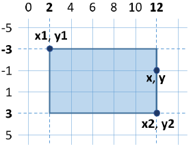
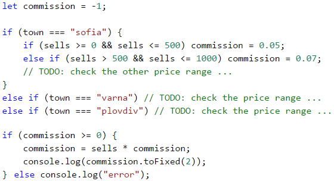
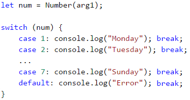
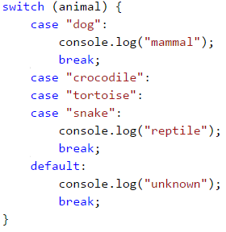
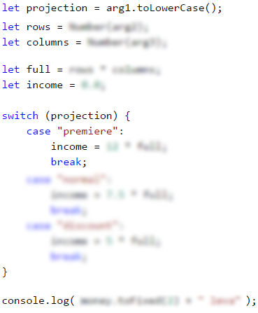
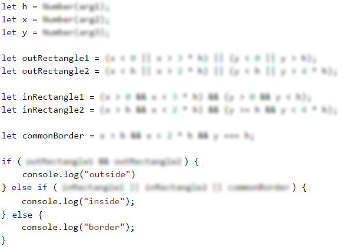
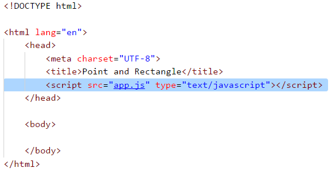
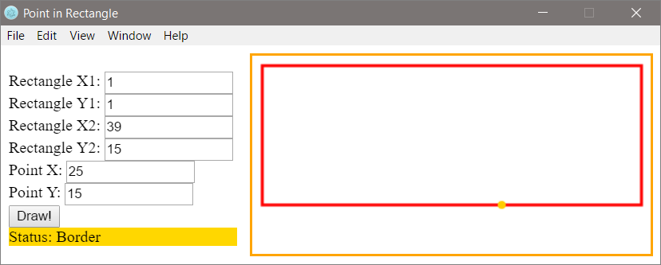

# Chapter 4.1. More Complex Conditions

In this **current** chapter, we are going to examine **nested conditional statements** in the **JavaScript** language, by which our program can execute **conditions**, that contain other **nested conditional statements**. We call them **"nested"** because **we put the `if` condition** into **another `if` condition**. We are going to examine the **more complex logical conditions** through proper examples.

## Nested conditions

Pretty often the program logic requires the use of **`if`** or **`if-else`** statements, which are contained one inside another. They are called **nested** **`if`** or **`if-else`** statements. As implied by the title **"nested"**,these are **`if`** or **`if-else`** statements, that are placed inside other **`if`** or  **`else`** statements.

```JavaScript
if (condition1) {
    if (condition2) {
        // body; 
    } else {
        // body;
    }
}
```

Using more than three levels of nested conditional statements is not considered a good practice and has to be avoided, mostly through optimization of the structure/the algorithm of the code and/or by using another type of conditional statement, which we are going to examine below in this chapter.

### Problem: Personal titles

Depending on **age** (decimal number) and **gender** (**m** / **f**) print a personal title:
* “**Mr.**” – man (gender “**m**”) 16 or more years old.
* “**Master**” – boy (gender “**m**”) under 16 years.
* “**Ms.**” – woman (gender “**f**”) 16 or more years old.
* “**Miss**” – girl (gender “**f**”) under 16 years.

#### Sample Input and Output

|Input|Output|Input|Output|
|----|----|----|----|
|12<br>f|Miss|17<br>m|Mr.|

|Input|Output|Input|Output|
|----|----|----|----|
|25<br>f|Ms.|13.5<br>m|Master|

#### Solution

We should notice that the **output** of the program **depends on few things**. First, we have to check what **gender** entered and then to check the **age**. Respectively, we are going to use **a few** **`if-else`** blocks. These blocks will be **nested**, i.e. from the **result** of the first, we are going to **define** which of the **others** to execute.


After reading the input data from the console, the following program logic should be executed:


#### Testing in The Judge System

Test your solution here: [https://judge.softuni.org/Contests/Practice/Index/931#0](https://judge.softuni.org/Contests/Practice/Index/931#0).


### Problem: Small Shop

A Bulgarian entrepreneur opens **small shops** in **a few** cities with different **prices** for the following **products**:

|product / city|Sofia|Plovdiv|Varna|
|:-------:|:-------:|:-------:|:-------:|
|coffee<br>water<br>beer<br>sweets<br>peanuts|0.50<br>0.80<br>1.20<br>1.45<br>1.60<br>|0.40<br>0.70<br>1.15<br>1.30<br>1.50<br>|0.45<br>0.70<br>1.10<br>1.35<br>1.55|

Calculate the price by the given **city** (string), **product** (string), and **quantity** (decimal number).

#### Sample Input and Output

|Input|Output|Input|Output|
|-------|-------|-------|-------|
|coffee<br>Varna<br>2|0.90|peanuts<br>Plovdiv<br>1|1.50|

|Input|Output|Input|Output|
|-------|-------|-------|-------|
|beer<br>Sofia<br>6|7.20|water<br>Plovdiv<br>3|2.10|

#### Solution

We **convert** all of the letters into the **lower register** by using the method **`.toLowerCase()`**, to compare products and cities **no matter** what the letters are - small/capital ones.


#### Testing in The Judge System

Test your solution here: [https://judge.softuni.org/Contests/Practice/Index/931#1](https://judge.softuni.org/Contests/Practice/Index/931#1).


## More Complex Conditions

Let's take a look at how we can create more complex conditions. We can use the logical "**AND**" (**`&&`**), logical "**OR**" (**`||`**), logical **negation** (**`!`**) or **brackets** (**`()`**).

### Logical "AND"

As we saw, in some tasks we have to make **multiple checks at once**. But what happens, when executing some code,  **more** conditions have to be executed and we **don't want to** make a **negation** (**`else`**) for each one of them? The option with the nested **`if` blocks** are valid, but the code will look very **unordered** and for sure - **hard** to read and maintain.  

Logical "**AND**" (operator **`&&`**) means a few conditions have to be **fulfilled simultaneously**. The following table of truthfulness is applicable:

|a|b|a && b|
|-----|-----|-----|
|true<br>true<br>false<br>false|true<br>false<br>true<br>false|true<br>false<br>false<br>false|

### How does the && Operator Work?

The operator **`&&`** accepts **a couple of Boolean** (conditional) statements, which have a **`true`** or **`false`** value, and returns **one** boolean statement as a **result**. Using it **instead** of a couple of nested **`if`** blocks, makes the code **more readable**, **ordered**, and **easy** to maintain. But how does it **work**, when we put a **few** conditions one after another? As we saw above, the logical **"AND"** returns **`true`**, **only** when it accepts as **arguments statements** with the value **`true`**. Respectively, when we have a **sequence** of arguments, the logical "**AND**" checks either until one of the arguments is **over**, or until it **meets** an argument with value **`false`**. 

**Example**:

```JavaScript
let a = true;
let b = true;
let c = false;
let d = true;

let result = a && b && c && d;
// false (as d is not being checked)
```

The program will run in the **following** way: **It starts** the check from **`a`**, **reads** it, and accepts that it has a **`true`** value, after that, it  **checks `b`**. After it has **accepted**, that **`a`** and **`b`** return value **`true`**, **it checks the next** argument. It gets to **`c`** and sees that the variable has a **`false`** value. After the program accepts that argument **`c`** has a **`false`** value, it calculates the expression **to `c`**, **regardless** of what the value of **`d`** is. That is why the evaluation of **`d`**is being **skipped** and the whole expression is calculated as **`false`**.

### Problem: Point in a Rectangle

Checks whether **point {x, y}** is placed **inside the rectangle {x1, y1} – {x2, y2}**. The input data is readfrom the console and consists of 6 lines: the decimal numbers **x1**, **y1**, **x2**, **y2**, **x**, and **y** (as it is guaranteed that **x1 < x2** and **y1 < y2**).

#### Sample Input and Output

|Input |Output |Visualization|
|-----|------|:------:|
|2<br>-3<br>12<br>3<br>8<br>-1|Inside||

#### Solution

A point is internal for a given polygon if the following four conditions are applied at the same time:

* The point is placed to the right from the left side of the rectangle.
* The point is placed to the left from the right side of the rectangle.
* The point is placed downwards from the upper side of the rectangle.
* The point is placed upwards from the downside of the rectangle.
 


#### Testing in The Judge System

Test your solution here: [https://judge.softuni.org/Contests/Practice/Index/931#2](https://judge.softuni.org/Contests/Practice/Index/931#2).


## Logical "OR"

The logical **"OR"** (operator **`||`**) means that **at least one** among a few conditions is fulfilled. Similar to the operator **`&&`**, the logical **"OR"** accepts a few arguments of **boolean** (conditional) type and returns **`true`** or **`false`**. We can easily guess that we **obtain** as value **`true`**, whenever at least **one** of the arguments has a **`true`** value. A typical example of the logic of this operator is the following:

At school, the teacher says: "Ivan or Peter should clean the board". To fulfill this condition (to clean the board), either Ivan can clean it, or just for Peter to clean it, or both of them to clean it together.

|a|b|a &#124;&#124; b|
|:-----:|:-----:|:-----:|
|true<br>true<br>false<br>false|true<br>false<br>true<br>false|true<br>true<br>true<br>false|


### How does the || Operator Work?

We have already learned what the logical **"OR"** **represents**. But how is it being achieved? Just like the logical **"AND"**, the program **checks** from left to right **the arguments**, that are given. To obtain **`true`** from the expression, just one argument must have a **`true`** value, respectively the checking **continues** until an **argument** with **such** value is met or until the arguments **are over**.

Here is one **example** of the operator **`||`** in action:

```JavaScript
let a = false;
let b = true;
let c = false;
let d = true;

let result = a || b || c || d;
// true (as c and d are not being checked)
```

The program **checks `a`**, accepts that it has a value **`false`**, and continues. Reaching **`b`**, it understands that it has **`true`** value and the whole **expression** is calculated as **`true`**, **without** having to check **`c`** or **`d`**, because their values **wouldn't change** the result of the expression.

### Problem: Fruit or Vegetable

Let's check whether a given product is a **fruit** or a **vegetable**. The "**fruits**" are **banana**, **apple**, **kiwi**, **cherry**, **lemon**, and **grapes**. The "**vegetables**" are **tomato**, **cucumber**, **pepper**, and **carrot**. Everything else is "**unknown**".

#### Sample Input and Output

|Input|Output|
|----|----|
|banana<br>tomato<br>Java|fruit<br>vegetable<br>unknown|

#### Solution

We have to use a few conditional statements with logical "**OR**" (**`||`**):


#### Testing in The Judge System

Test your solution here: [https://judge.softuni.org/Contests/Practice/Index/931#3](https://judge.softuni.org/Contests/Practice/Index/931#3).


## Logical Negation

**Logical negation** (operator **`!`**) means a given condition is **not fulfilled**.

|a|!a|
|:----:|:----:|
|true|false|

The operator **`!`** accepts as an **argument** a boolean variable and **returns** its value.

### Problem: Invalid Number

A given **number is valid** if it is in the range [**100 … 200**] or it is **0**. Validate an **invalid** number.

#### Sample Input and Output

|Input|Output|
|----|----|
|75|invalid|
|150| (no output)|
|220|invalid|

#### Solution


#### Testing in The Judge System

Test your solution here: [https://judge.softuni.org/Contests/Practice/Index/931#4](https://judge.softuni.org/Contests/Practice/Index/931#4).


## The Parentheses `()` Operator

Like the other operators in programming, the operators **`&&`** and **`||`** have a priority, and in this case, the operator **`&&`** have higher precedence than the operator  **`||`**. The operator **`()`** serves to **change the priority of the operator** and is calculated first, just like in math. The use of parentheses also gives the code better readability and is considered a good practice.


## More complex logical conditions

Sometimes the conditions may be very complex, so they can require a long boolean expression or a sequence of conditions. Let's take a look at a few examples.

### Problem: Point on a Rectangle Border

Write a program that checks whether a **point {x, y}** is placed **onto any of the sides of a rectangle {x1, y1} - {x2, y2}**. The input data is read from the console and consists of 6 lines: the decimal numbers **x1**, **y1**, **x2**, **y2**, **x**, and **y** (as it is guaranteed that **x1 < x2** and **y1 < y2**). Print "**Border**" (if the point lies on any of the sides) or "**Inside / Outside**" (in the opposite case).



#### Sample Input and Output

|Input|Output|Input|Output|
|-----|-----|-----|-----|
|2<br>-3<br>12<br>3<br>12<br>-1|Border|2<br>-3<br>12<br>3<br>8<br>-1|Inside / Outside|

#### Solution

The point lies on any of the sides of the rectangle, if:
* **x** coincides with **x1** or **x2** and at the same time **y** is between **y1** and **y2** or
* **y** coincides with **y1** or **y2** and at the same time **x** is between **x1** and **x2**.


The previous evaluation might be simplified in the following way:


The second way with the additional boolean variables is longer, but is much more understandable than the first one, isn't it? We recommend when you write boolean conditions to make them **easy to read and understand**, instead of making them short. Use additional variables with meaningful names, if needed. The names of the boolean variables have to hint at what the value that is kept inside them represents.

What remains is to finish writing the code to print “**Inside / Outside**”, if the point is not onto any of the sides of the rectangle.

#### Testing in The Judge System

After you finish writing the solution, you can test it here: [https://judge.softuni.org/Contests/Practice/Index/931#5](https://judge.softuni.org/Contests/Practice/Index/931#5).


### Problem: Fruit Shop

A fruit shop during **weekdays** sells at the following **prices**:

|Fruit|Price|
|:-----:|:-----:|
|banana<br>apple<br>orange<br>grapefruit<br>kiwi<br>pineapple<br>grapes|2.50<br>1.20<br>0.85<br>1.45<br>2.70<br>5.50<br>3.85|

During the **weekend days** the prices are higher:

|Fruit|Price|
|:-----:|:-----:|
|banana<br>apple<br>orange<br>grapefruit<br>kiwi<br>pineapple<br>grapes|2.70<br>1.25<br>0.90<br>1.60<br>3.00<br>5.60<br>4.20|

Write a program that reads from the console **fruit** (banana / apple / …), **a day of the week** (Monday / Tuesday / …), and **quantity (decimal number)** and **calculates the price** according to the prices from the tables above. The result has to be printed **rounded up to 2 digits after the decimal point**. Print **“error”** if it is an **invalid day** of the week or an **invalid name** of a fruit.

#### Sample Input and Output

|Input|Output|Input|Output|
|----|----|----|----|
|orange<br>Sunday<br>3|2.70|kiwi<br>Monday<br>2.5|6.75|

|Input|Output|Input|Output|
|----|----|----|----|
|grapes<br>Saturday<br>0.5|2.10|tomato<br>Monday<br>0.5|error|

#### Solution


#### Testing in The Judge System

Test your solution here: [https://judge.softuni.org/Contests/Practice/Index/931#6](https://judge.softuni.org/Contests/Practice/Index/931#6).


### Problem: Trade Fees

A company is giving the following **commissions** to its traders according to the **city**, in which they are working and the  **volume of sales s**:

|City|0 <= s <= 500|500 < s <= 1000|1000 < s <= 10000|s > 10000|
|:----:|:----:|:----:|:----:|:----:|
|Sofia<br>Varna<br>Plovdiv|5%<br>4.5%<br>5.5%|7%<br>7.5%<br>8%|8%<br>10%<br>12%|12%<br>13%<br>14.5%|

Write a program that reads the name of a **city** (string) and the volume of **sales** (decimal number) and calculates the rate of the commission fee. The result has to be shown rounded **up to 2 digits after the decimal point**. When there is an **invalid city or volume of sales** (a negative number), print "**error**".

#### Sample Input and Output

|Input|Output|Input|Output|Input|Output|
|-----|-----|-----|-----|-----|-----|
|Sofia<br>1500|120.00|Plovdiv<br>499.99|27.50|Kaspichan<br>-50|error|

#### Solution

When reading the input, we could convert the city into small letters (with the method **`.toLowerCase()`**). Initially, we set the commission fee to **`-1`**. It will be changed if the city and the price range are found in the table of commissions. To calculate the commission according to the city and volume of sales, we need a few nested **`if` statements**, as in the sample code below:



#### Testing in The Judge System

Test your solution here: [https://judge.softuni.org/Contests/Practice/Index/931#7](https://judge.softuni.org/Contests/Practice/Index/931#7).


<table><tr><td></td>
<td><b>It is a good practice</b> to use <b>blocks</b>, that are <b>enclosed</b> with curly braces <b><code>{ }</code></b> after <b><code>if</code></b> and <b><code>else</code></b>. Also, it is recommended during writing to <b>move aside</b> the code <b>after <code>if</code> and <code>else</code></b> with a single tabulation <b>inward</b>, to make the code more easily readable.</td>
</tr></table>


## Switch-Case Conditional Statements

The **`switch-case`**  construction works as a sequence of **`if-else`** blocks. Whenever the work of our program depends on the value of **one variable**, instead of making consecutive with **`if-else`** blocks, we can **use** the conditional **`switch-case`** statement. It is being used for **choosing between a list of possibilities**. The statement compares a given value with defined constants and depending on the result, it takes an action.

We put **the variable**, that we want to **compare**, inside the **brackets after the operator `switch`** and it is called a "**selector**". Here **the type must be comparable** (numbers, strings). **Consecutively**, the program starts **comparing** each **value**, that **is found** after the **`case` labels**. Upon a match, the executions of the code from the respective place continue, until it reaches the **`break`** operator. When **no matches** are **found**, the **`default`** construction is being executed, **if** such **exist**.

```JavaScript
switch (selector) {
    case value1:
        construction;
        break;
    case value2:
        construction;
        break;
    case value3:
        construction;
        break;
    …
    default:
        construction;
        break;
}
```

### Problem: Day of the Week

Let's write a program that prints the **day of the week** (in English) depending on the **given number** (1 … 7) or "**Error**" if an invalid day is given.

#### Sample Input and Output

|Input|Output|
|-----|-----|
|1<br>7<br>-1|Monday<br>Sunday<br>Error|

#### Solution



<table><tr><td></td>
<td>It is a good practice to put at <b>first</b> place those <b><code>case</code> statements</b>, that process <b>the most common situations</b>, and leave the <b><code>case</code> construction</b>, processing <b>the more rare situations</b>, in <b>the end, before the <code>default</code> constructions</b>. Another good practice is to  <b>arrange the <code>case</code> labels</b> in <b>ascending order</b>, regardless of whether they are integral or symbolic.</td>
</tr></table>

#### Testing in The Judge System

Test your solution here: [https://judge.softuni.org/Contests/Practice/Index/931#8](https://judge.softuni.org/Contests/Practice/Index/931#8).


### Multiple Labels in Switch-Cases

In **JavaScript**, we can **use multiple `case`** labels, when they have to execute **the same** code. In this way, when our program finds a **match**, it will execute **the next** code, because **after** the respective **`case`** label **there is no code** for execution and a **`break`** operator:

```JavaScript
switch (selector) {
    case value1:
    case value2:
    case value3:
        construction;
        break;
    case value4:
    case value5:
        construction;
        break;
    …
    default:
        construction;
        break;
}
```

### Problem: Animal Type

Write a program that prints the type of the animal depending on its name: 

* dog -> **mammal**
* crocodile, tortoise, snake -> **reptile**
* others -> **unknown**

#### Sample Input and Output

|Input|Output|Input|Output|Input|Output|
|-----|-----|-----|-----|-----|-----|
|tortoise|reptile|dog|mammal|elephant|unknown|

#### Solution

We can solve the task with **`switch-case`** conditions with multiple labels in the following way:



#### Testing in The Judge System

Thes your solution here: [https://judge.softuni.org/Contests/Practice/Index/931#9](https://judge.softuni.org/Contests/Practice/Index/931#9).


## What Have We Learned from This Chapter?

Let's look back on what new constructions and programming techniques we have learned in this chapter:

### Nested Conditions

```JavaScript
if (condition1) {
    if (condition2) {
        // body; 
    } else {
        // body;
    }
}
```

### More Complex Conditions with &&, ||, !, and ()

```JavaScript
if ((x === left || x === right) && y >= top && y <= bottom)
    console.log(…); 
```

#### Switch-case statements

```JavaScript
switch (selector) {
    case value1:
        construction;
        break;
    case value2:
    case value3:
        construction;
        break;
    …
    default:
        construction;
        break;
}
```


## Exercises: More Complex Conditions

Now let's exercise our new skills with complex conditions. Let's solve a few practical tasks.

### Problem: Cinema

In a cinema hall, the chairs are ordered in a **rectangle** shape in **r** rows and **c** columns. There are three types of screening with tickets of **different** prices:

* **Premiere** – a premiere screening, with a price of **12.00** BGN.
* **Normal** – a standart screeneing, with a price of **7.50** BGN.
* **Discount** – a screening for children and students at a promotional price of **5.00** BGN.

Write a program that enters a **type of screening** (string), several **rows**, and several **columns** in the hall (integer numbers) and calculates **the total income** from tickets from a **full hall**. The result has to be printed in the same format as in the example below - rounded up to 2 digits after the decimal point.

#### Sample Input and Output

|Input|Output|Input|Output|
|----|-----|----|-----|
|Premiere<br>10<br>12|1440.00 BGN|Normal<br>21<br>13|2047.50 BGN|

#### Hints and Guidelines 

While reading the input, we could convert the screening type into small letters (with the method **`.toLowerCase()`**). We create and initialize a variable, that will store the calculated income. In another variable, we calculate the full capacity of the hall. We use a **`switch-case`**  conditional statement, to calculate the income according to the type of projection and print the result on the console in the given format (look for the needed **JavaScript** functionality on the internet). 

Sample code (parts of the code are blurred with the purpose to stimulate your thinking and solving skills):



#### Testing in The Judge System

Test your solution here: [https://judge.softuni.org/Contests/Practice/Index/931#10](https://judge.softuni.org/Contests/Practice/Index/931#10).


### Problem: Volleyball

Vlady is a student, lives in Sofia, and goes to his hometown from time to time. He is very keen on volleyball, but he is very busy during weekdays and plays **volleyball** only during **weekends** and on **holidays**. Vlady plays **in Sofia** every **Saturday** when **he is not working**, and **he is not traveling to his hometown**, and also during **2/3 of the holidays**. He travels to his **hometown h times** a year, where he plays volleyball with his old friends on **Sunday**. Vlady **is not working 3/4 of the weekends**, during which he is in Sofia. Furthermore, during **leap years** Vlady plays **15% more** volleyball than usual. We accept that the year has exactly **48 weekends**, suitable for volleyball. 
Write a program, that calculates **how many times Vlady has played volleyball** through the year. **Round the result** down to the nearest integer (e.g. 2.15 -> 2; 9.95 -> 9).

The input data is read from the console:

* The first line contains the word “**leap**” (leap year) or “**normal**” (a year has 365 days).
* The second line contains the integer **p** – the count of holidays in the year (which are not Saturday or Sunday).
* The third line contains the integer **h** – the count of weekends, in which Vlady travels to his hometown.

#### Sample Input and Output

|Input|Output|Input|Output|
|-----|-----|-----|-----|
|leap<br>5<br>2|45|normal<br>3<br>2|38|

|Input|Output|Input|Output|
|-----|-----|-----|-----|
|normal<br>11<br>6|44|leap<br>0<br>1|41|

#### Hints and Guidelines

As usual, we read the input data from the console and, to avoid making mistakes, we convert the text into small letters with the method **`.toLowerCase()`**. Consequently, we calculate **the weekend spent in Sofia**, **The time for playing in Sofia**, and **the total playtime**. At last, we check whether the year is a **leap**, we make additional calculations when necessary and we print the result on the console, **rounded down** to the nearest **integer** (look for a **JavaScript** class with such functionality).

A sample code (parts of the code are blurred on purpose to stimulate independent thinking and solving skills):


#### Testing in The Judge System

Test your solution here: [https://judge.softuni.org/Contests/Practice/Index/931#11](https://judge.softuni.org/Contests/Practice/Index/931#11).


### Problem: * Point in the Figure

The figure consists of **6 blocks with size h \* h**, placed as in the figure below. The lower left angle of the building is on position {0, 0}. The upper right angle of the figure is on position {**2\*h**, **4\*h**}. The coordinates given in the figure are for **h = 2**:

<p></p>

Write a program, that enters an integer **h** and the coordinates of given **point {x, y}** (integers) and prints whether the points are inside the figure (**inside**), outside the figure (**outside**), or on any of the borders of the figure (**border**).

#### Sample Input and Output

|Input|Output|Input|Output|
|-----|-----|-----|-----|
|2<br>3<br>10|outside|2<br>3<br>1|inside|

|Input|Output|Input|Output|
|-----|-----|-----|-----|
|2<br>2<br>2|border|2<br>6<br>0|border|

|Input|Output|Input|Output|
|----|-----|-----|-----|
|2<br>0<br>6|outside|15<br>13<br>55|outside|

|Input|Output|Input|Output|
|-----|-----|-----|-----|
|15<br>29<br>37|inside|15<br>37<br>18|outside|

|Input|Output|Input|Output|
|-----|-----|-----|-----|
|15<br>-4<br>7|outside|15<br>30<br>0|border|

#### Hints and Guidelines

A possible logic for solving the task (not the only correct one):

* We might split the figure into **two rectangles** with a shared side:

<p></p>

* A point is **outer (outside)** for the figure when it is **outside** both of the rectangles.
* A point is **inner (inside)** for the figure if it is inside one of the rectangles (excluding their borders) or lies on their shared side.
* In **another case**, the point lies on the border of the rectangle (**border**).

Sample code (parts of the code are blurred to stimulate logical thinking and solving skills):



#### Testing in The Judge System

Test your solution here: [https://judge.softuni.org/Contests/Practice/Index/931#12](https://judge.softuni.org/Contests/Practice/Index/931#12).


## Exercise: Graphic Application with More Complex Conditions 

In this chapter, we learned how we can make **statements with non-trivial conditions**. Now let's apply this knowledge to create something interesting: a desktop application, that visualizes a point in a rectangle. This is a wonderful visualization of one of the tasks from the exercises.

### Lab: * Point in a rectangle – (GUI) application

The task we have is to develop a graphical (**GUI**) application for **visualizing a point in a rectangle**. The application must look like identically the following:


Using the controls on the left we set the coordinates of  **two of the angles of the rectangle** (decimal numbers) and the coordinates of the **point**. The application **visualizes graphically** the rectangle and the point and prints whether the point is **inside** the rectangle (**Inside**),  **outside** of it (**Outside**), or on one of the sides (**Border**). The application **moves and resizes** the coordinates of the rectangle and the point to be maximum large, but to fit the field for visualization, on the right side of the application.

<table><tr><td></td>
<td><b>Attention</b>: this application is significantly <b>more complex</b> than the previous graphical applications, which we have to develop until now because it requires using functions for drawing (Canvas ), work with HTML, JavaScript, and GUI framework (Electron).</td>
</tr></table>

Follow the instructions for building the application step by step:

1. We will first create a separate folder for the project of our application with a suitable name, for example: "**Point-in-Rectangle**".

2. **Electron** – working frame (**framework**) for creating graphical (**GUI**) applications with JavaScript. We execute the following command on the console (Command Prompt / Bash):
```
npm install -g electron
```

3. In the project folder, we create a **JavaScript file** named **main.js** using the keyboard shortcut  [**Ctrl + N**] in VS Code. After that, we save the new file by using [**Ctrl + Shift + S**] and entering the desired file name.

4. The code, described in **main.js**, manages the events and creates new windows in the application. It should look like the following code below: 

```JavaScript
const path = require('path');
const url = require('url');
const { app, BrowserWindow } = require('electron');

let win;

function createWindow () {
    win = new BrowserWindow({width: 750, height: 300, resizable: false});
    win.loadURL(url.format({
        pathname: path.join(__dirname, 'index.html'),
        protocol: 'file:',
        slashes: true
    }));
    
    win.on('closed', () => { win = null; });
}

app.on('ready', createWindow);

app.on('window-all-closed', () => { app.quit(); });

app.on('activate', () => {
    if (win === null) {
        createWindow();
    }
});
```

5. In the project folder, we create an **HTML** file with the name **`index.html`**. The **`<title>`** tag is mandatory for every **HTML** document and defines its title. We open it and write **`"Point in Rectangle"`**:


We add the following code under the **`<title>`** in the **index.html** file:

```JavaScript
<script src="app.js" type="text/JavaScript"></script>
```



In this way the connection bettween the files **`index.html`** and **`app.js`** (which we will create later) is realized. The **`<body>`**  tag defines **the body of the html document**. We write in it the following code:

```html
<body>
    <div style="float:left">
        <br />
        <label>Rectangle X1:</label>
        <input id="rect-x1" type="number" />
        <br />
        
        <label>Rectangle Y1:</label>
        <input id="rect-y1" type="number" />
        <br />
        
        <label>Rectangle X2:</label>
        <input id="rect-x2" type="number" />
        <br />
        
        <label>Rectangle Y2:</label>
        <input id="rect-y2" type="number" />
        <br />
        
        <label>Point X:</label>
        <input id="point-x" type="number" />
        <br />
        
        <label>Point Y:</label>
        <input id="point-y" type="number" />
        <br />
        
        <input type="button" onclick="draw()" value="Draw!" />
        <br />

        <div id="result">
            <label>Status:</label>
            <span id="status"></span>
        </div>
    </div>
    
    <div style="float:right">
        <canvas style="border: 2px solid orange;" id="a" width="400" height="200">
            This text is displayed if your browser does not support HTML5 Canvas.
        </canvas>
    </div>
</body>
```

To enter the coordinates of the rectangle and the point, we use **`input`** fields of type **`Number`**, with tags **`<label>`**. To draw geometric figures in the application, we use the html tag **`<canvas>`**:

<p></p>

It accepts the following parameters:
  - **Width** (width) in pixels (px)
  - **Height** (height) in pixels (px)
  - **Border** (border)
  
To have your changes stored in the application, the files must be saved with **`[Ctrl+S]`**.

To start the application, run the following command in the console (in the folder of the current project): 
```
electron .
```

The application should look like the following:


6. The most complicated part remains to be implemented: **visualization of the rectangle and the point** at the field of the element **`<canvas>`** by using the function **`draw()`** in the file **`app.js`**, which we create in the directory of the application, in the way described at Point 2.
  
We create  <a target="_blank" href="https://developer.mozilla.org/en-US/docs/Web/API/CanvasRenderingContext2D">**`CanvasRenderingContext2D`**</a> an object by writing the following code:
  
```JavaScript
// Create canvas element
let canvas = document.getElementById('a');
let context = canvas.getContext('2d');
```

The **`<canvas>`** element is a field, in which the object generated with the method <a target="_blank" href="https://developer.mozilla.org/en-US/docs/Web/API/HTMLCanvasElement/getContext">**`.getContext('2d')`**</a>, is drawing graphics, text, images and other elements. In this case, the **`context`** variable represents this object. We store in separate variables the coordinates of the two angles of the rectangle:
  
```JavaScript
// Get input for rectangle coordinates
let rectX1 = Number(document.getElementById("rect-x1").value) * 10;
let rectY1 = Number(document.getElementById("rect-y1").value) * 10;
let rectX2 = Number(document.getElementById("rect-x2").value) * 10;
let rectY2 = Number(document.getElementById("rect-y2").value) * 10;
```

The coordinate values are accesible through the **`id`** of the **`<input>`** fields. For better visualization of the screen, we scale the values by **increasing them 10 times**. The next step is to calculate the sides of the rectangle, because the object **`context`** draws a rectangle on four parameters: **`x`** - coordinate, **`y`**  coordinate, **`width`** in pixels and **`height`** in pixels:

```JavaScript
// Calculate rectangle parameters
let rectWidth = Math.abs(rectX1 - rectX2);
let rectHeight = Math.abs(rectY1 - rectY2);
```

We can use the code below, which draws a red rectangle, according to the coordinates given in the form, using the method <a target="_blank" href="https://www.w3schools.com/tags/canvas_strokerect.asp">**`.strokeRect(...)`**</a>:

```JavaScript
// Set rectangle style
context.strokeStyle = "#ff0000";
context.lineWidth = 3;

// Draw rectangle with given parameters
context.strokeRect(rectX1, rectY1, rectWidth, rectHeight);
```

Similar to the rectangle, we take the coordinates of the point and scale them. After that, we set the style of the point - orange color. For better visualization of the screen, we convert the point into a circle with the method <a target="_blank" href="https://www.w3schools.com/tags/canvas_arc.asp">**`.arc(...)`**</a>. This method accepts five parameters: **`x`** - coordinate, **`y`** - coordinate, **`radius`**, **`start of the arc`** in radians, **`end of the arc`** radians:

```JavaScript
// Get input for point coordinates
let pointX = Number(document.getElementById("point-x").value) * 10;
let pointY = Number(document.getElementById("point-y").value) * 10;

// Set point style and draw point
context.beginPath();
context.fillStyle = "#ffcc00";
context.arc(pointX, pointY, 4, 0, 2 * Math.PI);
context.closePath();
context.fill();
```

To reflect the results in the **`if`** checks, we store the following elements of the html code in separate variables:

```JavaScript
// Assign variables to (<div id="result">) and (<span id="status">) html elements
let result = document.getElementById("status");
let output = document.getElementById("result");
```

The last step is to check the position of the point relative to the rectangle:

```JavaScript
// Check point position
if () {
    result.innerHTML = "Inside";
    output.style.backgroundColor = "palegreen";
} else if () {
    result.innerHTML = "Border";
    output.style.backgroundColor = "gold";
} else {
    result.innerHTML = "Outside";
    output.style.backgroundColor = "lightsalmon";
}
```

Let's now think about how **to add** the unfinished (on purpose) conditions in the **`if`** constructions. The code above is intentionally not compiled, because its purpose is to make the reader think about how and why it works and to complete the missing parts. The code above takes the coordinates of the rectangle and the point checks whether the point is inside, outside, or on the side of the rectangle. When the result is visualized, the background color of the text block that contains it also changes.

This is the full version of the function **`draw()`**:

```JavaScript
function draw() {
    // Create canvas element
    let canvas = document.getElementById('a');
    let context = canvas.getContext('2d');
       
    // Clear canvas window
    context.clearRect(0, 0, canvas.width, canvas.height);
        
    // Get input for rectangle coordinates
    let rectX1 = Number(document.getElementById("rect-x1").value) * 10;
    let rectY1 = Number(document.getElementById("rect-y1").value) * 10;
    let rectX2 = Number(document.getElementById("rect-x2").value) * 10;
    let rectY2 = Number(document.getElementById("rect-y2").value) * 10;
        
    // Calculate rectangle parameters
    let rectWidth = Math.abs(rectX1 - rectX2);
    let rectHeight = Math.abs(rectY1 - rectY2);
        
    // Set rectangle style
    context.strokeStyle = "#ff0000";
    context.lineWidth = 3;
        
    // Draw rectangle with given parameters
    context.strokeRect(rectX1, rectY1, rectWidth, rectHeight);
        
    // Get input for point coordinates
    let pointX = Number(document.getElementById("point-x").value) * 10;
    let pointY = Number(document.getElementById("point-y").value) * 10;
        
    // Set point style and draw point
    context.beginPath();
    context.fillStyle = "#ffcc00";
    context.arc(pointX, pointY, 4, 0, 2 * Math.PI);
    context.closePath();
    context.fill();
        
    // Assign variables to (div id="result") and (span id="status") html elements
    let result = document.getElementById("status");
    let output = document.getElementById("result");
        
    // Check point position
    if (pointX > rectX1 && pointX < rectX2 && pointY > rectY1 && pointY < rectY2) {
        result.innerHTML = "Inside";
        output.style.backgroundColor = "palegreen";
    } else if ((pointX === rectX1 || pointX === rectX2) && pointY >= rectY1 && pointY <= rectY2 
                || (pointY === rectY1 || pointY === rectY2) && pointX >= rectX1 && pointX <= rectX2) {
        result.innerHTML = "Border";
        output.style.backgroundColor = "gold";
    } else {
        result.innerHTML = "Outside";
        output.style.backgroundColor = "lightsalmon";
    }
}
```

We start the application through the file **index.html** and test it (by entering the different input data). We try to enter different rectangles and locate the point at different positions, resize the application and see if it behaves correctly. If the application does not work correctly, we check for errors. The most likely cause for an error is if we wrote the code in the wrong place.

At last, we start the application in our own GUI window: 
```
electron .
```

**Case 1: The point is in the rectangle**:


**Case 2: The point lies on one of the sides of the rectangle**:



**Case 3: The point is outside the rectangle**:


If you have problems with the last task, feel free to ask in **the SoftUni Reddit**: https://www.reddit.com/r/softuni/.
