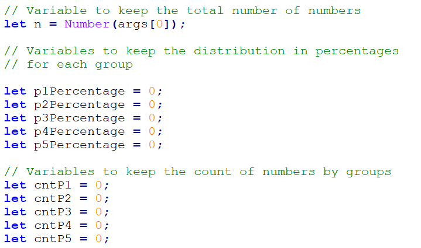
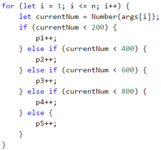
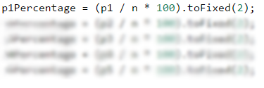
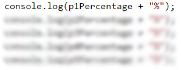
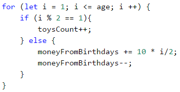
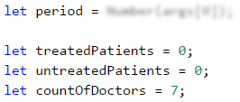
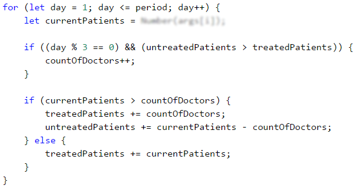

# Chapter 5.2. Loops – Exam Problems

In the previous chapter, we learned how to run a block of commands **more than once**. That's why we introduced a **`for` loop** and reviewed some of its main use cases. The purpose of this chapter is to improve our knowledge, by solving some more complex exam problems with loops, used for entrance exams. For some of them, we will show examples of comprehensive solutions, and for others, we will provide only guidance.
Before we start, let's take another look at the **`for` loop** construction:


The **`for` loops** consist of:
 * **Initialization expression**, in which the variable-counter (**`let i`**) is created and its initial value is set. 
 * **Condition expression** (**`i <= 10`**), executed once, before each loop iteration.
 * **Increment expression** (**`i++`**) – expression executed after each iteration.
 * **Body** of the loop - contains any block of source code

 
## Exam Problems

Let's solve some SoftUni exam problems with loops


## Problem: Histogram

**N integers** are given within the range of [**1 … 1000**]. A percentage of them **p1** are with values below 200, another percentage __p2__ are with values from 200 to 399, percentage **p3** are with values from 400 to 599, a percentage **p4** are with values from 600 to 799 and the remaining percentage **p5** representing values above 800. Write a program that calculates and prints the percentages **p1**, **p2**, **p3**, **p4**, and **p5**.

**Example**: we are given n = **20** numbers: 53, 7, 56, 180, 450, 920, 12, 7, 150, 250, 680, 2, 600, 200, 800, 799, 199, 46, 128, 65 in the following distribution and visualization:
                          
| **Group**   | **Numbers**                                     | **Number count**| **Persent**                     |
|-------------|-------------------------------------------------|:---------------|---------------------------------|
| < 200       | 53, 7, 56, 180, 12, 7, 150, 2, 199, 46, 128, 65 | 12             | p1 = 12 / 20 * 100 = 60.00%     |
| 200 … 399   | 250, 200                                        | 2              | p2 = 2 / 20 * 100 = 10.00%      |
| 400 … 599   | 450                                             | 1              | p3 = 1 / 20 * 100 = 5.00%       |
| 600 … 799   | 680, 600, 799                                   | 3              | p4 = 3 / 20 * 100 = 15.00%      |
| ≥ 800       | 920, 800                                        | 2              | p5 = 2 / 20 * 100 = 10.00%      |

### Input Data

The first line (argument) of the input is an integer **n** (1 ≤ **n** ≤ 1000), representing the count of lines with numbers that will be passed. On the following **n lines (arguments)** will be given **one integer** within the range of [**1 … 1000**] – based on these numbers the histogram should be calculated.

### Output Data

Print on the console **histogram that consists of 5 lines**, each of them containing a number between 0% and 100%, formatted with precision two digits after the decimal point (for example 25.00%, 66.67%, 57.14%).

### Sample Input and Output

<table>
<thead>
<tr>
<th align="left"><strong>Input</strong></th>
<th align="left"><strong>Output</strong></th>
<th align="left"><strong>Input</strong></th>
<th align="left"><strong>Output</strong></th>
</tr>
</thead>
<tbody>
<tr>
<td valign="top"><strong>3</strong><br>1<br>2<br>999</td>
<td valign="top">66.67%<br>0.00%<br>0.00%<br>0.00%<br>33.33%</td>
<td valign="top"><strong>4</strong><br>53<br>7<br>56<br>999</td>
<td valign="top">75.00%<br>0.00%<br>0.00%<br>0.00%<br>25.00%</td>
</tr>
</tbody>
</table>

<table>
<thead>
<tr>
<th align="left"><strong>Input</strong></th>
<th align="left"><strong>Output</strong></th>
<th align="left"><strong>Input</strong></th>
<th align="left"><strong>Output</strong></th>
</tr>
</thead>
<tbody>
<tr>
<td valign="top"><strong>7</strong><br>800<br>801<br>250<br>199<br>399<br>599<br>799</td>
<td valign="top">14.29%<br>28.57%<br>14.29%<br>14.29%<br>28.57%</td>
<td valign="top"><strong>9</strong><br>367<br>99<br>200<br>799<br>999<br>333<br>555<br>111<br>9</td>
<td valign="top">33.33%<br>33.33%<br>11.11%<br>11.11%<br>11.11%</td>
</tr>
</tbody>
</table>

<table>
<thead>
<tr>
<th align="left"><strong>Input</strong></th>
<th align="left"><strong>Output</strong></th>
</tr>
</thead>
<tbody>
<tr>
<td valign="top"><strong>14</strong><br>53<br>7<br>56<br>180<br>450<br>920<br>12<br>7<br>150<br>250<br>680<br>2<br>600<br>200</td>
<td valign="top">57.14%<br>14.29%<br>7.14%<br>14.29%<br>7.14%</td>
</tr>
</tbody>
</table>

### Hints and Guidelines

The program that solves this problem could be divided into three parts:

  * **Reading the input data** – the current problem includes a reading of the number **n**, followed by **n integers**, each on a single line.
  * **Processing the input data** – in this case, that means allocating the numbers into groups and calculating the percentage breakdown by groups.
  * **Print the output** – print the histogram in the specified format.
  
#### Reading The Input Data
  
Before we proceed to the actual reading of the input data, we have to **declare the variables**, in which the input data will be stored:
  


In the variable **`n`**, we will store the count of numbers that we will need to read. Additionally, we have to declare the variables **`p1`**, **`p2`**, etc., in which we will store the count of numbers for each corresponding group.
Once the variables have been declared we can proceed with input data processing.

#### Processing The Input Data
  
To be able to read and distribute each number to its respective group, a **`for` loop** from **0** to **`n`** (count of numbers) will be used. Each loop iteration will read and distribute **one single** number (**`currentNum`**) to its respective group. To define, if a number belongs to a certain group we have to, **perform a check in the respective range**. Once the check returns true - we increase the count of numbers in this group (**`p1`**, **`p2`**, etc.) by 1:



After determining the count of numbers in each group we can move on to the main objective and calculate the percentages. For the calculation we will use the following formula:

<p align="center"><strong>(group percentage) = (count of numbers in a group) / (count of all numbers) * 100 </strong></p>

This formula in the source code would look as:



According to the task assignment, the percentages have to be **formatted with precision two digits after the decimal point**. Considering this, **`.toFixed(...)`** method should be added to the formula and the first variable would look like this:

```JavaScript
p1Percentage = (p1 / n * 100).toFixed(2);
//Add the formula for the rest of the variables
```

To make it even clearer, let's take a look at the following example: 

|Input|Output|
|--------|---------|
|**3**<br>1<br>2<br>999|66.67%<br>0.00%<br>0.00%<br>0.00%<br>33.33%|

In this case **`n = 3`**.
For this loop we have:
   -    **`i = 0`** - we read the number 1, which is less than 200 and falls into the first group (**`p1`**), we increase the corresponding group counter by 1.
   -   	**`i = 1`** – we read the number 2, which again falls into the first group (**`p1`**) and we increase the same group counter by 1.
   -   	**`i = 2`** – we read the number 999, which falls into the last group (**`p5`**) because it's bigger than 800, and we increase the corresponding group counter by 1.
   
After reading the numbers, we have in group **`p1`** two numbers and in group **`p5`** one number. For the rest of the groups, we have **no numbers**. The percentage of each group is calculated by applying the above-mentioned formula.

#### Printing The Output
  
All we have to do at this point is to print the final results:



### Testing in The Judge System

You can test your solution here: [https://judge.softuni.org/Contests/Practice/Index/934#0](https://judge.softuni.org/Contests/Practice/Index/934#0).


## Problem: Smart Lilly

Lily is **N years old** already. For each **birthday** she receives a present. For each **odd** birthday (1, 3, 5, …, n) she receives **toys**, and for the **even** birthdays (2, 4, 6, …, n) she receives **money**. For her **second birthday**, she received **10.00 USD**, and the **amount is increased by 10.00 USD for every subsequent even birthday** (2 -> 10, 4 -> 20, 6 -> 30, etc.). Over the years Lily has secretly saved her money. In the years when Lily received money, her brother each time took 1 USD. Lily **sold the toys**, she got over the years, **each one for P USD**, and then added the sum to her savings. With her savings, she wanted to **buy herself a washing machine for X USD**. Write a program, that calculates the **amount of Lily's savings** and is this sum enough **for buying a washing machine**.

### Input Data

The program receives **3 numbers** (arguments), entered by the user on separate lines:

   - Lily's **age** – **integer** in the range of [**1 … 77**].
   - **Washing machine price** – a number in the range of [**1.00 … 10 000.00**].
   - **Single toy price** – **integer** in the range of [**0 … 40**].

### Output Data

In a single line print on the console:

  * If Lily has enough money to make the purchase:
    * "**Yes! {N}**" – where **N** is the money left after the purchase
  * If Lily's savings are not enough for making a purchase:
    * "**No! {M}**" – where **M** is the insufficiency amount
  * The numbers **N** and **M** must be **formatted with precision two digits after the decimal point**.

### Sample Input and Output

<table>
<thead>
<tr>
<th align="left"><strong>Input</strong></th>
<th align="left"><strong>Output</strong></th>
<th align="left"><strong>Comments</strong></th>
</tr>
</thead>
<tbody>
<tr>
<td valign="top">10<br>170.00<br>6</td>
<td valign="top">Yes! 5.00</td>
<td valign="top"><p><strong>First birthday</strong> receives <strong>toy</strong>; <strong>2nd</strong> -> <strong>10 USD</strong>; 3rd -> toy; <strong>4th</strong>  -> 10 + 10 = <strong>20 USD</strong>; 5th -> toy; <strong>6th</strong> -> 20 + 10 = <strong>30 USD</strong>; 7th -> toy; <strong>8th</strong> -> 30 + 10 = <strong>40 USD</strong>; 9th -> toy; <strong>10th</strong> -> 40 + 10 = <strong>50 USD</strong>.<br>
<strong>She has saved</strong> -> 10 + 20 + 30 + 40 + 50 = <strong>150 USD</strong>. She sold<strong>5 toys 6 USD each = 30 USD</strong>.<br>
<strong>Her brother took 1 USD 5 times</strong>. <strong>Remaining amount of money</strong> -> 150 + 30 – 5 = <strong>175 USD</strong>.
<strong>175 &gt;= 170</strong> (the price of the washing machine) <strong>she was able</strong> to buy the washing machine and she was <strong>left</strong> 175-170 = <strong>5 USD</strong>.
</p></td>
</tr>
<tr>
<td valign="top">21<br>1570.98<br>3</td>
<td valign="top">No! 997.98</td>
<td valign="top"><p><strong>She saved 550 USD.</strong> <strong>She sold</strong> <strong>11 toys</strong> <strong>3 USD each.</strong> = <strong>33 USD</strong>.Her brother <strong>has taken 1  USD each year for 10 years</strong> = <strong>10 USD</strong>. <strong>Remaining amount of money</strong> 550 + 33 – 10 = <strong>573 USD</strong> <br>
<strong>573 &lt; 1570.98</strong> – <strong>She didn't manage</strong> to buy a washing machine. <strong>The insufficient amount of money is</strong> 1570.98–573 = <strong>997.98 USD</strong></p></td>
</tr>
</tbody>
</table>    

### Hints and Guidelines

Similar to the previous problem, the solution could be divided into three parts – **reading** the input data, **processing** the input data, and **printing the output**.


Again, we should start with choosing appropriate variable names. For Lily's age(**`age`**), for the washing machine price (**`washingMachinePrice`**) and the single toy price (**`toyPrice`**). In the above code we **declare** and **initialized** (assign value to a variable) also variables for the toys count(**`toysCount`**), and money from birthdays (**`moneyFromBirthdays`**):


We use a **`for` loop** to iterate through every Lily's birthday. If the leading variable is an **odd number**, we increase the count of **toys**. We can do the parity check using **division with the remainder** (**`%`**) **by 2** – if the remainder is equal to 0, the number is **even**, and if the remainder is equal to 1 - **odd**. Inversely, if the leading variable is an **even number**, that would mean, that Lily has **received money** so we have to add this amount of money to her savings. Then we **Increase** the value of the variable **`moneyFromBirthdays`**, i.e. **we increase by 10** the sum, that she will receive for her next birthday. At the same time, we **subtract 1 USD** - the money taken from her brother. To use the decrement operator we have to add two minus signs after the last sign of the variable (**`moneyFromBirthdays--`**):



Probably you will encounter some difficulties calculating the amount of birthday money  if you let the bonus money be added in the following way:

```JavaScript 
moneyFromBirthdays += 10;
```
The final result would be **10 x 5 = 50**, while our goal is to have **10 + 20 + 30 + 40 + 50 = 150**. The problem could be solved by declaring an additional variable(**`bonusMoney`**):

```JavaScript
bonusMoney += 10; 
moneyFromBirthdays += bonusMoney;
```
Or we can include the value of the variable **`i`**, which **counts the loops** and then divide it by **2**:
```JavaScript
moneyFromBirthdays += 10 * i/2;
```

Then we have to add the money received from the sold toys to Lily's savings.


At this point what is left is to print the results considering the required formating i.e. the sum should be **formatted with precision to the second digit after a decimal point**:


To avoid declaring additional variables we can use a template literal - **`${expression}`**. It's a text literal with a specific sequence of characters allowing embedding of expressions. Using it the calculation can be performed and the result to be directly included in the text string. 

### Testing in The Judge System

You can test your solution here: [https://judge.softuni.org/Contests/Practice/Index/934#1](https://judge.softuni.org/Contests/Practice/Index/934#1).

## Problem: Back to The Past

Ivan is **18 years old** and just received an inheritance, consisting of **X amount of money** and a **time machine**. He decides **to return to the year 1800**, but he is not certain **if the money** would be **enough** for him, to live at that time without working. Write a **program, that calculates** if Ivan **would have enough money**, to live without working **until a given year (inclusively)**. Assuming that, for **every even** (1800, 1802 etc.) year he **would spend 12 000 USD**. For **every odd year** (1801,1803 etc.) he would spend **12 000 + 50 * [the age he would have reached in the given year]**.

### Input Data

The program receives **2 numbers (arguments)**, entered by the user on separate lines

  * **Inherited money** – a number in the range of [**1.00 … 1 000 000.00**].
  * **The year, until he would have to live in the past (inclusively)** – an integer in the range of [**1801 … 1900**].

### Output Data

**Print** on the console **1 line**. **The sum** must be **formatted** with precision up to **two digits after the decimal point**:
  * If **the money is enough**:
    * „**Yes! He will live a carefree life and will have {N} dollars left.**“ – where **N** is the remaining amount of money.
  *	If **the money is not enough**:
    * „**He will need {M} dollars to survive.**“ – where **M** is the **insufficient** amount of money.

### Sample Input and Output

<table>
<thead>
<tr>
<th align="left"><strong>Input</strong></th>
<th align="left"><strong>Output</strong></th>
<th align="left"><strong>Explanations</strong></th>
</tr>
</thead>
<tbody>
<tr>
<td valign="top">50000<br>1802</td>
<td valign="top">Yes! Ivan would live a carefree life and<br> would have 13050.00 USD left.</td>
<td valign="top"><p>1800 &rarr; <strong>even</strong><br> 
 	&nbsp;	&nbsp;	&nbsp;	&nbsp;  &rarr; <strong>Spend 12000</strong> USD <br>
  &nbsp;	&nbsp;	&nbsp;	&nbsp;  &rarr; Remaining 50000 – 12000 = <strong>38000</strong><br>
1801 &rarr; <strong>odd</strong> <br>
	&nbsp;	&nbsp;	&nbsp;	&nbsp;  &rarr; <strong>Spend</strong> 12000 + <strong>19*50</strong> = 12950 USD<br>
	&nbsp;	&nbsp;	&nbsp;	&nbsp;  &rarr; <strong>Remaining</strong> 38000 – 12950 = <strong>25050</strong><br>
1802 &rarr; <strong>even</strong> <br>
	&nbsp;	&nbsp;	&nbsp;	&nbsp;  &rarr; <strong>Spend</strong> 12000 USD<br>
	&nbsp;	&nbsp;	&nbsp;	&nbsp;  &rarr; <strong>Remaining</strong> 25050 – 12000 = <strong>13050</strong></p></td>
</tr>
<tr>
<td valign="top">100000.15<br>1808</td>
<td valign="top">He would need 12399.85 USD<br> to survive.</td>
<td valign="top"><p>1800 &rarr; <strong>even</strong><br> 
  &nbsp;	&nbsp;	&nbsp;	&nbsp;  &rarr; Remaining 100000.15 – 12000 = <strong>88000.15</strong><br>
1801 &rarr; <strong>odd</strong> <br>
	&nbsp;	&nbsp;	&nbsp;	&nbsp;  &rarr; <strong>Remaining</strong> 88000.15 – 12950 = <strong>75050.15</strong><br>
<strong>…</strong><br>
1808 &rarr; <strong>even</strong> &rarr; -399.85 - 12000 = -12399.85<br>
<strong>12399.85 shortage</strong>
</p></td>
</tr>
</tbody>
</table>    

### Hints and Guidelines

The method for solving this problem is similar to the previous ones, so we should start with **declaring and initializing** the required variables. According to the problem description, Ivan is eighteen years old, so we could declare the variable **`years`** and set an initial value of **18**. The values of the other variables we can read from the function parameters:


Using a **`for` loop** we can iterate through all the years. **Starting from 1800** – the year, in which Ivan wants to return, and reach **the year until which he has to live in the past**. In the loop, we check, if the current year is **even** or **odd**. We perform the check using **division with a remainder** (**`%`**) by 2. If the year is **even**, we subtract from the (**`heritage`**) **12000**, and if the year is **odd**, we subtract from the (**`heritage`**) **12000 + 50 * (the age he would have reached in the given year)**:


Finally, we have to print out the result by **checking whether the inheritance** (**`heritage`**) was enough to live without working or not. If the inheritance (**`heritage`**) is a **positive number**, we print out: "**`Yes! He will live a carefree life and will have {N} dollars left.`**", and if it's a **negative number**: "**`He will need {M} dollars to survive.`**". Don't forget to format the result with precision to the second digit after the decimal point.

**Hint**: Consider using the **`Math.abs(…)`** method, when printing the output in case the inheritance is insufficient.

### Testing in The Judge System

You can test your solution here: [https://judge.softuni.org/Contests/Practice/Index/934#2](https://judge.softuni.org/Contests/Practice/Index/934#2).


## Problem: Hospital

For a certain period, every day patients arrive at the hospital for examination. **Initially**, the hospital had **7 doctors**. Each doctor could treat **only one patient per day**, but sometimes there is a shortage of doctors, so **the remaining patients are sent to other hospitals**. **Every third day** the hospital makes evaluations and **if the count of untreated patients is greater than the count of treated ones, another doctor is appointed**. Each new doctor is appointed at the beginning of the day before the patients' admission.

Write a program, that calculates **for a given period, the count of treated and untreated patients**.

### Input Data

On the first line (argument) there is an integer in the range of [**1 … 1000**] - **The period**, for which you need to make calculations. On the next **lines (arguments)** there are **integers** in the range of [**1 … 10 000**] – the **number of arriving patients**, for the **current day**.  

### Output Data

**Print** on the console **2 lines**:

* On the **first line**: "**Treated patients: {count of treated patients}.**"
* On the **second line**: "**Untreated patients: {count of untreated patients}.**"

### Sample Input and Output

<table>
<thead>
<tr>
<th align="left"><strong>Input</strong></th>
<th align="left"><strong>Output</strong></th>
<th align="left"><strong>Explanation</strong></th>
</tr>
</thead>
<tbody>
<tr>
<td valign="top">4<br>7<br>27<br>9<br>1</td>
<td valign="top">Treated patients: 23.<br>Untreated patients: 21.</td>
<td valign="top"><p><strong>Day 1</strong>: 7 treated and 0 untreated patients for the day<br>
<strong>Day 2</strong>: 7 treated and 20 untreated patients for the day<br>
<strong>Day 3</strong>: 14 patients have been treated so far and<br>20 untreated –> A new doctor is appointed <br>–>
8 treated and 1 untreated patients for the day<br>
<strong>Day 4</strong>: 1 treated and 0 untreated patients for the day<br>
<strong>Total: 23 treated and 21 untreated patients.</strong></p></td>
</tr>
</tbody>
</table>    

<table>
<thead>
<tr>
<th align="left"><strong>Input</strong></th>
<th align="left"><strong>Output</strong></th>
</tr>
</thead>
<tbody>
<tr>
<td valign="top">6<br>25<br>25<br>25<br>25<br>25<br>2</td>
<td valign="top">Treated patients: 40.<br>Untreated patients: 87.</td>
</tr>
<tr>
<td valign="top">3<br>7<br>7<br>7</td>
<td valign="top">Treated patients: 21.<br>Untreated patients: 0.</td>
</tr>
</tbody>
</table>    

### Hints and Guidelines

We start again by, **declaring and initializing** the required variables. The calculation period we read from the console and save in the **`period`** variable. We will need some additional variables such as the number of treated patients (**`treatedPatients`**), the number of untreated patients (**`untreatedPatients`**), and the number of doctors (**`countOfDoctors`**), which initially is set to 7.



Using **`for` loop** we iterate through all days in the given period (**`period`**). For each day, we read from the console the number of the patients(**`currentPatients`**). According to the problem description, the increase of the doctors can occur **every third day**, **but** only if the count of untreated patients is **greater** than the count of treated ones. For this purpose we check, if the day is the third one – using the division with a remainder operator (**`%`**): **`day % 3 == 0`**.

For example:
 * If it's the **third** day, the remainder of the division by **3** will be **0** (**`3 % 3 = 0`**) and the check **`day % 3 == 0`** will return **`true`**.
 * If it's the **second** day, the remainder of the division by **3** will be **2** (**`2 % 3 = 2`**) and the check will return **`false`**.
 * If it's the **fourth** day, the remainder of the division by **1** (**`4 % 3 = 1`**) and the check will return **`false`**.

If **`day % 3 == 0`** returns **`true`**, the program logic will check, if the number of untreated patients is greater than the treated ones: **`untreatedPatients > treatedPatients`**. If the result is again **`true`**, then the count of doctors will be increased (**`countOfDoctors`**).
 
Then we have to check if the daily count of patients (**`currentPatients`**) is greater than the count of the doctors (**`countOfDoctors`**). If the count of patients is **greater**:
 - Increase the value of the variable **`treatedPatients`** by the count of doctors (**`countOfDoctors`**).
 - Increase the value of the variable **`untreatdPatients`** by the count of remaining patients, which we calculate by subtracting the count of doctors from the count of patients (**`currentPatients - countOfDoctors`**).
 
If the count of patients **is not greater**, we increase only the value of the variable **`treatedPatients`** by the count of patients for the day (**`currentPatients`**).



Finally, the only thing left is to print the number of treated and untreated patients.

### Testing in The Judge System

You can test your solution here: [https://judge.softuni.org/Contests/Practice/Index/934#3](https://judge.softuni.org/Contests/Practice/Index/934#3).


## Problem: Division

**N integers** are given in the range of [**1 … 1000**]. **Some percentage p1 of them are divisible without remainder by 2**, **percentage p2** are **divisible without remainder by 3**, **percentage p3** is **divisible without remainder by 4**. Write a program that calculates and prints the percentages p1, p2, and p3.
**Example:** We are given **n = 10** numbers: 680, 2, 600, 200, 800, 799, 199, 46, 128, 65 and the following distribution and visualization:
<table>
<thead>
<tr>
<th align="left"><strong>Division without remainder by:</strong></th>
<th align="left"><strong>Numbers</strong></th>
<th align="left"><strong>Count</strong></th>
<th align="left"><strong>Percent</strong></th>
</tr>
</thead>
<tbody>
<tr>
<td valign="top">2</td>
<td valign="top">680, 2, 600, 200, 800, 46, 128</td>
<td valign="top">7</td>
<td valign="top">p1 = (7 / 10) * 100 = <strong>70.00%</strong></td>
</tr>
<tr>
<td valign="top">3</td>
<td valign="top">600</td>
<td valign="top">1</td>
<td valign="top">p2 = (1 / 10) * 100 = <strong>10.00%</strong></td>
</tr>
<tr>
<td valign="top">4</td>
<td valign="top">680, 600, 200, 800, 128</td>
<td valign="top">5</td>
<td valign="top">p3 = (5 / 10) * 100 = <strong>50.00%</strong></td>
</tr>
</tbody>
</table>   

### Input Data

On the first line (argument) of the input, we have integer **n** (1 ≤ **n** ≤ 1000) – count of numbers. On each next **n line**, we have **one integer** in the range of [**1 … 1000**] – numbers that have to be checked for division without remainder.

### Output Data

Print on the console **3 lines**, each containing a percentage between 0% and 100%, formatted with precision two digits after the decimal point, for example 25.00%, 66.67%, 57.14%.
 * On the **first line** – the percentage of the numbers, which is **divisible by 2**.
 * On the **second line** – the percentage of the numbers, which is **divisible by 3**.
 * On the **third line** – the percentage of the numbers, which is **divisible by 4**.

### Sample Input and Output

<table>
<thead>
<tr>
<th align="left"><strong>Input</strong></th>
<th align="left"><strong>Output</strong></th>
<th align="left"><strong>Input</strong></th>
<th align="left"><strong>Output</strong></th>
<th align="left"><strong>Input</strong></th>
<th align="left"><strong>Output</strong></th>
</tr>
</thead>
<tbody>
<tr>
<td valign="top"><strong>10</strong><br>680<br>2<br>600<br>200<br>800<br>799<br>199<br>46<br>128<br>65</td>
<td valign="top">70.00%<br>10.00%<br>50.00%</td>
<td valign="top"><strong>3</strong><br>3<br>6<br>9</td>
<td valign="top">33.33%<br>100.00%<br>0.00%</td>
<td valign="top"><strong>1</strong><br>12</td>
<td valign="top">100.00%<br>100.00%<br>100.00%</td>
</tr>
</tbody>
</table>   

### Hints and Guidelines

For the current and for the next problem you will have to write the program code by yourself, following the given guidelines.

The program logic that solves the current problem is similar to the **Histogram** problem, that we reviewed above. Therefore we can start with declaring the required variables. Typical variable names could be **`n`** – count of numbers (that we need to read from the console) and **`divisibleBy2`**, **`divisibleBy3`**, **`divisibleBy4`** – additional variables, containing a count of the numbers in the corresponding group.

To read and allocate each number to its corresponding group we have to iterate  **`for` loop** from **`0`** to **`n`** (count of numbers). Each iteration of the loop should read and allocate **one single number**. The difference here is that **one number could be a part of several groups simultaneously**, therefore we have to perform **three different `if` checks for each number** - respectively, whether the number is divisible by 2,3, and 4 and then to increase the value of the variable that keeps the count of numbers in the corresponding group.

**Note**: **`if-else`** construction wouldn't work in this case, because once the condition is true, the code wouldn't perform any further checkings.

Finally, you need to print the obtained results, by following the specified format.

### Testing in The Judge System

You can test your solution here: [https://judge.softuni.org/Contests/Practice/Index/934#4](https://judge.softuni.org/Contests/Practice/Index/934#4).


## Problem: Logistics

In this problem, you are responsible for the logistics of various types of cargo **Depending on the weight** of each cargo you need a **different vehicle** and this will cost **different prices per ton**:

 * Up to **3 tons** – **microbus** (200 USD per ton).
 * From **over 3 to 11 tons** – **truck** (175 USD per ton).
 * **Over 11 tons – train** (120 per ton).

Your task is to calculate **the average price per ton of cargo**, as well as **the percentage of the cargo** transported **by each vehicle**.

### Input Data

The program receives a **sequence of numbers** (arguments):
 * On the first line (argument): **the count of cargos** that have to be transported – **integer** in the range of [**1 … 1000**].
 * On the next lines, we pass the **weight of the cargo** – **integer** in the range of [**1 … 1000**].

### Output Data

Print on the console **4 lines**, as follow:
 * **Line #1** – **average price per ton for a transported cargo** (formatted with precision two digits after the decimal point).
 * **Line #2** – a **percentage** of the cargo, transported by **microbus** (between 0.00% and 100.00%, formatted with precision two digits after the decimal point).
 * **Line #3** – a **percentage** of the cargo, transported by **truck** (between 0.00% and 100.00%).
 * **Line #4** – a **percentage** of the cargo, transported by **train** (between 0.00% and 100.00%).
 
### Sample Input and Output

<table>
<thead>
<tr>
<th align="left"><strong>Input</strong></th>
<th align="left"><strong>Output</strong></th>
<th align="left"><strong>Explanation</strong></th>
</tr>
</thead>
<tbody>
<tr>
<td valign="top">4<br>1<br>5<br>16<br>3</td>
<td valign="top">143.80<br>16.00%<br>20.00%<br>64.00%</td>
<td valign="top">
The <b>microbus</b> is transporting two cargos <b>1</b> + <b>3</b>, a total of <b>4</b> tons.<br>
The <b>truck</b> is transporting one cargo: <b>5</b> tons.<br>
The <b>train</b> is transporting one cargo: <b>16</b> tons.<br>
<b>The sum</b> of all cargos is: 1 + 5 + 16 + 3 = <b>25</b> tons.<br>
Percentage of the cargo transported by <b>microbus</b> is: 4/25*100 = <b>16.00%</b><br>
Percentage of the cargo transported by <b>truck</b> is: 5/25*100 = <b>20.00%</b><br>
Percentage of the cargo transported by <b>train</b> is: 16/25*100 = <b>64.00%</b><br>
<b>The average price</b> per ton trasported cargo should be: (4 * 200 + 5 * 175 + 16 * 120) / 25 = <b>143.80</b>
</td>
</tr>
</tbody>
</table>

<table>
<thead>
<tr>
<th align="left"><strong>Input</strong></th>
<th align="left"><strong>Output</strong></th>
<th align="left"><strong>Input</strong></th>
<th align="left"><strong>Output</strong></th>
</tr>
</thead>
<tbody>
<tr>
<td valign="top">5<br>2<br>10<br>20<br>1<br>7</td>
<td valign="top">149.38<br>7.50%<br>42.50%<br>50.00%</td>
<td valign="top">4<br>53<br>7<br>56<br>999</td>
<td valign="top">120.35<br>0.00%<br>0.63%<br>99.37%</td>
</tr>
</tbody>
</table>

### Hints and Guidelines

First, we will read **the weight of each cargo** and **sum** the amount of cargo transported by **microbus**, **truck** and **train**, then we have to calculate the **total tons** of transported cargo. The next step is to calculate **the prices of each transport type** related to the transported tons and the **total price**. Finally,  we will calculate and print **the total average price per ton** and **what part of the cargo as a percentage is transported by each type of vehicle**.

We declare the necessary variables such as **`countOfLoads`** – count of the cargos for transportation (we read them from the console), **`sumOfTons`** – the weight amount of all cargos, **`microbusTons`**, **`truckTons`**, **`trainTons`** – variables containing the amount of weight of transported cargo, respectively by the microbus, the truck, and the train. 

We still need a**`for` loop** from **`0`** to **`countOfLoads - 1`**, to iterate through all cargo types. For each cargo, **we read weight** (in tons) and save the value in a variable, such as **`tons`**. Next, we add the weight of the current cargo (**`tons`**) to the sum of all cargo weights (**`sumOfTons`**). Once we have read the weight of the current cargo, **we need to determine which vehicle type will be used** (microbus, truck or train). For this purpose we should use **`if-else`** check:

 * If the value of the variable **`tons`** is **less than 3**, increase the value of **`microbusTons`** by the value of **`tons`**:
 
   ```JavaScript
   microbusTons += tons;
   ```
   
 * In case the value of **`tons`** is **less than 11** - increase the value of **`truckTons`** by the value of **`tons`**.
 * If the value of **`tons`** is **more than 11**, increase the value of **`trainTons`** by the value of **`tons`**.

Before printing the output, we have to **calculate the percentage of tons, transported by each vehicle** and the **average price per ton**. For the average price per ton, we will declare one more variable **`totalPrice`**, which will **sum the total price of all transported cargo** (by microbus, truck and train). We can calculate the average price by, dividing **`totalPrice`** by **`sumOfTons`**. Finally, you have to **calculate by yourself** the percentages of tons, transported by each vehicle, and print the results, keeping the format specified in the description.

### Testing in The Judge System

You can test your solution here: [https://judge.softuni.org/Contests/Practice/Index/934#5](https://judge.softuni.org/Contests/Practice/Index/934#5).
