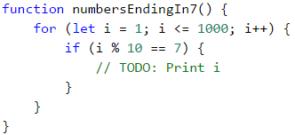
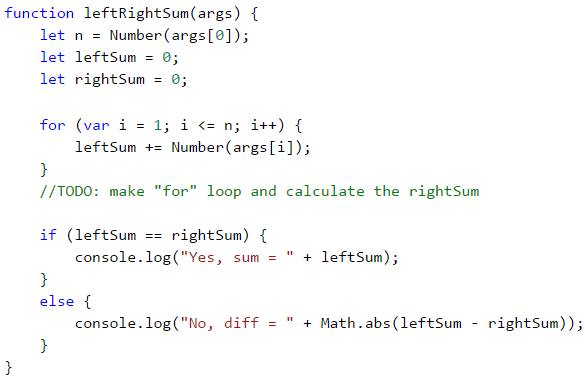
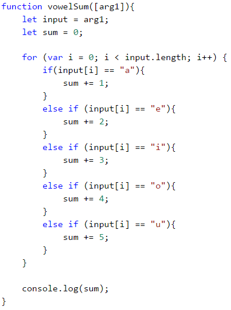
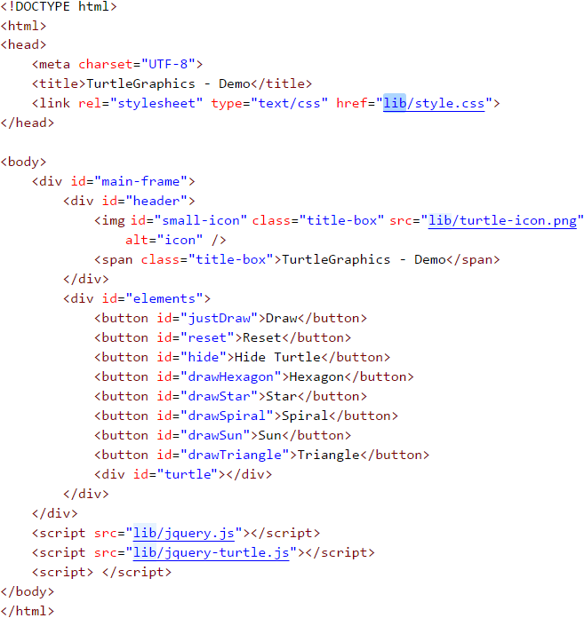
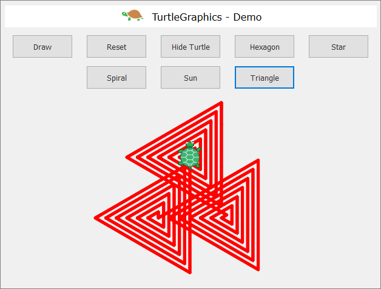

# Chapter 5.1. Loops (Repetitions)

In this chapter we will introduce the **repeat blocks of commands**, also known as "**loops**". We will write a number of loops, using the **`for`** operator in its simplest form. Finally, we will solve a few practical problems that require repetition of commands, using loops.


## Video

<div class="video-player">
  Watch the video course for this chapter here: <a target="_blank"
  href="https://www.youtube.com/watch?v=qTh58nRP-nE">
  https://www.youtube.com/watch?v=qTh58nRP-nE</a>.
</div>


## Repeating code blocks (for loops)

In programming we often need **to execute a block of commands multiple times**. In order to do that we use **loops**. Let's look at one example of a **`for` loop**, which will loop through the numbers from 1 to 10 and print each one:

```js
for (let i = 1; i <= 10; i++) {
    console.log("i = " + i);
}
```

The loop starts with the **operator `for`** and loops through all values of a given variable in a given range, for example all numbers from 1 to 10 included. For each value it executes a sequence of commands.

Upon declaring the loop you can specify a **start value** and an **end value**. **The loop's body** is usually in curly braces **`{ }`** and contains one or more commands. The figure below shows the structure of a **`for` loop**:


A **`for` loop** often circles **`1`** to **`n`** times (for example 1 to 10). The goal is to **loop** through the numbers 1, 2, 3, …, n sequentially and after each pass through the loop to **perform a certain action**. In the example above the variable **`i`** holds values from 1 to 10 and the current value is printed in the loop's body. The loop repeats 10 times and each of these repetitions is called an "**iteration**".

### Problem: The numbers from 1 to 100

Write a program that **prints the numbers from 1 to 100**. The program doesn't receive input and prints the numbers from 1 to 100 sequentially, each one on a separate line.

#### Hints and Guidelines

We can solve this problem with a **`for` loop** , which will pass through the numbers from 1 to 100 using the variable **`i`** and will print the numbers in the loop's body:


**Start** the program with [**Ctrl+F5**] and **test** it:


#### Testing in the Judge System

Test your solution here: [https://judge.softuni.bg/Contests/Practice/Index/933#0](https://judge.softuni.bg/Contests/Practice/Index/933#0).

You should get **100 points** (completely correct solution).


## Code Snippet for a for loop in Visual Studio Code

While programming, we often need to use loops, dozens of times a day. That's why in most development environments (IDE) there are **code snippets** for writing loops. An example of such a snippet is the **snippet for a `for` loop in Visual Studio Code**. Write **`for`** in the JavaScript code editor in Visual Studio Code and **hit** [**Tab**]:


 **VS Code** will open a snippet and write a complete **`for` loop**:


**Try it yourself**, so you can master the skill of using the code snippet for **`for` loops** in Visual Studio Code.

### Problem: Numbers up to 1000, ending in 7

Write a program that finds all numbers ending in 7 in the range [**1 … 1000**]. 

#### Hints and Guidelines

We can solve this problem by combining a **`for` loop** that loops through the numbers from 1 to 1000 and a **conditional statement** that checks if the number ends in 7. Of course, there are other options, too, but let's solve the problem using a **for loop + conditional statement**:



#### Testing in the Judge System

Test your solution here: [https://judge.softuni.bg/Contests/Practice/Index/933#1](https://judge.softuni.bg/Contests/Practice/Index/933#1).

### Problem: All Latin Letters

Write a program that prints the letters from the alphabet: **a, b, c, …, z**.

#### Hints and Guidelines

We can solve this problem using a **`for` loop**, that loops through all letters' code numbers. Keep in mind that the code of the letter (the serial number in the [Unicode list of letters and characters](https://unicode-table.com/en/)\) ‘`a`’ is 97, the code of the letter ‘`b`’ is 98 and so on, and the code of the letter ‘`z`’ is 122. The transition from the number of the character to the letter itself is done with the help of the function `String.fromCharCode(x)`. Here's the example:


If we want to make the code easier to read, we can write the following:


#### Testing in the Judge System

Test your solution here: [https://judge.softuni.bg/Contests/Practice/Index/933#2](https://judge.softuni.bg/Contests/Practice/Index/933#2).

### Problem: Sum Numbers

Write a program that **sums `n` given integer numbers**.

* The first line of the input holds the number of integers **`n`**.
* Each of the following **`n`** lines holds a number to sum.
* Sum up the numbers and finally print the sum.

#### Sample Input and Output

| Input | Output |
| --- | --- |
| 2<br>10<br>20 | 30 |
| 3<br>-10<br>-20<br>-30 | -60 |
| 4<br>45<br>-20<br>7<br>11<br> | 43 |
| 1<br>999 | 999 | 
| 0 | 0 |

#### Hints and Guidelines

We can solve the problem with summing up numbers in the following way:
 - Read the input number **`n`**.
 - We start with a sum that initially equals zero **`sum = 0`**.
 - We run a loop from 1 to **`args.length`**. On each step of the loop we read the number **`args[i]`** and add it to the sum **`sum`**.
 - Finally, we print the calculated sum **`sum`**.
 
Here's the source code for the solution:


#### Testing in the Judge System

Test your solution here: [https://judge.softuni.bg/Contests/Practice/Index/933#3](https://judge.softuni.bg/Contests/Practice/Index/933#3).

### Problem: Max Number

Write a program that reads **n integer numbers** (**n** > 0) and finds **the biggest** among them. The first line of the input specifies the number of integers **n**. The next **n** lines hold the numbers, one per line. Examples:

#### Sample Input and Output

| Input | Output |
| --- | --- |
| 2<br>100<br>99 | 100 | 
| 3<br>-10<br>20<br>-30 | 20 |
| 4<br>45<br>-20<br>7<br>99<br> | 99 | 
| 1<br>999 | 999 |
| 2<br>-1<br>-2 | -1 |

#### Hints and Guidelines

First, we read one number **`n`** (the number of integers that will be entered). We assign an initial neutral value to the current maximum **`max`**, for example **-10000000000000** (or **`Number.NEGATIVE_INFINITY`**). Using a **`for` цикъл** that iterates **n times** (**`n = args[0]`**), we read one integer number **`num`** on each iteration. If the current number **`num`** is higher than the current maximum **`max`**, we assign the value of the **`num`** to the variable **`max`**. Finally, we have the highest number's value stored in **`max`**. We print the number on the console.


#### Testing in the Judge System

Test your solution here: [https://judge.softuni.bg/Contests/Practice/Index/933#4](https://judge.softuni.bg/Contests/Practice/Index/933#4).


### Problem: Min Number

Write a program that reads **n integer numbers** (**n** > 0) and finds **the smallest** among them. First, read the number of integers **n**, then **n** numbers, one per line. 

#### Sample Input and Output

| Input | Output | 
| --- | --- |
| 2<br>100<br>99 | 99 |
| 3<br>-10<br>20<br>-30 | -30 |
| 4<br>45<br>-20<br>7<br>99<br> | -20 |

#### Hints and Guidelines

The problem is completely identical with the previous one, except this time we will use another neutral value for a start.


#### Testing in the Judge System

Test your solution here: [https://judge.softuni.bg/Contests/Practice/Index/933#5](https://judge.softuni.bg/Contests/Practice/Index/933#5).


### Problem: Left and Right Sum

Write a program that reads **2 \* n integer numbers** and checks whether **the sum of the first n integers** (left sum) equals **the sum of the second group of n integers** (right sum). In case the sums are equal, print **"Yes" + the sum**, otherwise print **"No" + the difference**. The difference is calculated as a possitive number (by absolute value). The format of the output must be identical to the one in the examples below.

#### Sample Input and Output

| Input | Output | Input | Output |
| --- | --- | --- | --- | 
| 2<br>10<br>90<br>60<br>40 | Yes, sum = 100 | 2<br>90<br>9<br>50<br>50 | No, diff = 1 |

#### Hints and Guidelines

First, we read the number **n**, after that we enter the first **n** numbers (**the left** half) and calculate their sum. We will then proceed reading more **n** numbers (**the right** half) and sum them up. We calculate **the difference** between the sums by absolute value: **`Math.abs(leftSum - rightSum)`**. If the difference is **0**, print **"Yes" + the sum**, otherwise print **"No" + the difference**.



#### Testing in the Judge System

Test your solution here: [https://judge.softuni.bg/Contests/Practice/Index/933#6](https://judge.softuni.bg/Contests/Practice/Index/933#6).


### Problem: Even / Odd sum

Write a program that reads **n integer numbers** and checks whether **the sum of the numbers on even positions** equals **the sum of the numbers on odd positions**. In case the sums are equal, print **"Yes" + the sum**, otherwise print **"No" + the difference**. The difference is calculated by absolute value. The format of the output must be identical to the one in the examples below.

#### Sample Input and Output

| Input | Output |
| --- | --- |
| 4<br>10<br>50<br>60<br>20 | Yes<br>Sum = 70 |
| 4<br>3<br>5<br>1<br>-2 | No<br>Diff = 1 |
| 3<br>5<br>8<br>1 | No<br>Diff = 2 |

#### Hints and Guidelines

The program reads the numbers one by one and calculates the two **sums** (the sum of numbers on **even** positions and the sum of numbers on **odd** positions). We calculate the absolute value of the difference, like in the previous problem, and print the result (**"Yes" + the sum** in case the difference is 0 or **"No" + the difference** in any other case).


#### Testing in the Judge System

Test your solution here: [https://judge.softuni.bg/Contests/Practice/Index/933#7](https://judge.softuni.bg/Contests/Practice/Index/933#7).


### Problem: Sum of Vowels

Write a program that reads a **text** (string), calculates and prints **the sum of the vowels' value** according to the table below:

| a | e | i | o | u | 
| :---: | :---: | :---: | :---: | :---: |
| 1 | 2 | 3 | 4 | 5 |

#### Sample Input and Output

| Input | Output | Input | Output | 
| --- | --- | --- | --- |
| hello | 6<br>(e+o = 2+4 = 6) | bamboo | 9<br>(a+o+o = 1+4+4 = 9) |
| hi | 3<br>(i = 3) | beer | 4<br>(e+e = 2+2 = 4) |

#### Hints and Guidelines

We read the text input **`arg1`**, then create a sum that equals zero and run a loop from **0** to **`input.length`** (the text's length). Check whether each letter **`input[i]`** is a vowel and add its value to the sum.



#### Testing in the Judge System

Test your solution here: [https://judge.softuni.bg/Contests/Practice/Index/933#8](https://judge.softuni.bg/Contests/Practice/Index/933#8).


## What did we learn in this chapter?

We can repeat a block of code using a **`for` loop**:


We can perform various mathematical operations:


## Exercises: Loops (Repetitions)

Now that we got acquainted with the loops, it's time **to consolidate our knowledge in practice**, and as you know, this is done with a lot of code writing. Let's solve several problems for exercise:

### Problem: An element, equal to the sum of the rest

Write a program that reads **n integer numbers** and checks whether there is a number that equals the sum of all the rest among them. If there is such an element, print **"Yes" + the element's value**, otherwise - **"No" + the difference between the largest element and the sum of the rest** (by absolute value). 

#### Sample Input and Output

| Input | Output | Comment |
| --- | --- | :---: |
| 7<br>3<br>4<br>1<br>1<br>2<br>12<br>1 | Yes<br>Sum = 12 | 3 + 4 + 1 + 2 + 1 + 1 = 12 |
| 4<br>6<br>1<br>2<br>3 | Yes<br>Sum = 6 | 1 + 2 + 3 = 6 |
| 3<br>1<br>1<br>10 | No<br>Diff = 8 | &#124;10 - (1 + 1)&#124; = 8 |
| 3<br>5<br>5<br>1 | No<br>Diff = 1 | &#124;5 - (5 + 1)&#124; = 1 |
| 3<br>1<br>1<br>1 | No<br>Diff = 1 | - |

#### Hints and Guidelines

Calculate **the sum** of all elements, find **the biggest** among them and check the condition.

#### Testing in the Judge System

Test your solution here: [https://judge.softuni.bg/Contests/Practice/Index/933#9](https://judge.softuni.bg/Contests/Practice/Index/933#9).


### Problem: Even / Odd Positions

Write a program that reads **n numbers** and calculates **the sum**, **the min** and **the max** value of the numbers on **even** and **odd** positions (counting from 1). If no min / max element exists, print **"No"**. 

#### Sample Input and Output

| Input | Output | Input | Output |
| --- | --- | --- | --- |
| 6<br>2<br>3<br>5<br>4<br>2<br>1 | OddSum=9,<br>OddMin=2,<br>OddMax=5,<br>EvenSum=8,<br>EvenMin=1,<br>EvenMax=4 | 2<br>1.5<br>-2.5 | OddSum=1.5,<br>OddMin=1.5,<br>OddMax=1.5,<br>EvenSum=-2.5,<br>EvenMin=-2.5,<br>EvenMax=-2.5 |
| 1<br>1 | OddSum=1,<br>OddMin=1,<br>OddMax=1,<br>EvenSum=0,<br>EvenMin=No,<br>EvenMax=No | 0 | OddSum=0,<br>OddMin=No,<br>OddMax=No,<br>EvenSum=0,<br>EvenMin=No,<br>EvenMax=No |
| 5<br>3<br>-2<br>8<br>11<br>-3 | OddSum=8,<br>OddMin=-3,<br>OddMax=8,<br>EvenSum=9,<br>EvenMin=-2,<br>EvenMax=11 | 4<br>1.5<br>1.75<br>1.5<br>1.75 | OddSum=3,<br>OddMin=1.5,<br>OddMax=1.5,<br>EvenSum=3.5,<br>EvenMin=1.75,<br>EvenMax=1.75 |
| 1<br>-5 | OddSum=-5,<br>OddMin=-5,<br>OddMax=-5,<br>EvenSum=0,<br>EvenMin=No,<br>EvenMax=No | 3<br>-1<br>-2<br>-3 | OddSum=-4,<br>OddMin=-3,<br>OddMax=-1,<br>EvenSum=-2,<br>EvenMin=-2,<br>EvenMax=-2 |

#### Hints and Guidelines

The problem combines some of the previous problems: finding **the min**, **the max** value and **the sum**, as well as processing the elements on **even and odd positions**. Check them out.

In this problem it's better to work with **fractions** (not integers). The sum, the minimum and the maximum value are also fractions. We must use **a neutral start value** upon finding the minimum / maximum, for example **1000000000.0** and **-1000000000.0**. If the final result is the neutral value, print **“No”**.

#### Testing in the Judge System

Test your solution here: [https://judge.softuni.bg/Contests/Practice/Index/933#10](https://judge.softuni.bg/Contests/Practice/Index/933#10).

### Problem: Equal Pairs

There are **2 \* n numbers**. The first and the second number form **a pair**, so do the third and the forth number, and so on. Each pair has **a value** – the sum of its numbers. Write a program that checks **whether all pairs have the same value**.

In case the value is the same, print **"Yes, value=…" + the value**, otherwise, print **the maximum difference** between two consecutive pairs in the following format - **"No, maxdiff=…" + the maximum difference**. 

The input holds the number **n**, followed by **2*n integers**, all of them on a separate line.

#### Sample Input and Output

| Input | Output | Comment |
| --- | --- | :---: | 
| 3<br>1<br>2<br>0<br>3<br>4<br>-1| Yes, value=3 | стойности = {3, 3, 3}<br>еднакви стойности | 
| 2<br>1<br>2<br>2<br>2 | No, maxdiff=1 | стойности = {3, 4}<br>разлики = {1}<br>макс. разлика = 1 |
| 4<br>1<br>1<br>3<br>1<br>2<br>2<br>0<br>0 | No, maxdiff=4 | стойности = {2, 4, 4, 0}<br>разлики = {2, 0, 4}<br>макс. разлика = 4 |
| 1<br>5<br>5 | Yes, value=10 | стойности = {10}<br>една стойност<br>еднакви стойности |
| 2<br>-1<br>0<br>0<br>-1 | Yes, value=-1 | стойности = {-1, -1}<br>еднакви стойности | 
| 2<br>-1<br>2<br>0<br>-1 | No, maxdiff=2 | стойности = {1, -1}<br>разлики = {2}<br>макс. разлика = 2 |

#### Hints and Guidelines

Read the numbers from the input **in pairs**. For each pair calculate its **sum**. As we read the number pairs from the input, for each pair, except for the first one, we must calculate **the difference with the previous one**. In order to do that, we need to store the sum of the previous pair in a separate variable. Finally, find **the biggest difference** between two pairs. If it is **0**, print **“Yes”** + the value, otherwise - **“No”** + the difference.

#### Testing in the Judge System

Test your solution here: [https://judge.softuni.bg/Contests/Practice/Index/933#11](https://judge.softuni.bg/Contests/Practice/Index/933#11).

## Lab: Graphic and Web applications

In this chapter we learned about **loops** as a programming construction that allows us to repeat a particular action or a group of actions multiple times. Now let's play with them. In order to do that, we will draw several figures, which consist of a large number of repetitive graphic elements, and this time we will not do it on the console, but in a graphical environment, using "**turtle graphics**". It will be interesting. And it's not complicated at all. Try it!

### Problem: Drawing with a turtle – a graphical application (GUI)

The purpose of the next exercise is to play with a **drawing library**, also known as **turtle graphics**. We will build a graphical application in which we will **draw different shapes**, moving our **“turtle”** on the screen through commands like “move 100 positions forward”, “turn 30 degrees to the right”, “move 50 positions more forward”. The application will look something like this:


First, let's check out **the drawing concept “Turtle Graphics”**. Take a look at the following sources:

* Definition of “turtle graphics”: [http://c2.com/cgi/wiki?TurtleGraphics](http://c2.com/cgi/wiki?TurtleGraphics)
* Article on “turtle graphics” in Wikipedia: [https://en.wikipedia.org/wiki/Turtle_graphics](https://en.wikipedia.org/wiki/Turtle_graphics)
* Interactive online tool for drawing with a turtle:<br>[http://davidbau.github.io/jquery-turtle/demo.html](http://davidbau.github.io/jquery-turtle/demo.html)

We will build the application, using the following technologies:
  - **HTML** language – to describe the user interface (drawing field and buttons).
  - **JavaScript** code – to implement the actions of the buttons.
  - JS library **[jQuery](https://jquery.com/)** – to facilitate access to in the user's interface.
  - JS library **[jQuerу-Turtle](https://github.com/PencilCode/jquery-turtle)** – in order to implement screen drawing with the mechanics of “turtle graphics”.
  
There are two options to load all libraries and resources for our web application **Turtle Graphics**:

+ **Loading resources via CDN** (Content Delivery Network).

This option is suitable when we have a permanent internet connection. We need to make a standard HTML file (for example **index.html**) and write the following code in it:


All the necessary resources will be loaded automatically when the file is started and we can directly write our **JavaScript** code.

If for some reason you don't have permenent access to the Internet, you can use the second option:

+ **Loading resources locally**

You have to download all the necessary files and change a few lines in the html file. Start by creating a folder called **Turtle-Demo** and create the main **html file** and a subfolder for the necessary resources in it:


In the folder **"lib"** we need to put a few files that we can download from the book's online storage: [https://github.com/SoftUni/Programming-Basics-Book-JS-BG/tree/master/assets/chapter-5-1-assets](https://github.com/SoftUni/Programming-Basics-Book-JS-BG/tree/master/assets/chapter-5-1-assets)

For your convenience, we have put the files in an archive, easy to download **Turtle-Graphics-Demo-Files.zip**:


Let's take a look at each one of them:

> **jquery.js (версия 2.0.3)**

One of the most popular JavaScript libraries, which offers **speed and functionality** when working with HTML user interface. It changes the way we write code and plan its structure. Check out the tool at: [https://jquery.com](https://jquery.com/)

> **jquery-turtle.js (версия 2.0.8)**

A plugin, written by **David Bau** for jQuery - **jQuery-turtle** which provides a set of features for **graphic drawing** of the "turtle" type. Find detailed information and rules of use here: [https://github.com/davidbau/jquery-turtle](https://github.com/davidbau/jquery-turtle)

> **style.css**

A set of **design rules** in a separate file.

> **turtle-icon.png**

**Raster graphic**, which we use for better presentation of the application.

Once we have put all files in one folder, we need to change the network address of the resources in our **HTML** file - **index.html**:



After this change, each time you start the file, the browser will load the files locally from the **"lib"** folder.

Сега можем да преминем към забавната част - **писането на JavaScript код** за уеб приложението. Той ще бъде разположен между последната двойка **`script`** тагове в горния HTML файл (`index.html`): 

```html
<script> </script>
```
Кодът с функциите на приложението ще бъде сравнително кратък (около 70-80 реда) и затова не е нужно да го отделяме в нов самостоятелен файл. Важно е само да го разположим правилно в нашия HTML файл.

<table><tr><td></td>
<td>Препоръчително е всички JavaScript файлове да се поставят в края на HTML документа, преди завършващия <strong>"body"</strong> таг. С това гарантираме по-бързото зареждане на страницата, защото не забавяме рендирането (обработването) на елементите и.</td>
</tr></table>

Винаги **първо поставяме файла с библиотеката** [**jquery.js**], след това този с кода на приставката [**jquery-turtle.js**]. Едва тогава записваме нашия код, защото той се базира на първите два файла. Ако се опитаме да ги разместим ще получим грешки и приложението ни няма да функционира нормално.

Библиотеката **"jQuery"** ни позволява да манипулираме **HTML** елементи, като използваме валидни селектори за дизайн (**CSS**). Нужно е да приложим конкретен синтаксис:
```js
$('#ID') или $('.Class')  
```
Можем да използваме името на **HTML** елемента, **ID** или неговия **клас**. Селекторите винаги са низове от текст, затова се ограждат в единични или двойни кавички. Ако селектора е **ID** (самостоятелно име за всеки елемент), в началото се поставя **знака диез** (**#**). Но ако сме решили да селектираме **чрез клас** (едно име за множество елементи), тогава записваме **точка**.

Придържайки се към документацията на **jQuery-turtle**, трябва да инициализираме нашия обект и да зададем основни характеристики на "костенурката". Със следния код ще определим **размера** на графиката (**`turtleScale`**) и **скоростта** на движение (**`turtleSpeed`**):

```js
eval($.turtle());
$('#turtle').css('turtleScale', '2').css('turtleSpeed', '4');
```

След като сме готови с основата на нашето приложение, остава да напишем функциите за всеки бутон. За тази цел използваме предварително зададените от нас селектори (**ID**) на обектите в **html файла**. Ще споделим кода за първите три бутона, за да се запознаете с основните принципи:

+ **Бутон "Draw"**

Закачаме функция към елемента с **ID** (селектор) **"justDraw"**, която да се активира в момента на кликване върху бутона:

```js
$('#justDraw').click(function() {
    cg();
    for (let index = 0; index < 4; index++) {
        $('#turtle').pen('blue', '5')
        .lt(30).fd(150)
        .lt(120).fd(150)
        .lt(120).fd(150);
    }
});
```
Първо **изтриваме графиките** с функцията **`cg()`** (clear graphics) и **построяваме** елементарен **цикъл**, който да се повтори 4 пъти. Целенасочено използваме ключовата дума **`let`** за дефиниране на променливата **`index`**. По този начин гарантираме автономността на променливата за конкретния цикъл и може без проблем да използваме същото наименование отново. 

При всяка итерация (повторение) прилагаме конкретни методи за движение с определена стойност (завъртане наляво и движение напред):

```js
.lt(30) // завъртане наляво (left) с аргумент 30
.fd(150) // движение напред (forward) с аргумент 150
```

Чрез техниката на приковаването (chaining) спестяваме допълнително писане на код:

```js
$('#turtle').pen('blue', '5').lt(30).fd(150).lt(120) ...
        
// което е по-кратка версия на класическия метод:

$('#turtle').pen('blue', '5');
$('#turtle').lt(30);
$('#turtle').fd(150);
$('#turtle').lt(120);
$('#turtle').fd(150);
...       
```

+ **Бутон "Reset"**

Закачаме функция към елемента с **ID** (селектор) **"reset"**, която да се активира в момента на кликване:

```js
$('#reset').click(function() {
    window.location.reload();
});
```
Чрез **`window.location.reload()`** aктивираме **презареждане на прозореца**, с което нулираме текущото му състояние. Важно е да отбележим, че **`location`** е **характеристика** на обекта **`window`**, а **`reload()`** e **метод** на **`location`**.

+ **Бутон "Hide Turtle"**

Закачаме функция към елемента с **ID** (селектор) **"hide"**, която да се активира при кликване върху бутона:

```js
$('#hide').click(function() {
        $('#turtle').toggle();
        $(this).text(function(i, text) {
          return text === "Hide Turtle" ? "Show Turtle" : "Hide Turtle";
      });
});
```
Използваме готова функция от библиотеката **jQuery - `toggle()`**. Чрез нея **скриваме и показваме** елементи. Отделно ще прикачим друга функция, която да **променя текста на бутона** при кликване. Трябва да използваме ключовата дума **`this`**. Тя има съществена роля в синтаксиса на езика JavaScript и **мислено** може да я заменим със **self/itself**. В конкретния случай е равна на елемента **`hide`**, т.е. **`this = #hide`**. Обръщаме се към самия елемент и задаваме функция за смяна на текста, която също се активира при всяко направено кликване върху бутона.

Нека да обобщим кода, който написахме до момента:

```html
<script>
eval($.turtle());
$('#turtle').css('turtleScale', '2').css('turtleSpeed', '4');

$('#reset').click(function() {
    window.location.reload();
});

$('#justDraw').click(function() {
    cg();
    for (let index = 0; index < 4; index++) {
        $('#turtle').pen('blue', '5')
        .lt(30).fd(150)
        .lt(120).fd(150)
        .lt(120).fd(150);
    }
});

$('#hide').click(function() {
        $('#turtle').toggle();
        $(this).text(function(i, text) {
          return text === "Hide Turtle" ? "Show Turtle" : "Hide Turtle";
      });
});
</script>
```

Остава да решим проблема с автоматичното изтриване на полето за рисуване при натискане на нов бутон. Не желаем фигурите да се чертаят една върху друга или всеки път да използваме бутона **Reset**.

+ **Функция `resetCanvas()`**

```js
function resetCanvas() {
    cg();
    home();
    $('#turtle').css('turtleScale', '2').css('turtleSpeed', '4');
}
```
Прилагаме предварително зададените функции в приставката на Дейвид Бау, за да **изтрием всички графични елементи** (**`cg()`**) и **преместим** костенурката в **стартовата и позиция** (**`home()`**). След това задаваме отново първоначалните настройки на елемента **`turtle`**. Цялата функция **`resetCanvas()`** се прибавя в началото на всяка нова функция, която ще прикачим към останалите бутони.

**Пример:**
```js
$('#drawSpiral').click(function() {
    resetCanvas();
    $('#turtle').css('turtleSpeed', '4');
    for (let index = 0; index < X; index++) {
        // replace "X" with an appropriate number
        // some code you need to add
    }
});
```
По ваша преценка, можете да променяте скоростта на анимацията и цвета на контура, като добавяте новата настройка директно в функцията **`click(...)`** и приложената в него функция за всеки бутон:

```js
$('#turtle').css('turtleSpeed', '6').pen('red', '5');
```

### Задача: * чертане на шестоъгълник с костенурката

Добавете функция за бутон [**Hexagon**], който чертае правилен шестоъгълник:


**Подсказка:**

В цикъл повторете 6 пъти следното:
* Ротация на 60 градуса.
* Движение напред с 90.

### Задача: * чертане на звезда с костенурката

Добавете функция за бутон [**Star**], който чертае звезда с 5 върха (**петолъчка**), като на фигурата по-долу:


**Подсказка:**

Сменете цвета: **`$("#turtle").pen("green", "5")`** 

В цикъл повторете 5 пъти следното:
* Движение напред със 180.
* Ротация на 144 градуса.

### Задача * чертане на спирала с костенурката

Добавете функция за бутон [**Spiral**], който чертае спирала с 30 върха като на фигурата по-долу:


**Подсказка:**

Чертайте в цикъл, като движите напред и завъртате. С всяка стъпка увеличавайте постепенно дължината на движението с 5 напред и завъртайте на 60 градуса.

### Задача: * чертане на слънце с костенурката

Добавете функция за бутон [**Sun**], който чертае слънце с 36 върха като на фигурата по-долу:


**Подсказка:**
 
В цикъл повторете 36 пъти следното:
* Движение напред с 200.
* Ротация на 170 градуса.

### Задача: * чертане на спирален триъгълник с костенурката

Добавете функция за бутон [**Triangle**], който чертае три триъгълника с по 22 върха като на фигурата по-долу:



**Подсказка:**

Чертайте в цикъл като движите напред и завъртате. С всяка стъпка увеличавайте с 10 дължината на движението напред и завъртайте на 120 градуса. Повторете в още един цикъл 3 пъти за трите триъгълника.

Ако имате проблеми с примерния проект по-горе, питайте във **форума на СофтУни**: https://softuni.bg/forum.
