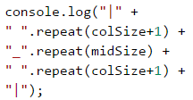
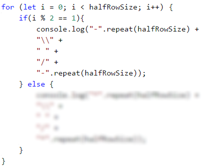
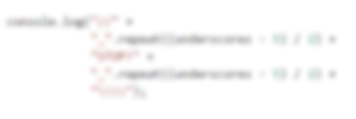
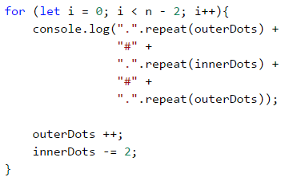

# Chapter 6.2. Nested loops – exam problems

In the previous chapter we introduced **nested loops** and how to use them for **drawing** of various kinds of **figures on the console**. We've learned how to print figures with different sizes, establishing suitable logic construction by using **single and nested `for`** loops in combination with different calculations and program logic:

```javascript
let result = "";

for (let i = 0; i < 10; i++) {
  for (let j = 0; j < 10; j++) {
    result += "*";
  }
  
  console.log(result);
  result = "";
}

```

We also learned the **method `str.repeat(count)`**, which lets you for defined by us **number** of times, a **given string** to be printed:

``` javascript
'abc'.repeat(2); // 'abcabc'
```

## Exam problems

Now let's solve some exam problems to consolidate what we have learned and to develop our algorithmic thinking.

## Problem: Drawing a fortress

Write a program, that reads from the console an **integer n** and draws a **fortress** with width of **2 * n columns** and height of **n rows**, as in the below given examples. The left and the right inner columns have width of **n / 2**.

### Input data

The program input consists one element (argument) - **integer n** within the range [**3 … 1000**].

### Output data

Print on the console **n** text lines, depicting the **fortress**, just as in the examples below.

### Sample input and output

|Input|Output|Input|Output|
|----|----|----|----|
|3|<code>&#47;&#94;&#92;&#47;&#94;&#92;</code><br><code>&#124;&nbsp;&nbsp;&nbsp;&nbsp;&#124;</code><br><code>&#92;&#95;&#47;&#92;&#95;&#47;</code>|4|<code>&#47;&#94;&#94;&#92;&#47;&#94;&#94;&#92;</code><br><code>&#124;&nbsp;&nbsp;&nbsp;&nbsp;&nbsp;&nbsp;&#124;</code><br><code>&#124;&nbsp;&nbsp;&nbsp;&nbsp;&nbsp;&nbsp;&#124;</code><br><code>&#92;&#95;&#95;&#47;&#92;&#95;&#95;&#47;</code><br>|

|Input|Output|Input|Output|
|----|----|----|----|
|5|<code>&#47;&#94;&#94;&#92;&#95;&#95;&#47;&#94;&#94;&#92;</code><br><code>&#124;&nbsp;&nbsp;&nbsp;&nbsp;&nbsp;&nbsp;&nbsp;&nbsp;&#124;</code><br><code>&#124;&nbsp;&nbsp;&nbsp;&nbsp;&nbsp;&nbsp;&nbsp;&nbsp;&#124;</code><br><code>&#124;&nbsp;&nbsp;&nbsp;&#95;&#95;&nbsp;&nbsp;&nbsp;&#124;</code><br><code>&#92;&#95;&#95;&#47;&nbsp;&nbsp;&#92;&#95;&#95;&#47;</code><br>|8|<code>&#47;&#94;&#94;&#94;&#94;&#92;&#95;&#95;&#95;&#95;&#47;&#94;&#94;&#94;&#94;&#92;</code><br><code>&#124;&nbsp;&nbsp;&nbsp;&nbsp;&nbsp;&nbsp;&nbsp;&nbsp;&nbsp;&nbsp;&nbsp;&nbsp;&nbsp;&nbsp;&#124;</code><br><code>&#124;&nbsp;&nbsp;&nbsp;&nbsp;&nbsp;&nbsp;&nbsp;&nbsp;&nbsp;&nbsp;&nbsp;&nbsp;&nbsp;&nbsp;&#124;</code><br><code>&#124;&nbsp;&nbsp;&nbsp;&nbsp;&nbsp;&nbsp;&nbsp;&nbsp;&nbsp;&nbsp;&nbsp;&nbsp;&nbsp;&nbsp;&#124;</code><br><code>&#124;&nbsp;&nbsp;&nbsp;&nbsp;&nbsp;&nbsp;&nbsp;&nbsp;&nbsp;&nbsp;&nbsp;&nbsp;&nbsp;&nbsp;&#124;</code><br><code>&#124;&nbsp;&nbsp;&nbsp;&nbsp;&nbsp;&nbsp;&nbsp;&nbsp;&nbsp;&nbsp;&nbsp;&nbsp;&nbsp;&nbsp;&#124;</code><br><code>&#124;&nbsp;&nbsp;&nbsp;&nbsp;&nbsp;&#95;&#95;&#95;&#95;&nbsp;&nbsp;&nbsp;&nbsp;&nbsp;&#124;</code><br><code>&#92;&#95;&#95;&#95;&#95;&#47;&nbsp;&nbsp;&nbsp;&nbsp;&#92;&#95;&#95;&#95;&#95;&#47;</code><br>|

### Hints and guidelines

By the set task condition we can see that **input data** will contain only one **integer** within the range [**3 … 1000**], therefore we have to create a function, that receives an argument as **array with one element**. Because we have to work with numbers, we can use the method **`Number()`** as a function, to convert the received argument from a **string** type to a number: 


After we've declared and initialized the input data, we have to divide the **fortress** into three parts:
* roof
* body
* base

We can see from the examples, that the **roof** consists of **two towers** and **middle part**. Each tower has a beginning **`/`**, middle part **`^`** and an end **`\`**.

By the set task condition the left and the right inner columns have width of **`n / 2`**, therefore we can save this value in a separate **variable**, keeping in mind, that if we receive an **odd number** as input, the result of dividing by two will be a number with whole and fractional part. In this case we need **only the whole part** (in the set task condition we can see, that when the input is equal to **3** the count of **`^`** in the inner part column is equal to **1**, and at input of **5** it is **3**), we can separate it with the method **`Math.trunc()`** and to save only its value in our new variable:


<table><tr><td></td>
<td>It's aways a good practice, whenever we have an expression with value we intend to use <b>more than once</b>, to keep it in a variable. In this way, on the one hand, our code will be <b>easier to read</b>, and on the other hand, it will be <b>easier to correct</b> possible <b>errors</b>, as we will not have to look for each use of the expression separately. </td>
</tr></table>

We also declare a second **variable**, which will keep **the value** of the part **between the two towers**. By the set task condition, we know that the total width of the fortress is **`n * 2`**. In addition we have two towers with one slash for a start and one slash for an end (a total of 4 characters) and width of **`colSize`**. Therefore, to get the number of characters in the middle part, we have to subtract the size of the towers from the width of entire fortress: **`2 * n - 2 * colSize - 4`**.


To print the **roof** part, on the console we will use **`repeat(n)`** method, that join a given string **n** number of times.


<table><tr><td></td>
<td><strong><code>\</code></strong> is a special symbol in JavaScript and using it solely in the method <strong><code>console.log(…)</code></strong>, the console will not print it out, so with <strong><code>\\</code></strong> we indicate on the console, that we want to print out exactly this character, without interpreting it as special character (<b>we screen it </b>, in English this is called “<b>character escaping</b>”).</td>
</tr></table>

**The fortress body** consists of beginning **`|`**, middle part **`(white spaces)`** and an end **`|`**. **The middle part** of white spaces has width of **`2 * n - 2`**. The count of **rows** for the walls, we can determine from the given examples: **`n - 3`**.


In order to draw penultimate row, which is part of the base, we need to print a beginning **`|`**, middle part **`(white space)_(white space)`** and an end **`|`**. To do this, we can use already declared variables **`colSize`** and **`midSize`**, because as we see from the examples they are equal to the number of **`_`** in the roof.



We add to the value of **white spaces** **`+ 1`**, because in the examples we have **one** white space more.

The structure of the **fortress base** is the same as the one on the **roof**. It includes **two towers** and a **middle part**. Each **tower** begins with **`\`**, followed by middle part with **`_`** and an end with **`/`**.


### Testing in the Judge system

You can test your solution here: [https://judge.softuni.bg/Contests/Practice/Index/936#0](https://judge.softuni.bg/Contests/Practice/Index/936#0).

## Problem: Butterfly

Write a program, that takes **an integer n** from the console and draws **butterfly** with width of **2 * n - 1 columns** and height of **2 * (n - 2) + 1 rows** as in the examples below.  **The left and the right** **part** have **width of n - 1**.

### Input data

The input consists of one element (argument) - **integer n** in the range [**3 … 1000**].

### Output data

Print on the console **2 * (n - 2) + 1**  text rows, representing the **butterfly**, exactly as shown in the examples.

### Sample input and output

|Input|Output|Input|Output|
|---|---|---|---|
|3|<code>&#42;&#92;&nbsp;&#47;&#42;</code><br><code>&nbsp;&nbsp;&#64;&nbsp;&nbsp;</code><br><code>&#42;&#47;&nbsp;&#92;&#42;</code><br>|5|<code>&#42;&#42;&#42;&#92;&nbsp;&#47;&#42;&#42;&#42;</code><br><code>&#45;&#45;&#45;&#92;&nbsp;&#47;&#45;&#45;&#45;</code><br><code>&#42;&#42;&#42;&#92;&nbsp;&#47;&#42;&#42;&#42;</code><br><code>&nbsp;&nbsp;&nbsp;&nbsp;&#64;&nbsp;&nbsp;&nbsp;&nbsp;</code><br><code>&#42;&#42;&#42;&#47;&nbsp;&#92;&#42;&#42;&#42;</code><br><code>&#45;&#45;&#45;&#47;&nbsp;&#92;&#45;&#45;&#45;</code><br><code>&#42;&#42;&#42;&#47;&nbsp;&#92;&#42;&#42;&#42;</code><br>|

|Input|Output|
|---|---|
|7|<code>&#42;&#42;&#42;&#42;&#42;&#92;&nbsp;&#47;&#42;&#42;&#42;&#42;&#42;</code><br><code>&#45;&#45;&#45;&#45;&#45;&#92;&nbsp;&#47;&#45;&#45;&#45;&#45;&#45;</code><br><code>&#42;&#42;&#42;&#42;&#42;&#92;&nbsp;&#47;&#42;&#42;&#42;&#42;&#42;</code><br><code>&#45;&#45;&#45;&#45;&#45;&#92;&nbsp;&#47;&#45;&#45;&#45;&#45;&#45;</code><br><code>&#42;&#42;&#42;&#42;&#42;&#92;&nbsp;&#47;&#42;&#42;&#42;&#42;&#42;</code><br><code>&nbsp;&nbsp;&nbsp;&nbsp;&nbsp;&nbsp;&#64;&nbsp;&nbsp;&nbsp;&nbsp;&nbsp;&nbsp;</code><br><code>&#42;&#42;&#42;&#42;&#42;&#47;&nbsp;&#92;&#42;&#42;&#42;&#42;&#42;</code><br><code>&#45;&#45;&#45;&#45;&#45;&#47;&nbsp;&#92;&#45;&#45;&#45;&#45;&#45;</code><br><code>&#42;&#42;&#42;&#42;&#42;&#47;&nbsp;&#92;&#42;&#42;&#42;&#42;&#42;</code><br><code>&#45;&#45;&#45;&#45;&#45;&#47;&nbsp;&#92;&#45;&#45;&#45;&#45;&#45;</code><br><code>&#42;&#42;&#42;&#42;&#42;&#47;&nbsp;&#92;&#42;&#42;&#42;&#42;&#42;</code><br>|

### Hints and guidelines

Similar to the previous task, we can see from the condition, that the **input data** will consist of only one **integer** in the range [**3 … 1000**]. We create a function, that receives **array of one element** as an argument. Since it's a **text** (**`String`**) type, and we have to work with numbers, we use the **`Number()`** method, to convert it to a number type: 


We can divide the figure into 3 parts - **upper wing**, **body** and **lower wing**. In order to draw the upper wing of the butterfly, we have to divide it into three parts - a beggining with **`*`**, middle part with **`\ /`** and an end with **`*`**. After looking at the examples, we can say that the upper wing of the butterfly is with size **`n - 2`**.


To draw the upper wing we make a loop repeated **`halfRowSize`** times:


We can see in the examples, that on an **even** row we have a beginning **`*`**, middle part **`\ /`** and an end **`*`**, on the other hand on an **odd** row we have a beginning **`-`**, middle part **`\ /`** and an end **`-`**. Therefore, at each iteration of the loop, we have to do **`if-else`** check to see whether the row that we print is even or odd. From the examples given in the set condition, we can see that the number of star characters and dashes on each row is equal to **`n - 2`**, i. e. we can again use the variable **`halfRowSize`** to print them. 



In order to draw the **the butterfly body**, we can again use **variable** **`halfRowSize`** and to print exactly  **one** row on the console. The structure of the body has a beginning **`(white space)`**, middle part **`@`** and an end **`(white space)`**. From the examples we can see, that the number of the white spaces is equal to **`n-1`**. 


What is left now is to print on the console the **lower wing**, which is **analogical to the upper wing**: we only need to swap the places of the slashes.


### Testing in the Judge system

You can test your solution here: [https://judge.softuni.bg/Contests/Practice/Index/936#1](https://judge.softuni.bg/Contests/Practice/Index/936#1).

## Задача: знак "Stop"

Да се напише програма, която приема **цяло число n** и чертае **предупредителен знак STOP** с размери като в примерите по-долу.

### Input data

Входът е състоящ се от един елемент (аргумент)- **цяло число n** в интервала [**3 … 1000**].

### Output data

Да се отпечатат на конзолата текстови редове, изобразяващи **предупредителния знак STOP**, точно както в примерите.

### Примерен вход и изход

|Input|Output|Input|Output|
|----|----|----|----|
|3|<code>....\_\_\_\_\_\_\_....</code><br><code>...//\_\_\_\_\_\\\\...</code><br><code>..//\_\_\_\_\_\_\_\\\\..</code><br><code>.//\_\_\_\_\_\_\_\_\_\\\\.</code><br><code>//\_\_\_STOP!\_\_\_\\\\</code><br><code>\\\\\_\_\_\_\_\_\_\_\_\_\_//</code><br><code>.\\\\\_\_\_\_\_\_\_\_\_//.</code><br><code>..\\\\\_\_\_\_\_\_\_//..</code><br>|6|<code>.......\_\_\_\_\_\_\_\_\_\_\_\_\_.......</code><br><code>......//\_\_\_\_\_\_\_\_\_\_\_\\\\......</code><br><code>.....//\_\_\_\_\_\_\_\_\_\_\_\_\_\\\\.....</code><br><code>....//\_\_\_\_\_\_\_\_\_\_\_\_\_\_\_\\\\....</code><br><code>...//\_\_\_\_\_\_\_\_\_\_\_\_\_\_\_\_\_\\\\...</code><br><code>..//\_\_\_\_\_\_\_\_\_\_\_\_\_\_\_\_\_\_\_\\\\..</code><br><code>.//\_\_\_\_\_\_\_\_\_\_\_\_\_\_\_\_\_\_\_\_\_\\\\.</code><br><code>//\_\_\_\_\_\_\_\_\_STOP!\_\_\_\_\_\_\_\_\_\\\\</code><br><code>\\\\\_\_\_\_\_\_\_\_\_\_\_\_\_\_\_\_\_\_\_\_\_\_\_//</code><br><code>.\\\\\_\_\_\_\_\_\_\_\_\_\_\_\_\_\_\_\_\_\_\_\_//.</code><br><code>..\\\\\_\_\_\_\_\_\_\_\_\_\_\_\_\_\_\_\_\_\_//..</code><br><code>...\\\\\_\_\_\_\_\_\_\_\_\_\_\_\_\_\_\_\_//...</code><br><code>....\\\\\_\_\_\_\_\_\_\_\_\_\_\_\_\_\_//....</code><br><code>.....\\\\_\_\_\_\_\_\_\_\_\_\_\_\_//.....</code><br>|

|Input|Output|
|---|---|
|7|<code>........\_\_\_\_\_\_\_\_\_\_\_\_\_\_\_........</code><br><code>.......//\_\_\_\_\_\_\_\_\_\_\_\_\_\\\\.......</code><br><code>......//\_\_\_\_\_\_\_\_\_\_\_\_\_\_\_\\\\......</code><br><code>.....//\_\_\_\_\_\_\_\_\_\_\_\_\_\_\_\_\_\\\\.....</code><br><code>....//\_\_\_\_\_\_\_\_\_\_\_\_\_\_\_\_\_\_\_\\\\....</code><br><code>...//\_\_\_\_\_\_\_\_\_\_\_\_\_\_\_\_\_\_\_\_\_\\\\...</code><br><code>..//\_\_\_\_\_\_\_\_\_\_\_\_\_\_\_\_\_\_\_\_\_\_\_\\\\..</code><br><code>.//\_\_\_\_\_\_\_\_\_\_\_\_\_\_\_\_\_\_\_\_\_\_\_\_\_\\\\.</code><br><code>//\_\_\_\_\_\_\_\_\_\_\_STOP!\_\_\_\_\_\_\_\_\_\_\_\\\\</code><br><code>\\\\\_\_\_\_\_\_\_\_\_\_\_\_\_\_\_\_\_\_\_\_\_\_\_\_\_\_\_//</code><br><code>.\\\\\_\_\_\_\_\_\_\_\_\_\_\_\_\_\_\_\_\_\_\_\_\_\_\_\_//.</code><br><code>..\\\\\_\_\_\_\_\_\_\_\_\_\_\_\_\_\_\_\_\_\_\_\_\_\_//..</code><br><code>...\\\\\_\_\_\_\_\_\_\_\_\_\_\_\_\_\_\_\_\_\_\_\_//...</code><br><code>....\\\\\_\_\_\_\_\_\_\_\_\_\_\_\_\_\_\_\_\_\_//....</code><br><code>.....\\\\\_\_\_\_\_\_\_\_\_\_\_\_\_\_\_\_\_//.....</code><br><code>......\\\\\_\_\_\_\_\_\_\_\_\_\_\_\_\_\_//......</code><br>|

### Насоки и подсказки

Както при предните задачи, създаваме функция, която приема масив от един елемент и с **`Number()`** го преобразуваме от тип текст (**`String`**) към число:


Можем да **разделим** фигурата на **3 части** - горна, средна и долна. **Горната част** се състои от две подчасти - начален ред и редове, в които знака се разширява. **Началния ред** е съставен от начало **`.`**, среда **`_`** и край **`.`**. След разглеждане на примерите можем да кажем, че началото е с големина **`n + 1`** и е добре да отделим тази **стойност** в отделна **променлива**.


		
Трябва да създадем и втора **променлива**, в която ще пазим **стойността** на **средата на началния ред** с големина **`2 * n + 1`**.


		
След като вече сме декларирали и инициализирали двете променливи, можем да отпечатаме на конзолата началния ред.


		
За да начертаем редовете, в които знака се **"разширява"**, трябва да създадем **цикъл**, който да се завърти **`n`** брой пъти. Структурата на един ред се състои от начало **`.`**, **`//`** + среда **`_`** + **`\\`** и край **`.`**. За да можем да използваме отново създадените **променливи**, трябва да намалим **`dots`** с 1 и **`underscores`** с 2, защото ние вече сме **отпечатали** първия ред, а точките и долните черти в горната част от фигурата на всеки ред **намаляват**. 


		
На всяка следваща итерация **началото** и **краят** намаляват с 1, а **средата** се увеличава с 2.


		
**Средната част** от фигурата има начало **`//`** + **`_`**, среда **`STOP!`** и край **`_`** + **`\\`**. Броят на долните черти **`_`** е **`(underscores - 5) / 2`**.


		
**Долната част** на фигурата, в която знака се **смалява**, можем да направим като отново създадем **цикъл**, който да се завърти **`n`** брой пъти. Структурата на един ред е начало **`.`** + **`\\`**, среда **`_`** и край **`//`** + **`.`**. Броят на **точките** при първата итерация на цикъла трябва да е 0 и на всяка следваща да се **увеличава** с едно. Следователно можем да кажем, че броят на **точките в долната част от фигурата** е равен на **`i`**.

За да работи нашата програма правилно, трябва на всяка итерация от **цикъла** да **намаляваме** броя на **`_`** с **2**.


	
### Тестване в Judge системата

Тествайте решението си тук: [https://judge.softuni.bg/Contests/Practice/Index/936#2](https://judge.softuni.bg/Contests/Practice/Index/936#2).

## Задача: стрелка
Да се напише програма, която приема **цяло нечетно число n** и чертае **вертикална стрелка** с размери като в примерите по-долу.

### Входни данни

Входът се състои от **цяло нечетно число n** (аргумент) в интервала [**3 … 79**].

### Изходни данни
Да се отпечата на конзолата вертикална стрелка, при която "**`#`**" (диез) очертава стрелката, а "**`.`**" - останалото.

### Примерен вход и изход

|Вход|Изход|Вход|Изход|
|----|----|----|----|
|3|<code>.###.</code><br><code>.#.#.</code><br><code>##.##</code><br><code>.#.#.</code><br><code>..#..</code><br>|5|<code>..#####..</code><br><code>..#...#..</code><br><code>..#...#..</code><br><code>..#...#..</code><br><code>###...###</code><br><code>.#.....#.</code><br><code>..#...#..</code><br><code>...#.#...</code><br><code>....#....</code><br>|

|Вход|Изход|
|---|---|
|9|<code>....#########....</code><br><code>....#.......#....</code><br><code>....#.......#....</code><br><code>....#.......#....</code><br><code>....#.......#....</code><br><code>....#.......#....</code><br><code>....#.......#....</code><br><code>....#.......#....</code><br><code>#####.......#####</code><br><code>.#.............#.</code><br><code>..#...........#..</code><br><code>...#.........#...</code><br><code>....#.......#....</code><br><code>.....#.....#.....</code><br><code>......#...#......</code><br><code>.......#.#.......</code><br><code>........#........</code><br>|

### Насоки и подсказки

Както при предните задачи, създаваме функция, която приема масив от един елемент и с **`Number()`** го преобразуваме от текст към число:


		
Можем да разделим фигурата на **3 части** - горна, средна и долна. **Горната част** се състои от две подчасти - начален ред и тяло на стрелката. От примерите виждаме, че броят на **външните точки** в началния ред и в тялото на стрелката са **`(n - 1) / 2`**. Тази стойност можем да запишем в **променлива** **`outerDots`**: 


		
Броят на **вътрешните точки** в тялото на стрелката е **`(n - 2)`**. Трябва да създадем **променлива** с име **`innerDots`**, която  ще пази тази стойност:


		
От примерите можем да видим структурата на началния ред. Трябва да използваме декларираните и инициализирани от нас **променливи** **`outerDots`** и **`n`**, за да отпечатаме **началния ред**:


За да нарисуваме на конзолата **тялото на стрелката**, трябва да създадем **цикъл**, който да се повтори **`n - 2`** пъти:


**Средата на фигурата** е съставена от начало **`#`**, среда **`.`** и край **`#`**. Броят на **`#`** е равен на **`outerDots + 1`**:


За да начертаем **долната част на стрелката**, трябва да зададем нови стойности на двете **променливи** **`outerDots`** и **`innerDots`**:


При всяка итерация **`outerDots`** се увеличава с 1, а **`innerDots`** намалява с 2. Забелязваме, че тъй като на предпоследния ред стойността на **`innerDots`** ще е 1 при последвала итерация на цикъла тя ще стане **отрицателно число**. Ако използваме **метода `str.repeat(count)`** с отрицателно число, програмата ни **ще даде грешка**. Един вариант да избегнем това е да отпечатаме последния ред на фигурата отделно. 

Височината на долната част на стрелката е **`n - 1`**, следователно **цикълът**,  който ще отпечата всички редове без последния, трябва да се завърти **`n - 2`** пъти:


		
**Последният ред** от нашата фигура е съставен от начало **`.`**, среда **`#`** и край **`.`**. Броят на **`.`** е равен на **`outerDots`**:
   


### Тестване в Judge системата

Тествайте решението си тук: [https://judge.softuni.bg/Contests/Practice/Index/936#3](https://judge.softuni.bg/Contests/Practice/Index/936#3).


## Problem: брадва

Да се напише програма, която приема **цяло число n** и чертае брадва с размери, показани по-долу.
Ширината на брадвата е **5 * n**  колони.

### Входни данни

Входът се състои от един елемент (аргумент) - **цяло число n** в интервала [**2..42**].

### Изходни данни

Да се отпечата на конзолата **брадва**, точно както е в примерите.

### Примерен вход и изход

|Вход|Изход|Вход|Изход|
|---|---|---|---|
|2|<code>------\*\*--</code><br><code>------\*-\*-</code><br><code>\*\*\*\*\*\*\*-\*-</code><br><code>------\*\*\*-</code><br>|5|<code>---------------\*\*--------</code><br><code>---------------\*-\*-------</code><br><code>---------------\*--\*------</code><br><code>---------------\*---\*-----</code><br><code>---------------\*----\*----</code><br><code>\*\*\*\*\*\*\*\*\*\*\*\*\*\*\*\*----\*----</code><br><code>\*\*\*\*\*\*\*\*\*\*\*\*\*\*\*\*----\*----</code><br><code>---------------\*----\*----</code><br><code>--------------\*\*\*\*\*\*\*\*---</code><br>|

|Вход|Изход|
|---|---|
|8|<code>------------------------\*\*--------------</code><br><code>------------------------\*-\*-------------</code><br><code>------------------------\*--\*------------</code><br><code>------------------------\*---\*-----------</code><br><code>------------------------\*----\*----------</code><br><code>------------------------\*-----\*---------</code><br><code>------------------------\*------\*--------</code><br><code>------------------------\*-------\*-------</code><br><code>\*\*\*\*\*\*\*\*\*\*\*\*\*\*\*\*\*\*\*\*\*\*\*\*\*-------\*-------</code><br><code>\*\*\*\*\*\*\*\*\*\*\*\*\*\*\*\*\*\*\*\*\*\*\*\*\*-------\*-------</code><br><code>\*\*\*\*\*\*\*\*\*\*\*\*\*\*\*\*\*\*\*\*\*\*\*\*\*-------\*-------</code><br><code>\*\*\*\*\*\*\*\*\*\*\*\*\*\*\*\*\*\*\*\*\*\*\*\*\*-------\*-------</code><br><code>------------------------\*-------\*-------</code><br><code>-----------------------\*---------\*------</code><br><code>----------------------\*-----------\*-----</code><br><code>---------------------\*\*\*\*\*\*\*\*\*\*\*\*\*\*\*----</code><br>|

### Насоки и подсказки

За решението на задачата е нужно първо да изчислим големината на **тиретата отляво**, **средните тирета**, **тиретата отдясно** и цялата дължина на фигурата.


След като сме декларирали и инициализирали **променливите**, можем да започнем да изчертаваме фигурата като започнем с **горната част**. От примерите можем да разберем каква е структурата на **първия ред** и да създадем цикъл, който се повтаря **`n`** на брой пъти. При всяка итерация от цикъла **средните тирета** се увеличават с 1, а **тиретата отдясно** се намаляват с 1.


Сега следва да нарисуваме **дръжката на брадвата**. За да можем да използваме отново създадените **променливи** при чертането на дръжката на брадвата, трябва да намалим **средните тирета** с 1, а **тези отдясно и отляво** да увеличим с 1.


**Дръжката на брадвата** можем да нарисуваме, като завъртим цикъл, който се повтаря **`n / 2`** пъти. Можем да отделим тази стойност в отделна **променлива**, като внимаваме, че ако като входни данни имаме **нечетно число**, при деление на 2 резултатът ще е **реално число** с цяла и дробна част. Тъй като в този случай ни трябва **само цялата част** (от условието на задачата виждаме, че при вход **5** височината на дръжката на брадвата е **2**), можем да използваме метода **`Math.trunc()`**, с който да запазим само нейната стойност в новата ни променлива.

От примерите можем да разберем, каква е структурата на дръжката:


**Долната част** на фигурата, трябва да разделим на две подчасти - **глава на брадвата** и **последния ред от фигурата**. **Главата на брадвата** ще отпечатаме на конзолата, като направим цикъл, който да се повтаря **`axeHeight - 1`** пъти. На всяка итерация **тиретата отляво** и **тиретата отдясно** намаляват с 1, а **средните тирета** се увеличават с 2.


За **последния ред** от фигурата, можем отново да използваме трите, вече декларирани и инициализирани променливи **`leftDashes`**, **`middleDashes`**, **`rightDashes`**.


### Тестване в Judge системата

Тествайте решението си тук: [https://judge.softuni.bg/Contests/Practice/Index/936#4](https://judge.softuni.bg/Contests/Practice/Index/936#4).
