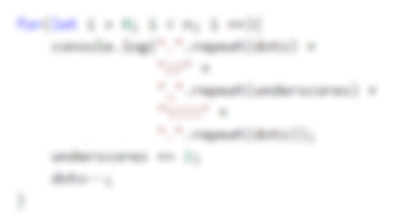
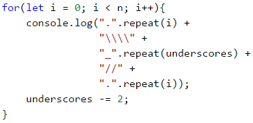
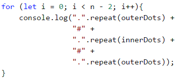
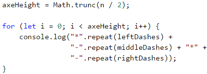
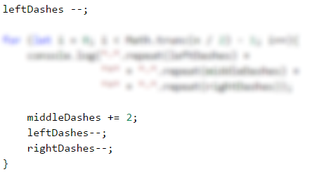

# Chapter 6.2. Nested loops – exam problems

In the previous chapter, we introduced **nested loops** and how to use them for **drawing** various kinds of **figures on the console**. We've learned how to print figures with different sizes, establishing suitable logic construction by using **single and nested `for`** loops in combination with different calculations and program logic:

```JavaScript
let result = "";

for (let i = 0; i < 10; i++) {
  for (let j = 0; j < 10; j++) {
    result += "*";
  }
  
  console.log(result);
  result = "";
}

```

We also learned the **method `str.repeat(count)`**, which lets you for defined by us **number** of times, a **given string** to be printed:

``` JavaScript
'abc'.repeat(2); // 'abcabc'
```

## Exam problems

Now let's solve some exam problems to consolidate what we have learned and to develop our algorithmic thinking.

## Problem: Drawing a fortress

Write a program, that reads from the console an **integer n** and draws a **fortress** with a width of **2 * n columns** and height of **n rows**, as in the below-given examples. The left and the right inner columns have a width of **n / 2**.

### Input data

The program input consists one element (argument) - **integer n** within the range [**3 … 1000**].

### Output data

Print on the console **n** text lines, depicting the **fortress**, just as in the examples below.

### Sample Input and Output

|Input|Output|Input|Output|
|----|----|----|----|
|3|<code>&#47;&#94;&#92;&#47;&#94;&#92;</code><br><code>&#124;&nbsp;&nbsp;&nbsp;&nbsp;&#124;</code><br><code>&#92;&#95;&#47;&#92;&#95;&#47;</code>|4|<code>&#47;&#94;&#94;&#92;&#47;&#94;&#94;&#92;</code><br><code>&#124;&nbsp;&nbsp;&nbsp;&nbsp;&nbsp;&nbsp;&#124;</code><br><code>&#124;&nbsp;&nbsp;&nbsp;&nbsp;&nbsp;&nbsp;&#124;</code><br><code>&#92;&#95;&#95;&#47;&#92;&#95;&#95;&#47;</code><br>|

|Input|Output|Input|Output|
|----|----|----|----|
|5|<code>&#47;&#94;&#94;&#92;&#95;&#95;&#47;&#94;&#94;&#92;</code><br><code>&#124;&nbsp;&nbsp;&nbsp;&nbsp;&nbsp;&nbsp;&nbsp;&nbsp;&#124;</code><br><code>&#124;&nbsp;&nbsp;&nbsp;&nbsp;&nbsp;&nbsp;&nbsp;&nbsp;&#124;</code><br><code>&#124;&nbsp;&nbsp;&nbsp;&#95;&#95;&nbsp;&nbsp;&nbsp;&#124;</code><br><code>&#92;&#95;&#95;&#47;&nbsp;&nbsp;&#92;&#95;&#95;&#47;</code><br>|8|<code>&#47;&#94;&#94;&#94;&#94;&#92;&#95;&#95;&#95;&#95;&#47;&#94;&#94;&#94;&#94;&#92;</code><br><code>&#124;&nbsp;&nbsp;&nbsp;&nbsp;&nbsp;&nbsp;&nbsp;&nbsp;&nbsp;&nbsp;&nbsp;&nbsp;&nbsp;&nbsp;&#124;</code><br><code>&#124;&nbsp;&nbsp;&nbsp;&nbsp;&nbsp;&nbsp;&nbsp;&nbsp;&nbsp;&nbsp;&nbsp;&nbsp;&nbsp;&nbsp;&#124;</code><br><code>&#124;&nbsp;&nbsp;&nbsp;&nbsp;&nbsp;&nbsp;&nbsp;&nbsp;&nbsp;&nbsp;&nbsp;&nbsp;&nbsp;&nbsp;&#124;</code><br><code>&#124;&nbsp;&nbsp;&nbsp;&nbsp;&nbsp;&nbsp;&nbsp;&nbsp;&nbsp;&nbsp;&nbsp;&nbsp;&nbsp;&nbsp;&#124;</code><br><code>&#124;&nbsp;&nbsp;&nbsp;&nbsp;&nbsp;&nbsp;&nbsp;&nbsp;&nbsp;&nbsp;&nbsp;&nbsp;&nbsp;&nbsp;&#124;</code><br><code>&#124;&nbsp;&nbsp;&nbsp;&nbsp;&nbsp;&#95;&#95;&#95;&#95;&nbsp;&nbsp;&nbsp;&nbsp;&nbsp;&#124;</code><br><code>&#92;&#95;&#95;&#95;&#95;&#47;&nbsp;&nbsp;&nbsp;&nbsp;&#92;&#95;&#95;&#95;&#95;&#47;</code><br>|

### Hints and guidelines

By the set task condition, we can see that the **input data** will contain only one **integer** within the range [**3 … 1000**], therefore we have to create a function, that receives as argument an **array with one element**. Because we have to work with numbers, we can use the method **`Number()`** as a function, to convert the received argument from a **string** to a number type: 


After we've declared and initialized the input data, we have to divide the **fortress** into three parts:
* roof
* body
* base

We can see from the examples, that the **roof** consists of **two towers** and **a middle part**. Each tower has a beginning **`/`**, middle part **`^`** and an end **`\`**.

By the set task condition the left and the right inner columns have a width of **`n / 2`**, therefore we can save this value as a separate **variable**, keeping in mind, that if we receive an **odd number** as input, the result of dividing by two will be a number with a whole and fractional part. In this case, we need **only the whole part** (in the set task condition we can see, that when the input is equal to **3** the count of **`^`** in the inner part column is equal to **1**, and input of **5** it is **3**), we can separate it with the method **`Math.trunc()`** and to save only its value in our new variable:


<table><tr><td></td>
<td>It's always a good practice, whenever we have an expression with value we intend to use <b>more than once</b>, to keep it in a variable. In this way, on the one hand, our code will be <b>easier to read</b>, and on the other hand, it will be <b>easier to correct</b> possible <b>errors</b>, as we will not have to look for each use of the expression separately. </td>
</tr></table>

We also declare a second **variable**, which will keep **the value** of the part **between the two towers**. By the set task condition, we know that the total width of the fortress is **`n * 2`**. In addition, we have two towers with one slash for a start and one slash for an end (a total of 4 characters) and a width of **`colSize`**. Therefore, to get the number of characters in the middle part, we have to subtract the size of the towers from the width of the entire fortress: **`2 * n - 2 * colSize - 4`**.


To print the **roof** part, on the console we will use the **`repeat(n)`** method, which joins a given string **n** number of times.


<table><tr><td></td>
<td><strong><code>\</code></strong> is a special symbol in JavaScript and using it solely in the method <strong><code>console.log(…)</code></strong>, the console will not print it out, so with <strong><code>\\</code></strong> we indicate on the console, that we want to print out exactly this character, without interpreting it as special character (<b>we screen it </b>, in English this is called “<b>character escaping</b>”).</td>
</tr></table>

**The fortress body** consists of beginning **`|`**, middle part **`(white spaces)`** and an end **`|`**. **The middle part** of white spaces has a width of **`2 * n - 2`**. The number of **rows** for the walls can be determined from the given examples: **`n - 3`**.


In order to draw a penultimate row, which is part of the base, we need to print a beginning **`|`**, middle part **`(white space)_(white space)`** and an end **`|`**. To do this, we can use already declared variables **`colSize`** and **`midSize`** because as we see from the examples they are equal to the number of **`_`** in the roof.


We add to the value of **white spaces** **`+ 1`**, because in the examples we have **one** white space more.

The structure of the **fortress base** is the same as the one in the **roof**. It includes **two towers** and **middle part**. Each **tower** begins with **`\`**, followed by a middle part **`_`** and an end **`/`**.


### Testing in The Judge System

You can test your solution here: [https://judge.softuni.org/Contests/Practice/Index/936#0](https://judge.softuni.org/Contests/Practice/Index/936#0).

## Problem: Butterfly

Write a program, that takes **an integer n** from the console and draws **butterfly** with width of **2 * n - 1 columns** and height of **2 * (n - 2) + 1 rows** as in the examples below.  **The left and the right** **part** have **width of n - 1**.

### Input data

The input consists of one element (argument) - **integer n** in the range [**3 … 1000**].

### Output data

Print on the console **2 * (n - 2) + 1**  text rows, representing the **butterfly**, exactly as shown in the examples.

### Sample Input and Output

|Input|Output|Input|Output|
|---|---|---|---|
|3|<code>&#42;&#92;&nbsp;&#47;&#42;</code><br><code>&nbsp;&nbsp;&#64;&nbsp;&nbsp;</code><br><code>&#42;&#47;&nbsp;&#92;&#42;</code><br>|5|<code>&#42;&#42;&#42;&#92;&nbsp;&#47;&#42;&#42;&#42;</code><br><code>&#45;&#45;&#45;&#92;&nbsp;&#47;&#45;&#45;&#45;</code><br><code>&#42;&#42;&#42;&#92;&nbsp;&#47;&#42;&#42;&#42;</code><br><code>&nbsp;&nbsp;&nbsp;&nbsp;&#64;&nbsp;&nbsp;&nbsp;&nbsp;</code><br><code>&#42;&#42;&#42;&#47;&nbsp;&#92;&#42;&#42;&#42;</code><br><code>&#45;&#45;&#45;&#47;&nbsp;&#92;&#45;&#45;&#45;</code><br><code>&#42;&#42;&#42;&#47;&nbsp;&#92;&#42;&#42;&#42;</code><br>|

|Input|Output|
|---|---|
|7|<code>&#42;&#42;&#42;&#42;&#42;&#92;&nbsp;&#47;&#42;&#42;&#42;&#42;&#42;</code><br><code>&#45;&#45;&#45;&#45;&#45;&#92;&nbsp;&#47;&#45;&#45;&#45;&#45;&#45;</code><br><code>&#42;&#42;&#42;&#42;&#42;&#92;&nbsp;&#47;&#42;&#42;&#42;&#42;&#42;</code><br><code>&#45;&#45;&#45;&#45;&#45;&#92;&nbsp;&#47;&#45;&#45;&#45;&#45;&#45;</code><br><code>&#42;&#42;&#42;&#42;&#42;&#92;&nbsp;&#47;&#42;&#42;&#42;&#42;&#42;</code><br><code>&nbsp;&nbsp;&nbsp;&nbsp;&nbsp;&nbsp;&#64;&nbsp;&nbsp;&nbsp;&nbsp;&nbsp;&nbsp;</code><br><code>&#42;&#42;&#42;&#42;&#42;&#47;&nbsp;&#92;&#42;&#42;&#42;&#42;&#42;</code><br><code>&#45;&#45;&#45;&#45;&#45;&#47;&nbsp;&#92;&#45;&#45;&#45;&#45;&#45;</code><br><code>&#42;&#42;&#42;&#42;&#42;&#47;&nbsp;&#92;&#42;&#42;&#42;&#42;&#42;</code><br><code>&#45;&#45;&#45;&#45;&#45;&#47;&nbsp;&#92;&#45;&#45;&#45;&#45;&#45;</code><br><code>&#42;&#42;&#42;&#42;&#42;&#47;&nbsp;&#92;&#42;&#42;&#42;&#42;&#42;</code><br>|

### Hints and guidelines

Similar to the previous task, we can see from the condition, that the **input data** will consist of only one **integer** in the range [**3 … 1000**]. We create a function, that receives **array of one element** as an argument. Since it's a **text** (**`String`**) type, and we have to work with numbers, we use the **`Number()`** method, to convert it to a number type: 


We can divide the figure into 3 parts - **upper wing**, **body** and **lower wing**. In order to draw the upper wing of the butterfly, we have to divide it into three parts - a beginning with **`*`**, a middle part with **`\ /`** and an end with **`*`**. After looking at the examples, we can say that the upper wing of the butterfly is with a size of**`n - 2`**.


To draw the upper wing we make a loop repeated **`halfRowSize`** number of times:


We can see in the examples, that on an **even** row we have a beginning **`*`**, middle part **`\ /`** and an end **`*`**, on the other hand on an **odd** row we have a beginning **`-`**, middle part **`\ /`** and an end **`-`**. Therefore, at each iteration of the loop, we have to do an **`if-else`** check to see whether the row that we print is even or odd. From the examples given in the set condition, we can see that the number of star characters and dashes on each row is equal to **`n - 2`**, i. e. we can use again the variable **`halfRowSize`** to print them. 


In order to draw the **the butterfly body**, we can use again **the variable** **`halfRowSize`** and to print exactly  **one** row on the console. The structure of the body has a beginning **`(white space)`**, middle part **`@`** and an end **`(white space)`**. From the examples we can see, that the number of the white spaces is equal to **`n-1`**. 


What is left now is to print on the console the **lower wing**, which is **analogical to the upper wing**: we only need to swap the places of the slashes.


### Testing in The Judge System

You can test your solution here: [https://judge.softuni.org/Contests/Practice/Index/936#1](https://judge.softuni.org/Contests/Practice/Index/936#1).

## Problem: "Stop" sign

Write a program, that takes an **integer n** from the console and draws **a STOP warning sign** with size as shown in the examples below.

### Input data

The input consists of one element (argument) - **integer n** in the range [**3 … 1000**].

### Output data

Print on the console text lines, representing **the STOP warning sign**, just as in the examples.

### Sample Input and Output

|Input|Output|Input|Output|
|----|----|----|----|
|3|<code>....\_\_\_\_\_\_\_....</code><br><code>...//\_\_\_\_\_\\\\...</code><br><code>..//\_\_\_\_\_\_\_\\\\..</code><br><code>.//\_\_\_\_\_\_\_\_\_\\\\.</code><br><code>//\_\_\_STOP!\_\_\_\\\\</code><br><code>\\\\\_\_\_\_\_\_\_\_\_\_\_//</code><br><code>.\\\\\_\_\_\_\_\_\_\_\_//.</code><br><code>..\\\\\_\_\_\_\_\_\_//..</code><br>|6|<code>.......\_\_\_\_\_\_\_\_\_\_\_\_\_.......</code><br><code>......//\_\_\_\_\_\_\_\_\_\_\_\\\\......</code><br><code>.....//\_\_\_\_\_\_\_\_\_\_\_\_\_\\\\.....</code><br><code>....//\_\_\_\_\_\_\_\_\_\_\_\_\_\_\_\\\\....</code><br><code>...//\_\_\_\_\_\_\_\_\_\_\_\_\_\_\_\_\_\\\\...</code><br><code>..//\_\_\_\_\_\_\_\_\_\_\_\_\_\_\_\_\_\_\_\\\\..</code><br><code>.//\_\_\_\_\_\_\_\_\_\_\_\_\_\_\_\_\_\_\_\_\_\\\\.</code><br><code>//\_\_\_\_\_\_\_\_\_STOP!\_\_\_\_\_\_\_\_\_\\\\</code><br><code>\\\\\_\_\_\_\_\_\_\_\_\_\_\_\_\_\_\_\_\_\_\_\_\_\_//</code><br><code>.\\\\\_\_\_\_\_\_\_\_\_\_\_\_\_\_\_\_\_\_\_\_\_//.</code><br><code>..\\\\\_\_\_\_\_\_\_\_\_\_\_\_\_\_\_\_\_\_\_//..</code><br><code>...\\\\\_\_\_\_\_\_\_\_\_\_\_\_\_\_\_\_\_//...</code><br><code>....\\\\\_\_\_\_\_\_\_\_\_\_\_\_\_\_\_//....</code><br><code>.....\\\\_\_\_\_\_\_\_\_\_\_\_\_\_//.....</code><br>|

|Input|Output|
|---|---|
|7|<code>........\_\_\_\_\_\_\_\_\_\_\_\_\_\_\_........</code><br><code>.......//\_\_\_\_\_\_\_\_\_\_\_\_\_\\\\.......</code><br><code>......//\_\_\_\_\_\_\_\_\_\_\_\_\_\_\_\\\\......</code><br><code>.....//\_\_\_\_\_\_\_\_\_\_\_\_\_\_\_\_\_\\\\.....</code><br><code>....//\_\_\_\_\_\_\_\_\_\_\_\_\_\_\_\_\_\_\_\\\\....</code><br><code>...//\_\_\_\_\_\_\_\_\_\_\_\_\_\_\_\_\_\_\_\_\_\\\\...</code><br><code>..//\_\_\_\_\_\_\_\_\_\_\_\_\_\_\_\_\_\_\_\_\_\_\_\\\\..</code><br><code>.//\_\_\_\_\_\_\_\_\_\_\_\_\_\_\_\_\_\_\_\_\_\_\_\_\_\\\\.</code><br><code>//\_\_\_\_\_\_\_\_\_\_\_STOP!\_\_\_\_\_\_\_\_\_\_\_\\\\</code><br><code>\\\\\_\_\_\_\_\_\_\_\_\_\_\_\_\_\_\_\_\_\_\_\_\_\_\_\_\_\_//</code><br><code>.\\\\\_\_\_\_\_\_\_\_\_\_\_\_\_\_\_\_\_\_\_\_\_\_\_\_\_//.</code><br><code>..\\\\\_\_\_\_\_\_\_\_\_\_\_\_\_\_\_\_\_\_\_\_\_\_\_//..</code><br><code>...\\\\\_\_\_\_\_\_\_\_\_\_\_\_\_\_\_\_\_\_\_\_\_//...</code><br><code>....\\\\\_\_\_\_\_\_\_\_\_\_\_\_\_\_\_\_\_\_\_//....</code><br><code>.....\\\\\_\_\_\_\_\_\_\_\_\_\_\_\_\_\_\_\_//.....</code><br><code>......\\\\\_\_\_\_\_\_\_\_\_\_\_\_\_\_\_//......</code><br>|

### Hints and guidelines

As in the previous examples, we have to create a function that takes an array of one element and using the Number() method, we convert it from text (String) type to number type:


We can **divide** the figure into **three parts** - upper, middle and lower. **The upper part** consists of two subparts - a starting line and lines in which the sign widens. **The starting line** consists of beginning **`.`**, middle part **`_`** and an end **`.`**. After looking at the examples, we can see that the beginning has a size of **`n + 1`** and it's better to keep this **value** as a separate **variable**.


		
We also have to create a second **variable**, in which we will keep **the value** of the **first row middle part** which has a size of **`2 * n + 1`**.


		
Once we have declared and initialized the two variables, we can print the first row on the console.


		
In order to draw the rows in which the sign is getting **"wider"**, we have to create a **loop**, that iterates **`n`** number of times. The row structure consists of a beginning **`.`**, **`//`** + middle part **`_`** + **`\\`** and an end **`.`**. In order to reuse the already created **variables**, we have to decrease **`dots`** by 1 and **`underscores`** by 2, because we've already **printed** the first row, and the dots and underscores in the top part of the figure are **decreasing** on each row.


		
At each subsequent iteration **the beginning** and **the end** decrease by 1, and **the middle part** increases by 2.


		
**The middle part** of the figure begins with **`//`** + **`_`**, middle part **`STOP!`** and an end **`_`** + **`\\`**. The count of the underscores **`_`** is **`(underscores - 5) / 2`**.


		
**The lower part** of the figure, in which the width of the sign **decreases**, can be done by creating a **loop**, that iterates **`n`** number of times. The structure of a row should have a beginning **`.`** + **`\\`**, middle part **`_`** and an end **`//`** + **`.`**. The number of the **dots** in the first loop iteration has to be 0 and on each subsequent have to **increase** by one. Therefore we can say that the **the dots in the lower part of the figure** are equal to **`i`**.

To ensure proper operation of our program, on each **loop** iteration, we have to **decrease** the number of **`_`** by **2**.


	
### Testing in The Judge System

You can test your solution here: [https://judge.softuni.org/Contests/Practice/Index/936#2](https://judge.softuni.org/Contests/Practice/Index/936#2).

## Problem: Arrow
Write a program that receives from the console **an odd integer n** and draws **a vertical arrow** with size as in the examples below.

### Input data

The input is **an odd integer n** (argument) within the range [**3 … 79**].

### Output data
Print on the console a vertical arrow, in which "**`#`**" (hash sign) marks the outline of the arrow, and "**`.`**" - the rest.

### Sample Input and Output

|Input|Output|Input|Output|
|----|----|----|----|
|3|<code>.###.</code><br><code>.#.#.</code><br><code>##.##</code><br><code>.#.#.</code><br><code>..#..</code><br>|5|<code>..#####..</code><br><code>..#...#..</code><br><code>..#...#..</code><br><code>..#...#..</code><br><code>###...###</code><br><code>.#.....#.</code><br><code>..#...#..</code><br><code>...#.#...</code><br><code>....#....</code><br>|

|Input|Output|
|---|---|
|9|<code>....#########....</code><br><code>....#.......#....</code><br><code>....#.......#....</code><br><code>....#.......#....</code><br><code>....#.......#....</code><br><code>....#.......#....</code><br><code>....#.......#....</code><br><code>....#.......#....</code><br><code>#####.......#####</code><br><code>.#.............#.</code><br><code>..#...........#..</code><br><code>...#.........#...</code><br><code>....#.......#....</code><br><code>.....#.....#.....</code><br><code>......#...#......</code><br><code>.......#.#.......</code><br><code>........#........</code><br>|

### Hints and guidelines

As on the previous examples, we have to create a function, that receives an array with one element, and using the **`Number()`** method, to convert it from text to a number type:


		
We can divide the figure into **3 parts** - upper, middle and lower. **The upper part** consists of two subparts - first row and body of the arrow. We can see from the examples, that the count of  **the outer dots** in the first row and in the body of the arrow are equal to **`(n - 1) / 2`**. We can keep this value in **a variable** **`outerDots`**:


		
The count of **the inner dots** in the body of the arrow is equal to **`(n - 2)`**. We have to create **the variable** **`innerDots`**, which will keep this value:


		
We can see from the examples the structure of the first row. We can use the declared and initialized by us **variables** **`outerDots`** and **`n`**, in order to print **the first row**:


To draw **the body of the arrow**, we have to create **a loop**, which iterates **`n - 2`** number of times:



**The middle part of the figure** is made of a beginning **`#`**, middle part **`.`** and an end **`#`**. The count of **`#`** is equal to **`outerDots + 1`**:


In order to draw **the lower part of the arrow**, we have to assign new values of the two **variables** **`outerDots`** and **`innerDots`**:


On each loop iteration **`outerDots`** increases by 1, and **`innerDots`** decreases by 2. We can notice, that on the penultimate row the **`innerDots`** value will be 1 and on each subsequent loop iteration will be a **negative number**. If we use **the method `str.repeat(count)`** with a negative number, the program will **throw an error**. In order to avoid that we can print the last row of the figure separately.

The height of the lower part of the arrow is **`n - 1`**, therefore **the loop**,  that will print all the rows, except the last one, have to iterate **`n - 2`** number of times:


		
**The last row** of our figure is made of a beginning **`.`**, middle part **`#`** and an end **`.`**. The count of **`.`** is equal to **`outerDots`**:
   


### Testing in The Judge System

You can test your solution here: [https://judge.softuni.org/Contests/Practice/Index/936#3](https://judge.softuni.org/Contests/Practice/Index/936#3).


## Problem: Axe

Write a program, that receives **an integer n** and draws an axe with size as in the example below.
The width of the axe is **5 * n** columns.

### Input data

The input consists one element (argument) - **integer n** within range [**2..42**].

### Output data

Print on the console **axe**, as in the examples.

### Sample Input and Output

|Input|Output|Input|Output|
|---|---|---|---|
|2|<code>------\*\*--</code><br><code>------\*-\*-</code><br><code>\*\*\*\*\*\*\*-\*-</code><br><code>------\*\*\*-</code><br>|5|<code>---------------\*\*--------</code><br><code>---------------\*-\*-------</code><br><code>---------------\*--\*------</code><br><code>---------------\*---\*-----</code><br><code>---------------\*----\*----</code><br><code>\*\*\*\*\*\*\*\*\*\*\*\*\*\*\*\*----\*----</code><br><code>\*\*\*\*\*\*\*\*\*\*\*\*\*\*\*\*----\*----</code><br><code>---------------\*----\*----</code><br><code>--------------\*\*\*\*\*\*\*\*---</code><br>|

|Input|Output|
|---|---|
|8|<code>------------------------\*\*--------------</code><br><code>------------------------\*-\*-------------</code><br><code>------------------------\*--\*------------</code><br><code>------------------------\*---\*-----------</code><br><code>------------------------\*----\*----------</code><br><code>------------------------\*-----\*---------</code><br><code>------------------------\*------\*--------</code><br><code>------------------------\*-------\*-------</code><br><code>\*\*\*\*\*\*\*\*\*\*\*\*\*\*\*\*\*\*\*\*\*\*\*\*\*-------\*-------</code><br><code>\*\*\*\*\*\*\*\*\*\*\*\*\*\*\*\*\*\*\*\*\*\*\*\*\*-------\*-------</code><br><code>\*\*\*\*\*\*\*\*\*\*\*\*\*\*\*\*\*\*\*\*\*\*\*\*\*-------\*-------</code><br><code>\*\*\*\*\*\*\*\*\*\*\*\*\*\*\*\*\*\*\*\*\*\*\*\*\*-------\*-------</code><br><code>------------------------\*-------\*-------</code><br><code>-----------------------\*---------\*------</code><br><code>----------------------\*-----------\*-----</code><br><code>---------------------\*\*\*\*\*\*\*\*\*\*\*\*\*\*\*----</code><br>|

### Hints and guidelines

In order to solve the problem we have to calculate the **the dashes in the left**, **the dashes in the middle**, **the dashes in the right** and the whole figure length.


Once we have declared and initialized the **variables**, we can draw the figure, starting with the **upper part**. We can see from the examples what the structure of **the first row** is and we can create a loop that iterates **`n`** number of times. At each loop iteration **the middle dashes** are increasing by 1, and the **right dashes** are decreasing by 1.


Now we have to draw the **the handle of the axe**. In order to be able to use the newly created **variables**, when drawing the handle of the axe, we have to decrease **the middle dashes** by 1 and to increase **these on the left and right** by 1.


**The handle of the axe** we can draw, by iterating a loop that repeats **`n / 2`** number of times. We can set this value into separate **variable**, considering that when dividing **odd number** inputs by 2 the result will be **a real number** with a whole and fractional part. Since in this case we need **only the whole part** (from the example condition we see that at input **5** the height of the axe handle is **2**), we can use the **`Math.trunc()`** method, to save only its value in our new variable.

We get the structure of the handle from the examples given:



**The lower part** of the figure, should be divided into two subparts  - the **head of the axe** and the **last row of the figure**. We will print on the console **the head of the axe**, by making a self iterating loop **`axeHeight - 1`** number of times. On each iteration **the left dashes** and **the right dashes** decrease by 1, and **the middle dashes** increase by 2.



For **the last row** of the figure, we can use again, the already declared variables **`leftDashes`**, **`middleDashes`**, **`rightDashes`**.


### Testing in The Judge System

You can test your solution here: [https://judge.softuni.org/Contests/Practice/Index/936#4](https://judge.softuni.org/Contests/Practice/Index/936#4).
