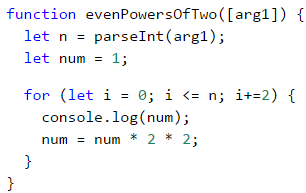
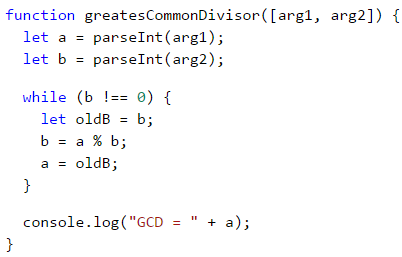
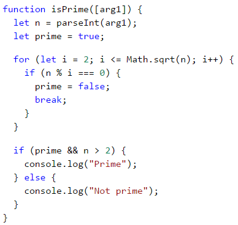
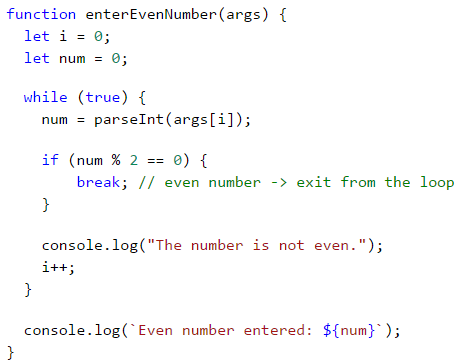
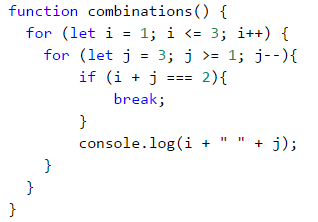
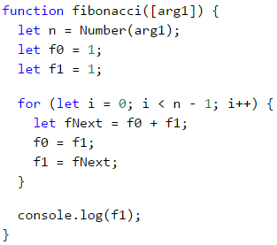

# Chapter 7.1. Complex loops

Since we have learned what **`for`** loops are and their function in code, now is the time to take a look at **other loop types**, as well as some **more complex loop constructs**. These will expand our knowledge and help us solve more challenging problems. In particular, we will discuss how to use the folowing programming constructs:

  * loops **with step aka stride**
  * **`while`** loops
  * **`do-while`** loops
  * **infinite** loops

In the current chapter we will also take a look at the **`break`** operator and **how** to emply it to **interrupt** a loop.


## Video

<div class="video-player">
  Watch the video course for this chapter: <a target="_blank"
  href="https://www.youtube.com/watch?v=KuaOHr3RpNs">
  https://www.youtube.com/watch?v=KuaOHr3RpNs</a>.
</div>


## Loops with stride

In the **"Loops (Repetitions)"** chapter we learned how the **`for`** loop works and we already know when and to what purpose to use it. In the present chapter we will **take a look** at a perticular and a very important **part of this structure** - its **step** or as it is also known **stride**.  

### Loop with a Step – Explanation

The **stride** is the **part** of the **`for`** loop, that specifys the **amount** used to **increment** or **decrement** the **main** variable. The **step** is declared in the skeleton of the **`for`** loop.

Most often we have a **size of `1`** and in this case, instead of writing **`i += 1`** or **`i -= 1`**, we can use the shorthand operators **`i++`** or **`i--`**. In case we need the stride to be **different than 1**, when increasing we use the shorthand **`i +=` + `required stride`**, and when we decrease **`i -=` + `required stride`**. With a step of 3 the loop would appear as below: 


Here is a series of sample problems, the solution of which will help us better understand the use of a **step** in a **`for`** loop.

### Example: Numbers from 1 to N with a step of 3

Write a program that prints the numbers **from 1 to n** with a **stride of 3**. For example, **if n = 100**, then the output would be: **1, 4, 7, 10, …, 94, 97, 100**.

We can solve the problem using the following sequence of actions (algorithm):

  * We create a function that will take the number **`n`**.
  * We run a **`for` loop from 1** to **`n`** with a stride of **3**.
  * in the **body of the loop**, we print the value of the current step.
  


#### Testing in the Judge System

You can test your solution at the following link: [https://judge.softuni.bg/Contests/Practice/Index/937#0](https://judge.softuni.bg/Contests/Practice/Index/937#0).

### Example: Numbers from N to 1 in reverse

Write a program that prints the numbers **from n to 1 in reverse** (step -1). For example, **if n = 100**, then the output will be: **100, 99, 98, …, 3, 2, 1**.

We can solve the problem in the folowing manner:

  * We create a function that will take the number **`n`**.
  * We run a **`for` loop**, by assigning **`let i = n`** .
  * We reverse the contidion of the loop: **`i >= 1`**.
  * We define the stride size: **-1**.
  * in the **body of the loop**, we print the value of the current step.


#### Testing in the Judge System

You can test your solution at the following link: [https://judge.softuni.bg/Contests/Practice/Index/937#1](https://judge.softuni.bg/Contests/Practice/Index/937#1).

### Example: Numbers from 1 to 2^n with a for loop

In the folowing example we will use the standard size 1 stride.

Write a program that prints the numbers **from 1 to 2^n** (two to the power of n). For example, **if n = 10**, then the output would be **1, 2, 4, 8, 16, 32, 64, 128, 256, 512, 1024**.


#### Testing in the Judge System

You can test your solution at the following link: [https://judge.softuni.bg/Contests/Practice/Index/937#2](https://judge.softuni.bg/Contests/Practice/Index/937#2).

### Example: Even Powers of 2

Print the **even** powers of **2** until **2^n**: **2^0, 2^2, 2^4, 2^8, …, 2^n**. For example, if **n = 10**, then the output would be **1, 4, 16, 64, 256, 1024**.

Here is how we can solve the problem:

  * We create a function that will take the number **`n`**.
  * We declare a variable **`num`** that will hold the current number and we assign it the initial **value of 1**.
  * For the **step** of the loop we set a value of **2**.
  * In the **body of the loop**: we print the value if the current number and **increase the current number `num` 4 times** (as per the problem description).



#### Testing in the Judge System

You can test your solution at the following link: [https://judge.softuni.bg/Contests/Practice/Index/937#3](https://judge.softuni.bg/Contests/Practice/Index/937#3).

## While loop

The next type of loops that we will familiarize wiht are called **`while` loops**. The special thing about them is that they repeat a comand block **while a condition is met**. Their structure is a bit different that that of the **`for`** loops, however they boast a simpler sintax.


### While Loop – Explanation

In programming the **`while` loop** is used when we want to **repeat** the execution of a specific logic block, until **a specific condition is met**. Any expression that returns either **`true`** or **`false`** (a Boolean) can be used as a "**condition**". When the **condition** becomes **invalid**, the **`while`** loop **is interrupted** and the program **proceeds** to execute the code after the loop. The **`while` loop** structure looks like this:


Here is a series of sample problems, the solutions of which will help us better understand the use of the **`while`**  loop.


### Example: Sequence of Numbers 2k+1

Write a program that prints **all numbers ≤ n** in the series: **1, 3, 7, 15, 31, …**, assuming that each number is generated according to the folowing formula nextNumber = **previousNumber \* 2 + 1**.

Here is how we can solve the problem:

* We create a function that will take the number **`n`**.
* We declare a variable **`num`** that will hold the current number and we assign it the initial **value of 1**.
* Fpr loop condition we use **the current number <= n**.
* in the **body of the loop**: we print the value of the vurrent number and increase the current number by using the formula above.

Here is a sample implementation of this idea:


 
#### Testing in the Judge System

You can test your solution here: [https://judge.softuni.bg/Contests/Practice/Index/937#4](https://judge.softuni.bg/Contests/Practice/Index/937#1).

### Example: Number in Range [1 … 100]

Enter an integer in the range [**1 … 100**]. If the entered number is **invalid**, enter **another**. In this case an invalid number would be any number that is **outside** the given range.

To solve the problem, we can use the following algorithm:

* We declare a variable **`i`**, to which we assign the initial value **0**. Through wich we save the position of each argument passed to our function.
* We declare a variable **`num`**, to which we assign the integer part of the first argument, passed to the function.
* For a loop condition, we put an expression that is **`true`**, if the number **is not** in the range specified in the problem description.
* On the **body of the loop**: we increment **`i`**, so that at the next loop cycle we can take the next number passed to our function. We print the message "**Invalid number!**" on the console, afterwards we assign a new value to **`num`** (the next argument, passed to our function).
* Once we have validated the entered number, we print its value outside the body of the loop.

Here is a sample implementation of the algorithm using a **`while` loop**:


#### Testing in the Judge System

You can test your solution here: [https://judge.softuni.bg/Contests/Practice/Index/937#5](https://judge.softuni.bg/Contests/Practice/Index/937#5).


## Greatest Common Divisor (GCD)

Before proceeding to the next problem, we should become familiar with the definition of the greatest common divisor (GCD).

**Definition if GCD**: the greatest common divisor of two **natural** numbers **a** and **b** is the largest number that **divides both** **a** and **b** without reminder. For exampe:


|a|b|GCD| 
|:---:|:---:|:---:| 
|24|16|8|
|67|18|1|
|12|24|12|
|15|9|3|
|10|10|10|
|100|88|4|

## The Euclidean Algorithm

In the next problem we will use one of the first published algorithms for finding the GCD – **Euclid's algorithm**:

**Until** we have a ramainder of 0:

* We divide the greater number by the smaller one.
* We take the remainder of the division.

Euclid's algorithm **pseudo-code**:

```javascript
while b ≠ 0
  var oldB = b;
  b = a % b;
  a = oldB;
print а;
```

### Example: Greatest Common Divisor (GCD)

Enter the **integers** **a** and **b** and find **GCD(a, b)**.

We will solve the problem by implementing **Euclid's algorithm**:

* We declare variables **`a`** and **`b`**, to which we assign the **integer** values, passed to our function.
* For loop condition we use an expression that is **`true`**, if the number **`b`** **is different** than **0**.
* In the **body of the loop** we follow the instructions from the pseudo-code:
   * We create a temporary variable to which we assign the **current** value of **`b`**.
   * We assign a new value to **`b`**, which is the remainder of the division of **`a`** and **`b`**.
   * On the variable **`a`** we assign the **previous** value of the variable **`b`**.
* Once the loop is complete and we have found the GCD, we print it on the screen.



#### Testing in the Judge System

You can test your solution here: [https://judge.softuni.bg/Contests/Practice/Index/937#6](https://judge.softuni.bg/Contests/Practice/Index/937#6).

## Do-while loop

The next type of loops we will study is the **`do-while`** loop. By structure it resembles the **`while`**, but with a significant difference. The **`do-while`** will execute its body **at least once**. Why is this? In the **`do-while`** loop structure, the **condition** is always checked **after** the body, which ensures that the **first loop iteration** will **execute** the code and the check for **the end of the loop** will be applied to each **subsequent** iteration of the **`do-while`**. 


Now we should proceed with the usual set of practical problems, that wull help us better understand the **`do-while`** loop.


### Example: Calculating Factorial

For natural **n** number, calculate **n! = 1 \* 2 \* 3 \* … \* n**. For example, if **n = 5**, то резултатът ще бъде: **5!** = 1 \* 2 \* 3 \* 4 \* 5 = **120**.

Here is how we can calculate factorial in more detail:

* We declare the variable **`n`**, to which we assign the integer value, passed to our function.
* We declare another variable - **`fact`**, with initial value of 1. We will use it in calculation and to store the factorial value.
* For loop condition we will use **`n > 1`**, because each time we perform the calculations in the body of the loop, we will decrease the value of **`n`** by 1.
* In the body of the loop:
   * We assign a new value to **`fact`**, which value is the product of multiplying the current **`fact`** with the current **`n`**.
   * We decrement **`n`** with **1**.
* Outside the body of the loop, we print the final factorial value.


#### Testing in the Judge System

Test your solution here: [https://judge.softuni.bg/Contests/Practice/Index/937#7](https://judge.softuni.bg/Contests/Practice/Index/937#7).

### Example: Summing the Digits of a Number

Sum up the digits of the integer **positive** number **n**. For example if **n = 5634**, then the output would be: 5 + 6 + 3 + 4 = **18**.

We can use the following idea to solve the problem:

* We declare the variable  **`n`**, to which we assign a value equal to the number passed to our function.
* We create a second variable - **`sum`**, with initial value of 0. We will use it for the calculation and storage of the result.
* As a loop condition, we will use **`n > 0`**, since after each iteration of the loop, we will be removing the last digit from **`n`**.
* In the body of the loop:
   * We assign a new balue to **`sum`**, which is the resul of the sum of the current value of **`sum`** with the last digit of **`n`**.
   * We assign a new balue to **`n`**, which is the resul of of removing the last digit of **`n`**.
* Outside the body of the loop, we print the final value of the sum.


<table><tr><td></td>
<td><code><strong>n % 10</strong></code>: <b>returns</b> the last digit of the nimber <code><strong>n</strong></code>.<br>
<code><strong>Math.floor(n / 10)</strong></code>: <b>deletes</b> the last digit of <code><strong>n</strong></code>.</td>
</tr></table>

#### Testing in the Judge System

Test your solution here: [https://judge.softuni.bg/Contests/Practice/Index/937#8](https://judge.softuni.bg/Contests/Practice/Index/937#8).

## Infinite loops and the operator break

So far, we were introduced to various types of loops, learning what structures they have and how they are applied. Now, we need to understand what an **infinite loop** is, when it occurs, and how we can break it using the **`break`** operator.

### Infinite Loop – Explanation

An infinite loop is one that **runs infinitely** the execution of its body. With **`while`** and **`do-while`** loops the end check is a conditional expression that **always** returns **`true`**. Infinite **`for`** occurs when there is **no condition to end the loop**. 

Here is an example of an **infinite `while`** loop:


And here is an **infinite `for`** loop:


### The Break Operator

We already know that the infinite loop executes a certain code infinitely, but what if we want at some point under a given condition to interrupt and exit the loop? The **break** operator comes in handy in this situation.

<table><tr><td></td>
<td>The operator <b><code>break</code></b> stops a loop's execution at the point it is called and execution continues from the first line after the end of the loop. This means that the current iteration of the loop will not be completed accordingy and the rest of the code in the body of the loop will not be executed.</td>
</tr></table>

### Example: Prime Number Checking

The next problem we are going to solve is to **check whether a given number is prime**, but before that we should remember what are prime numbers.

**Definition**: An integer is considered **prime**, if it is divisible only by itself and by 1. By definition, the prime numbers are positive and greater than 1. The smallest prime number is **2**.

We can assume that an integer **n** is a prime number if **n > 1** and **n** is not divisible by a number between **2** and **n-1**.

The first few prime numbers are: 2, 3, 5, 7, 11, 13, 17, 19, 23, 29, 31, 37, 41, 43, …

By contrast, **composite numbers** are integers, which can be obtained by multiplying several prime numbers.

Here are some examples of composite numbers:
* **10** = 2 * 5
* **42** = 2 * 3 * 7
* **143** = 13 * 11

**An algorithm to check** whether a given number is **prime**: we check if **n > 1** and if **n** is divisible by **2**, **3**, …, **n-1** without remainder.
* If it is divisible by any of the numbers, it is **composite**.
* If it is not divisible by any of the numbers, then it is **prime**.

<table><tr><td></td>
<td>We can optimize the algorithm by instead of checking until <code><strong>n-1</strong></code>, to check divisors only until <code><strong>√n</strong></code>. Think of the reasons why this is so.</td>
</tr></table>

### Example: check for a prime number. Break operator

You are tasked to write a function that takes a single input **n** integer and checks if it is prime. This can be implemented by checking if **n** is divisible by any numbers in the range between 2 and √n.

The steps of the **"prime checking algorithm"** are given below in bigger detail:

* We declare the varible **`n`**, to which we assign the integer passed to our function.
* We create an **`prime`** boolean with and initial value **`true`**. We assume that a number is prime until proven otherwise.
* We create a **`for`** loop, with initial value set to 2, for condition the **current calue `<= √n`**. The stride is set to 1.
* In the **body of the loop** we check if **`n`**, divided by the **current value** has a remainder. If there is **no reminder** from the division, then we change **`prime`** to **`false`** and exit the loop through the **`break`** operator.
* Depending on the value of **`prime`** we pring whether the input number is prime (**`true`**) or composite (**`false`**).

Here is a sample implementation of the prime checking algorithm, described above:



What remains is to add a **condition that checks if the input number is greater than 1**, because by definition numbers such as 0, 1, -1 and -2 are not prime.

#### Testing in the Judge System

Test your solution here: [https://judge.softuni.bg/Contests/Practice/Index/937#9](https://judge.softuni.bg/Contests/Practice/Index/937#9).

### Example: the break operator in an infinite loop

Write a function, which checks wether a given number **n** is even and if so - print it on the console. An even number is one that can be divided by 2 without a remainder. If the number is invalid, we will print that the curent number is not even and the user will need to input a new number.

Here is an idea for the solution:

* We declare the variable **`i`**, which shall hold the initial value **0**. Through it we will store the position of every number passed to our function.
* We declare a variable **`num`**, with initial value **0**.
* We create an infinite **`while`** loop with condition set to **`true`**.
* In **the body of the loop**:
   * We take the integer value, passed to our function and assign it to **`num`**.
   * If **the number is even**, we exit the loop by **`break`**. 
   * **Otherwise** we print a message stating that **the number is not even**. We increment **`i`**, so that we can take the next number from the input on the next iteration. The iterations continue untoll an even number is entered.
* We priint the even number on the console.

Here is an example implementation of the idea:



#### Testing in the Judge System

Test your solution here: [https://judge.softuni.bg/Contests/Practice/Index/937#10](https://judge.softuni.bg/Contests/Practice/Index/937#10).

## Nested Loops and the Break operator

Now since we know what the **nested loops** are and how the **`break`** operator works, it is time to figure out how they work together. To get a better idea, we should write a **function** step by step, that should make all possible combinations of **number pairs**. The first number in the pair is increasing from 1 to 3, while the second one is decreasing from 3 to 1. Our solution must continue running until **`i + j`** **is not** equal to 2 (i.e. **`i = 1`** and **`j = 1`**).

The desired result is:


Here is a **wrong implementation**, that liiks right at first glance:



If we leave our function that way, our result will be as follows:


Why is this so? As we can see, the resul is **missing "1 1"**. When the function reaches the point when **`i = 1`** and **`j = 1`**, it enters the **`if`** check and executes the **`break`** operation. This way, it **exits the inner loop**, but then continues the execution of the **outer loop**. **`i`** increases, the function enters the inner loop and prints the result.

<table><tr><td></td>
<td>When we use the <b><code>break</code> operator</b> in a <b>nested loop</b>, it interrupts <b>only</b> the execution of the inner loop.</td>
</tr></table>

What is the **correct solution**? One way to solve the problem is by declaring a **`bool` variable**, to keep track if the loop iteration has to continue. If we have to exit (leave all nested loops), we set the variable to **`true`** and exit the inner loop with **`break`** and in the next check we exit the outer loop. Here is an example implementation of this idea:


In this manner, when **`i + j = 2`**, the program will set the variable **`hasToEnd = true`** and will exit the inner loop. Upon the next iteration of the outer loop, via the **`if`** check, the function will not reach the inner loop and will interrupt its execution. 

### Testing in the Judge System

Test your solution here: [https://judge.softuni.bg/Contests/Practice/Index/937#11](https://judge.softuni.bg/Contests/Practice/Index/937#11).

## Задачи с цикли

В тази глава се запознахме с няколко нови вида цикли, с които могат да се правят повторения с по-сложна програмна логика. Да решим няколко задачи, използвайки новите знания.

### Задача: числа на Фибоначи

Числата на Фибоначи в математиката образуват редица, която изглежда по следния начин: **1, 1, 2, 3, 5, 8, 13, 21, 34, …**.

**Формулата** за образуване на редицата е:

```javascript
F0 = 1
F1 = 1
Fn = Fn-1 + Fn-2
```

#### Примерен вход и изход

|Вход (n)|Изход|Коментар|
|----|-----|---------|
|10|89|F(11) = F(9) + F(8)|
|5|8|F(5) = F(4) + F(3)|
|20|10946|F(20) = F(19) + F(18)|
|0|1| |
|1|1| |

Да се въведе **цяло** число **n** и да се пресметне **n-тото число на Фибоначи**.

#### Насоки и подсказки

Идея за решаване на задачата:

* Декларираме **променлива `n`**, на която присвояваме целочислена стойност, подадена на функцията.
* Създаваме променливите **`f0`** и **`f1`**, на които присвояваме стойност **1**, тъй като така започва редицата.
* Създаваме **`for`** цикъл с условие **текущата стойност `i < n - 1`**.
* В **тялото на цикъла:**
   * Създаваме **временна** променлива **`fNext`**, на която присвояваме следващото число в поредицата на Фибоначи.
   * На **`f0`** присвояваме текущата стойност на **`f1`**.
   * На **`f1`** присвояваме стойността на временната променлива **`fNext`**.
* Извън цикъла отпечатваме числото n-тото число на Фибоначи.

Примерна имплементация:



#### Тестване в Judge системата

Тествайте решението си тук: [https://judge.softuni.bg/Contests/Practice/Index/937#12](https://judge.softuni.bg/Contests/Practice/Index/937#12).

### Задача: пирамида от числа

Да се отпечатат **числата 1 … n в пирамида** като в примерите по долу. На първия ред печатаме едно число, на втория ред печатаме две числа, на третия ред печатаме три числа и т.н. докато числата свършат. На последния ред печатаме толкова числа, колкото останат докато стигнем до **n**.

#### Примерен вход и изход

|Вход |Изход                 |Вход |Изход          |Вход      |Изход                         |
|-----|----------------------|-----|---------------|----------|------------------------------|
|7    |1<br>2 3<br>4 5 6<br>7|5    |1<br>2 3<br>4 5|10        |1<br>2 3<br>4 5 6<br>7 8 9 10 |

#### Насоки и подсказки

Можем да решим задачата с **два вложени цикъла** (по редове и колони) с печатане в тях и излизане при достигане на последното число. Ето идеята, разписана по-подробно:

* Декларираме променлива **`n`**, на която присвояваме целочислена стойност, подадена на функцията.
* Декларираме променлива **`num`** с начална стойност 1. Тя ще пази броя на отпечатаните числа. При всяка итерация ще я **увеличаваме** с **1** и ще я добавяме към текущия ред.
* Декларираме променлива **`result`**, която ще е текущият ред и към която ще добавяме стойността на текущата клетка.
* Създаваме **външен** **`for`** цикъл, който ще отговаря за **редовете** в таблицата. Наименуваме променливата на цикъла **`row`** и ѝ задаваме начална стойност 1. За условие слагаме **`row < n`**. Размерът на стъпката е 1.
* В тялото на цикъла създаваме **вътрешен** **`for`** цикъл, който ще отговаря за **колоните** в таблицата. Наименуваме променливата на цикъла **`col`** и ѝ задаваме начална стойност 1. За условие слагаме **`col < row`** (**`row`** = брой цифри на ред). Размерът на стъпката е 1.
* В тялото на вложения цикъл:
   * Проверяваме дали **`col > 1`**, ако да – добавяме разстояние към променливата **`result`**. Ако не направим тази проверка, а директно добавяме разстоянието, ще имаме ненужно такова в началото на всеки ред.
   * **Запазваме** числото **`num`** в текущата клетка на таблицата и го **увеличаваме с 1**.
   * Правим проверка за **`num > n`**. Ако **`num`** е по-голямо от **`n`**, **прекъсваме** въртенето на **вътрешния цикъл**.
* Отпечатваме стойността на променливата **`result`**, след което й задаваме нова празна стойност. По този начин ще преминем на следващия ред.
* Отново проверяваме дали **`num > n`**. Ако е по-голямо, **прекъсваме** изпълнението на **програмата ни** чрез `break`. 

Ето и примерна имплементация:


#### Тестване в Judge системата

Тествайте решението си тук: [https://judge.softuni.bg/Contests/Practice/Index/937#13](https://judge.softuni.bg/Contests/Practice/Index/937#13).


### Задача: таблица с числа

Да се отпечатат числата 1 … n в таблица като в примерите по-долу.

#### Примерен вход и изход

|Вход |Изход|Вход|Изход|
|--------|-----|-------|-----|
|3|1 2 3<br>2 3 2<br>3 2 1|4|1 2 3 4<br>2 3 4 3<br>3 4 3 2<br>4 3 2 1|

#### Насоки и подсказки

Можем да решим задачата с **два вложени цикъла** и малко изчисления в тях:

* Взимаме размера на таблицата от целочислената променлива **`n`**, която е подадена на функцията.
* Декларираме променлива **`result`**, която ще е текущият ред и към която ще добавяме стойността на текущата клетка.
* Създаваме **`for`** цикъл, който ще отговаря за редовете в таблицата. Наименуваме променливата на цикъла **`row`** и ѝ задаваме начална **стойност 0**. За условие слагаме **`row < n`**. Размерът на стъпката е 1.
* В **тялото на цикъла** създаваме вложен **`for`** цикъл, който ще отговаря за колоните в таблицата. Наименуваме променливата на цикъла **`col`** и ѝ задаваме начална **стойност 0**. За условие слагаме **`col < n`**. Размерът на стъпката е 1.
* В **тялото на вложения цикъл**:
   * Създаваме променлива **`num`**, на която присвояваме резултата от **текущият ред + текущата колона + 1** (+1, тъй като започваме броенето от 0).
   * Правим проверка за **`num > n`**. Ако **`num`** е **по-голямо** от **`n`**, присвояваме нова стойност на **`num`** равна на **два пъти **`n`** - текущата стойност за **`num`**. Това правим с цел да не превишаваме **`n`** в никоя от клетките на таблицата.
    * Добавяме числото от текущата клетка в променливата **`result`**.
* Отпечатваме стойността на **result**, след което й задаваме нова празна стойност. По този начин ще преминем на следващия ред.


#### Тестване в Judge системата

Тествайте решението си тук: [https://judge.softuni.bg/Contests/Practice/Index/937#14](https://judge.softuni.bg/Contests/Practice/Index/937#14).

## Какво научихме от тази глава?

Можем да използваме **`for`** цикли със **стъпка**:

```javascript
for (let i = 1; i <= n; i+=3) {
   console.log(i);
}
```

Циклите **`while`** / **`do-while`** се повтарят докато е в сила дадено **условие**:

```javascript
let num = 1;
while (num <= n) {
   console.log(num++);
}
```

Ако се наложи да **прекъснем** изпълнението на цикъл, го правим с оператора **`break`**:

```javascript
let n = 0;
while (true) {
   n = parseInt(arg1);
   if (n % 2 === 0) {
      break; // even number -> exit from the loop
   }
   console.log("The number is not even.");
}
console.log(`Even number entered: ${num}`);
```

