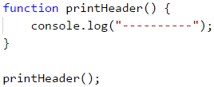
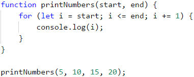
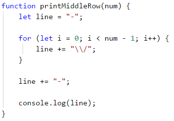
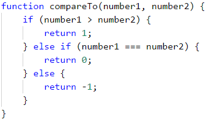
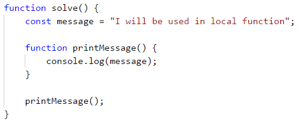
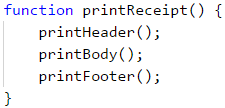
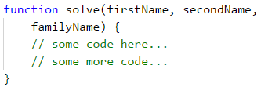
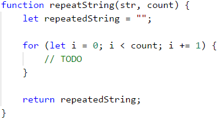

# Chapter 10. Functions

**JavaScript** is a well-known **functional language** for programming. As the name hints, **functions** are an extremely important part of the language. 

In this chapter, we will introduce you to **functions** and you will learn their **definition**, as well as what their **base concepts** are while working with them. You will learn why it's a **good practice** to use them, how to **define** and **declare** them. We will also introduce you to the **parameters** and **return value of a function**, as well as how to use that return value. In the end, we will peek at **best practices** when using functions.

## What is "function"?

Until this moment, we have found out that while **writing** a programming code for an exercise, **separating** the exercise into different **parts**, favors us a lot. Every part is responsible for a **corresponding action** and by doing so it's **easier** to solve the problem, and the **readability** and the debugging of the code are better.

A block of code designed to perform a particular task and which we have separated logically is called **function**. **Functions – slices of code, that are named** by us in a specific way. They can be called numerous times when we need them, and they will be run that many times as we want to.

One **function** can be **called** that many times, as we think is needed for solving a problem. That **saves** us from repeating the same code and **reduces** the opportunities of making a mistake while editing the repeated code. 

### Simple functions

Simple functions are responsible for running a specific **action**, that will **help** us solve a problem. Those actions can be printing a string on the console, doing a conditional statement, doing a loop, etc.

Let's see an **example of a simple function**:


This **function** has the task to print a header, that is a series of the symbol **`-`**. Because of this, the name of the function is **`printHeader`**. The round brackets **`( `** and **`)`** are always after the name, no matter how we have named the functions. Later we will take a look at how we have to name a function we are working with. For now, we will only say that the **name of the function must define the action** that is doing.

The **body** of the function consists of **programming code**, which is located between the curly brackets **`{`** and **`}`**. Between them, we place code, that will solve our problem, described by the name of the function.

### Why should we use functions?

Up to this moment, we have found out that, functions help us with **separating long exercises into smaller parts**, which leads to a **simple solution** of the corresponding problem. This makes our program, not just well structured, **easy readable** but also more understandable.

Using functions we **escape repeating** of programming code. **Repeating** code is a **bad practice** because it makes **harder maintenance** for the programmer to do which leads to errors. If one part of code exists in our program more than once and we have to fix it, we will have to change every occurrence of repeating code. The probability of us forgetting one of the repeated places is high, which will lead to incorrect behavior of our program. This is exactly why it's a **good practice** to define a fragment that will be used **more than once** as a **separate function**.

Functions offer us a **good method** to use **code several times**. With solving more and more exercises, we will come to the conclusion that using already defined functions saves us a lot of time and effort.

## Declaring functions

In JavaScript language we can **define** functions everywhere, using the same way we define variables. Declaring represents the **registration of a function** inside a program and to be recognized inside it.

JavaScript isn't **strongly typed** language. That's why when we **declare a function** it doesn't have a type(string, number, array, etc.), which other programming language methods have.

There are two ways, to declare a function in JavaScript - **function declaration** and **Function expression**.

### Function declaration

With the next example, we will take a look at the required elements inside a function, using **function declaration**.


* **Keyword function**. We start by using the keyword ***function***, with which we define that there will be declared a function. We name it **keyword** because it is reserved in the JavaScript language. We can't have a variable that is named **function** exactly because it is reserved.
* **Name of the function**.  The name of the function is **defined by us** and we must never forget that it must **define the task** it is doing. In the example, the name **`getSquare`** tells us that the task of this function is to find the area of a square.
* **List of parameters**. We declare them between **`(`** and **`)`** brackets, which we type after the name of the function. Here we list a series of **parameters**, which the function will use. We can have **only one** parameter, **more than one** parameter or we can leave it empty. If there are no parameters we will only type the brackets **`()`**. In the current example, the parameter is only the **`n`**.
* **Body of the function**. It is declared between  **`{`** and **`}`** brackets which we type after the closing bracket **`)`**. In our **body of the function**, we define all operations, that we want our function to do, **using code**. We also describe the **algorithm** by which the function will solve the given problem. We achieve the **logic** of the function. In the current example, we calculate the area of the square using **`n * n`**.

When declaring functions it is important to follow the **sequence** of the fundamental elements - first **Keyword function** then **Name of function**, **List of parameters** surrounded by round brackets **`()`**, **Body of the function** surrounded by curly brackets **`{}`**.

### Function expression

With the next example, we will take a look at the required elements in the declaration of an **expression function**. It is similar to **function declaration** which we have already viewed and it can be said that it's a **set** of **declaring a variable** and **declaring a declaration function**.


* **Keyword `let`**. We will start with using the **keyword `let`**, with which we will declare a declaration of a variable.
* **Name of the variable**. The name of the variable is **decided by us**. In the example, the name is **`getSquare`** which tells us that the task of this function is to calculate the area of the square.
* **Declaration of a function**. Using the same structure that we have learned in **function declaration** -  first **Keyword function** then **Name of function**, **List of parameters** surrounded by round brackets **`()`**, **Body of the function** surrounded by curly brackets **`{}`**. The difference, in this case, is that **Name of a function** is not necessary, but it is recommended to get used to writing the name. In the example, the program will work without problems even if we don't type **`getSquareFunc`**. If we don't type the name, the function will become **anonymous**.

When we declare a variable in the body of a function (using the keyword **`let`** or **`const`**). We call it a **local** variable for the function. The scope in which it exists and can be used is from the row it is defined to the end of the closing bracket **`}`** of the function. That scope is called **variable scope**.

### Function declaration or Function expression

The difference between **Function declaration** and **Function expression** is very simple. All functions declared by **function declaration** are loaded in the memory of a program before it is started. However, when we are using **function expression** the program will know and run the function only when it has come to it.

In theory, this means that we can **call a function** that is declared with **function declaration** even before it was declared in the previous rows. If we try to use **function expression** the program will **throw an error** that the function is not declared yet.

## Invoking a function
Invoking a function is a **start of the execution of a code** that is located inside the body of a function. We call it by typing the **name** of the function followed by **`()`** and **`;`** to end the row. Here is an example:


This function can be called from **different points** in our program. One of the ways to be called is to be called from the **global scope**.



A Function can be invoked from the **body of another function** which is **not** the global scope of our program.


A Function can be called from **its own body**. This is called **recursion** and you can find more about it on [Wikipedia](https://bg.wikipedia.org/wiki/%D0%A0%D0%B5%D0%BA%D1%83%D1%80%D1%81%D0%B8%D1%8F) or google it.

### Example: empty cash receipt

Write a function, that prints empty cash receipt. The function must call another three functions: one to print the title, one for the main part, and the last for the bottom part.

|Part of cash receipt|Text|
|---|---|
|Upper part|CASH RECEIPT<br>------------------------------|
|Middle part|Charged to\_\_\_\_\_\_\_\_\_\_\_\_\_\_\_\_\_\_\_\_<br>Received by\_\_\_\_\_\_\_\_\_\_\_\_\_\_\_\_\_\_\_|
|Bottom part|------------------------------<br>(c) SoftUni|

#### Sample Input and Output

|Input|Output|
|---|---|
|None|CASH RECEIPT<br>------------------------------<br>Charged to\_\_\_\_\_\_\_\_\_\_\_\_\_\_\_\_\_\_\_\_<br>Received by\_\_\_\_\_\_\_\_\_\_\_\_\_\_\_\_\_\_\_<br>------------------------------<br>(c) SoftUni|

#### Hints and Guidelines

Our first step is to create a function for **creating a title**. We should give it a short descriptive name. For example: **`printReceiptHeader`**. In the body we will write the following code:


In a like manner, we will create another two functions **to print the middle part** of the receipt (body) **`printReceiptBody`** and **to print the bottom part** of the receipt (footer **`printReceiptFooter`**.

After this we will set **one more function*** which will call the other three functions which we have written so far:


In the end, we will **invoke** **`printReceipt`** from the global scope of our program:


#### Testing in The Judge System

The program with a total of four functions that call one another is ready and we can **run and debug it**. After that, we will send it for test in the Judge system: [https://judge.softuni.org/Contests/Practice/Index/943#0](https://judge.softuni.org/Contests/Practice/Index/943#0).

## Functions with parameters

When we are dealing with a given task the function we are using needs **additional information** which the result depends on. Exactly this information are the **parameters of the functions** and the behavior of a program depends on.

### Using parameters inside a function

If the function requires **input data**, it is passed inside **`()`** brackets. The order of **function parameters** must match the order of the **function arguments** when declaring and invoking the function. Parameters can be **zero, one, or more**. When declaring the parameters we divide them with a comma **`,`**.

**Declaring** function **`printNumbers(...)`** and the **list** of **parameters** which the programs need to work correctly will look like this:


After this, we **invoke** the function, and we give it the **corresponding function arguments**:


When **declaring function parameters** we should check if every parameter has a **name**. It's also important when we invoke a function we should always pass **values** in the order that they were declared. In the previous example, the variable **`start`** will be passed to the first element (in our case the number 5). The variable **`end`** will have the next number which is 10.

It's important to point out that in the programming language **JavaScript** declaring a function with a given **number of parameters** doesn't force us to invoke a function with the **same number of parameters**. We can invoke the function by giving it **more** or **fewer** parameters than needed and it won't cause an error.

Let's look at this example:



In this example, we call the function  **`printNumbers(...)`** and we give 4 instead of the **declared** 2 parameters. All unnecessary parameters will be ignored. These are the numbers 15 and 20. They won't go to the function because the function doesn't have a declared parameter that will get them.

Let's look at another example:


In this example, we call the function **`printNumbers(...)`** but this time we give only 1 parameter instead of the **declared** 2 parameters. All parameters that are not **set as values** will automatically get **`undefined`** values. In our case the variable.

### Example: Symbol of integer

Create a function that checks if a number is a positive or negative number.

#### Sample Input and Output

|Input|Output|
|---|---|
|2|The number 2 is positive.|
|-5|The number -5 is negative.|
|0|The number 0 is zero.|

#### Hints and Guidelines

Our first step is **declaring** a function and giving it describing name - **`printSign`**. This function will only have one parameter:


Our next step is **implementing** logic by which our program will check if the number is positive or negative. From the example, we can see that there are 3 cases:  if the number is bigger and smaller than zero or if it's zero. We will make three conditional statements in the body of our function.

Our next step is to call the function we have created:


#### Testing in The Judge System

Test your solution here: [https://judge.softuni.org/Contests/Practice/Index/943#1](https://judge.softuni.org/Contests/Practice/Index/943#1).


### Optional parameters

**JavaScript** programming language supports **optional** parameters. They allow **skipping** of parameters when calling a function. We declare them by **providing default values** in the description of the parameter.

Our next example shows the use of optional parameters:


**`printNumbers(...)`** can be invoked in different ways:


When we are not **setting value** for the parameter, he will **get the value** that we have given him when declaring the function.

### Example: Print of triangle

Create a function that will create a triangle as shown in the example.

#### Sample Input and Output

|Input|OutPut|Input|OutPut|
|---|---|---|---|
|3|1<br>1 2<br>1 2 3<br>1 2<br>1|4|1<br>1 2<br>1 2 3<br>1 2 3 4 <br>1 2 3<br>1 2<br>1|

#### Hints and Guidelines

We choose a name according to the task it will do. For example, **`printLine`** and we implement it:


From drawing on console exercises we remember that it's a good practice to **divide the figure into different parts**. We will divide the triangle into 3 parts - upper, middle, and bottom.

Our next step is to print the **upper body** of the triangle with a loop:


After that, we will print the **middle part**:


In the end, we will print the **bottom part** from the triangle but this time with a reverse loop.


#### Testing in The Judge System

Test your solution here: [https://judge.softuni.org/Contests/Practice/Index/943#2](https://judge.softuni.org/Contests/Practice/Index/943#2).

### Example: draw a filled square.

Draw a square with side **`n`**, as shown in the example.

#### Sample Input and Output

|Input|Output|Input|Output|
|---|---|---|---|
|4|<code>--------</code><br><code>-\\/\\/\\/-</code><br><code>-\\/\\/\\/-</code><br><code>--------</code>|5|<code>----------</code><br><code>-\\/\\/\\/\\/-</code><br><code>-\\/\\/\\/\\/-</code><br><code>-\\/\\/\\/\\/-</code><br><code>----------</code>|

#### Hints and Guidelines

We create a function that prints the first and last row because they are the same. We shouldn't forget that we have to give him a **corresponding name** and set as a **parameter** the length of the side. We will use the built-in function **`repeat(...)`**:


Our next step is to create a function that will draw on the console the middle rows. Again we set a descriptive name such as **`printMiddleRow`**.



In the end, we invoke the declared functions to draw the whole square:


#### Testing in The Judge System

Test your solution here: [https://judge.softuni.org/Contests/Practice/Index/943#3](https://judge.softuni.org/Contests/Practice/Index/943#3).


## Return result from a function

Up to this point, we have viewed functions that do a specific task. For example printing a text, number or a figure on the console. There is another type of function that can **return** a **result** from their task. We can return a result of the multiplication of two numbers. We will look at this type of function in this part.

### Operator return
To get a result from a function we use the operator **`return`**. He must be **used inside the body** of a function. The **`return`** will tell the program to **stop the execution** of the function and **return** a corresponding value. This value is defined after the **`return`** word. 

In the example underneath we have a **function** that gets the first and last name as **parameters**. Then it combines them and returns the full name.


**There are cases** in which **`return`** can be called from different places inside the function, but if only the **conditions** are met. 

In the example below, we have a function that compares 2 numbers and **returns** the result which can be  **`-1`**, **`0`**, or **`1`** if the first argument is smaller, equal, or bigger than the second argument. The function uses the operator **`return`** on 3 different places. It returns different values depending on the logic of the code. 



#### Code after a return is unreachable

When the **return** operator is located inside a conditional statement such as **`if`**, after the statement in the same block, we must **not** have rows with code because Visual Studio Code will display a warning telling us that it had found an **unreachable** code.


The operator **`return`** can be also used without a **specific value**. In this case, the function will be **terminated** and the return value will be **`undefined`**.

<table><tr><td>
</td><td>In programming, we can't have 2 times the operator <code><b>return</b></code> one after another because the first return won't allow us to use the second. Sometimes programmers joke
with the phrase <b><i>type</i> <code>return; return;</code> <i>and let's go home</i></b>”, to explain that the logic of the program is wrongly typed.</td></tr>
</table>

### Using the return value of a function

After a function is executed and has returned a value, we can use the value in several ways.

The first is to **assign the result to a variable**:


The second is to be used inside **an expression**:


The third is to **pass** the result from one function to **another function**:


### Example: Find the area of a triangle

Write a function that finds the area of a triangle by given side and altitude and then returns the area.

#### Sample Input and Output

|Input|Output|
|---|---|
|3<br>4|6|

#### Hints and Guidelines

We **Create** a function with a descriptive name.


Our next step is to **call the new** function and **record the returned value inside another variable**.


#### Testing in The Judge System

Test your solution here: [https://judge.softuni.org/Contests/Practice/Index/943#4](https://judge.softuni.org/Contests/Practice/Index/943#4).


### Example: Power of a number

Write a function that calculates and returns the result the power of a number. 

#### Sample Input and Output

|Input|Output|Input|Output|
|---|---|---|---|
|2<br>8|256|3<br>4|81|

#### Hints and Guidelines

Our first step is again to create a function that will get 2 parameters (base and exponent(power)). Then the function will return the result.  


After we have done our calculations, all we are left to do is calling the function.

#### Testing in The Judge System

Test your solution here: [https://judge.softuni.org/Contests/Practice/Index/943#5](https://judge.softuni.org/Contests/Practice/Index/943#5).


### Functions, returning multiple values 

In practice, there are some cases in which we need a function that returns more than one element as a result. In the **JavaScript** language, there are 2 ways of doing that. They are with **destruction** and by **returning an object**.

#### Destruction

When we want a function to return **more than one value**, we use the keyword **`return`** and after that, we list all the values we want to return between **`[`**, **`]`** brackets:


After that to get the returned values using the square brackets we list a new set of variables that will get the returned values. We must follow the order we have returned them in the function.


In the upper example, the variable **`name`**  will get the value "**John Doe**", which is the first of the returned function of **`getNames`**, and *`fullName`** will get "**John Silver Doe**" which is second.

#### Objects

This way is very similar to the previous one. The only difference is that we don't just **list** all the values which we want to return. We give them **names**. **Objects** are extremely important and a big part of the **JavaScript** language. For now, it's enough for us to know that they are declared with curly brackets **`{`** **`}`** and we type the **name** of the value (it's called a key). After the **name**, we type **`:`**  followed by a value. We divide different **key-value** pairs with **`,`**. 


In this example, we return an object which holds 2 values - **`name`** and **`fullName`**. 


Here the variable  **`personNames`** will get all the returns values. By calling **`.name`** and **`.fullName`** we get the returned values:   


## Variant of function

In many programming languages, one function can be declared as **different variants** with the same name but different parameters. This is known as **method overloading**. For good or bad **JavaScript**, language doesn't support this.

When we declare **two or more functions with the same names**, our program will use the **last declared**. Declaring the second function with the same name removes the old function and overrides the new one in that place. 

## Nested Functions

Let's take a look at this example:


### What is a local function?

We see that in the previous example, **`solve()`** function has **another** declared function **`sum()`**. This **nested** function is called a **local** function. Local functions can be declared in every other function.

### Why should we use local functions?

With time and practice we will find out that when we type code, we often need functions, which
we might need only once or another function is becoming too long. We have already said that when one function has too many rows of code it is very hard to read, support, and understand. In those cases, we can declare another function which we will use even only once. This helps the code to be cleaner and reduces the chance of making a mistake in the programming code.

### Declaring local functions

Let's look again at the previous example


In this example **`sum()`** is local function because it's nested inside **`solve()`** function. This means that **`sum()`** can be  called **only** inside **`solve()`** function because it's **only declared inside it**.

Local functions have access to variables, which are declared in the same or upper level from them. Our next example shows how this happens.



This feature of nested functions makes them convenient helpers when solving a task. They save time and code by not having to pass values to parameters and variables.

## Naming functions. Best practices for working with functions.

In this part, we will take a look at some of the **best practices** for writing functions that are connected to an arrangement of a code and its structure. 

### Naming functions

When we name a function it's recommended to use **logical names**. This is good because every function must **correspond** to a specific part of our problem. We must take into consideration the **task** which the function will do. This is why it's a good practice **for the name to describes the purpose of the function**.

It is required for the name of the function to start with a **small letter** and to be a verb or a combination of a verb and a noun. Formatting the names must be done following **Lower Camel Case** convention - **every word except the first to start with an upper letter**. Round brackets 
**`( `** and **`)`** are always after the name of the function.

Every function must do an independent task and the name must describe its role.

Here are some examples of **correctly** named functions:
* **`findStudent`**
*	**`loadReport`**
*	**`sine`**

Some examples of **badly** named functions:
*	**`method1`**
*	**`doSomething`**
*	**`handleStuff`**
*	**`sampleMethod`**
*	**`dirtyHack`**
*	**`FindStudent`**
*	**`LoadReport`**

If we can't come up with a good name it's probably because our function does more than one job or it doesn't have a clear task. We must think of a way to divide the function into different functions.

### Naming parameters of functions

When naming **parameters** of functions, the same rules of naming functions apply to them.
The only difference is that the name of the parameters should be nouns or a set of a noun and an adjective. It's a **good practice** that the name of the parameter should **indicate** what type of unit is used when working with it.

Here are some examples of **correctly** named parameters of functions:
*   **`firstName`**
*	**`report`**
*	**`speedKmH`**
*	**`usersList`**
*	**`fontSizeInPixels`**
*	**`font`**

Some examples of **incorrectly** named parameters: 
*	**`p`**
*	**`p1`**
*	**`p2`**
*   **`populate`**
*   **`LastName`**
*   **`last_name`**

### Good practices for working with functions

We must keep in mind that a function must do **only one** specific **task**. If this can't be achieved, then we must come up with a way to **divide** the functionality into different parts.
As we have already said the name must be clear and descriptive. Another **good practice** is to **avoid** functions that are longer than our screen. If this happens it's recommended to **split** the function into smaller ones as shown in the example below.



### Structure and formatting of the code

When writing functions we must keep in mind to follow a correct **indication** (move more inward blocks of the code).

Here are some examples of **correctly** formatted JavaScript code:


Some examples of **incorrectly** formatted JavaScript code:


When the headline row of the function is **too long**, it's recommended to be split into several rows, and every row after the first should be moved 2 tabulations to right (for clear readability).



Another good practice is to **leave an empty row** between functions, after loops, and conditional statements. You should always try to **avoid** writing **long rows and complicated expressions**.
Over time you will find out that improves the readability and saves time.

We recommend you to always **use curly brackets for the body of conditional statements and loops**. The brackets don't just improve the readability but also reduce the possibility of making a mistake.

## What have we learned from this chapter?

In this chapter we have learned base concepts about working with functions:
* Learned that **the goal** of a function is to **split** programs with many rows to code with smaller and shorter parts.
* Comprehended the idea of the **structure** of functions and how to **declare** and **invoke** them by their name.
* Looked into different examples of functions with **parameters** and how to use them in our program.
* Learned what is **signature** and **return value** of the function as well as what is the role of the **`return`** operator.
* Studied **good practices** for working with functions, how to name them and their parameters and how to format our code and others.


## Exercises

To improve what we have learned we will solve a few exercises. In them, it is required to write functions with specific functionality and then call it with values as shown in the example.

### Problem: "Hello, Name!"

Write a function that takes a name as a parameter and prints on the console "*Hello, \{name\}!*".

#### Sample Input and Output

|Input|Output|
|---|---|
|Peter|Hello, Peter!|

#### Hints and Guidelines

Define a function **`printName(name)`** and implement it. Write a function **`solve(...)`** which receives as input name of a person and calls **`printName`** function.

#### Testing in The Judge System

Test your solution here: [https://judge.softuni.org/Contests/Practice/Index/943#7](https://judge.softuni.org/Contests/Practice/Index/943#7).

### Problem: Min Method

Define a function **`GetMin(int a, int b)`** and implement it, after which invoke it from the function **`solve(...)`** as shown below. To find the minimum of three numbers, first, find the minimum of the first two and then the minimum of the result and the third number:

#### Sample Input and Output

|Input|Output|Input|Output|
|---|---|---|---|
|1<br>2<br>3|1|-100<br>-101<br>-102|-102|

#### Hints and Guidelines

Define function  **`getMin(int a, int b)`** and implement it, after that call it from **`solve(...)`** as shown in the example below. To find the minimum of the tree numbers find first the minimum of the first and second value. Then find the minimum of the result of the two and the third number:

```JavaScript
function solve([num1, num2, num3]) {
    let min = getMin(getMin(num1, num2), num3);
}
```

#### Testing in The Judge System

Test your solution here: [https://judge.softuni.org/Contests/Practice/Index/943#8](https://judge.softuni.org/Contests/Practice/Index/943#8).


### Problem: String Repeater

Write a function **`repeatString(str, count)`** which gets as parameters string variable **`str`** and number **`n`** then returns the string repeated **`n`** times. After that print the result on the console.

#### Sample Input and Output

|Input|Output|Input|Output|
|---|---|---|---|
|str<br>2|strstr|roki<br>6|rokirokirokirokirokiroki|

#### Hints and Guidelines

Write function and add the input string to the result in the for loop:



#### Testing in The Judge System

Test your solution here: [https://judge.softuni.org/Contests/Practice/Index/943#9](https://judge.softuni.org/Contests/Practice/Index/943#9).


### Problem: Nth Digit

Write function **`findNthDigit(number, index)`** which gets number and index then print the Nth digit of the number (starting to count from left to right from 1). After that print the result to the console.

#### Sample Input and Output

|Input|Output|Input|Output|Input|Output|
|---|---|---|---|---|---|
|83746<br>2|4|93847837<br>6|8|2435<br>4|2|

#### Hints and Guidelines

To perform the algorithm we will use a **`while`** loop. While the number isn't 0 we will check if the index matches our input value. If it matches we will return the number of the index (**`number % 10`**). If it doesn't match anything we will remove the last digit of the number (**`number = number / 10`**). We must follow which digit we check in the conditional statement (starting from left to right from 1). When we find the digit we will return the index.

#### Testing in The Judge System

Test your solution here: [https://judge.softuni.org/Contests/Practice/Index/943#10](https://judge.softuni.org/Contests/Practice/Index/943#10).


### Problem: Integer to Base

Write a function **`integerToBase(number, toBase)`**, which takes as parameters an integer and a base of a numeral system and returns the integer converted to the given numeral system. After this, the result should be printed on the console. The input number will always be in the decimal numeral system, and the base parameter will be between 2 and 10.

## Sample Input and Output

|Input|Output|Input|Output|Input|Output|
|---|----|---|---|---|---|
|3<br>2|11|4<br>4|10|9<br>7|12|

## Hints and Guidelines

To solve the problem, we will declare a string, in which we will keep the result. After this, we need to do the following calculations to convert the number.
* Calculate **the remainder** of the number, divided by the base.
* **Insert the remainder** at the beginning of the string.
* **Divide** the number to the base.
* **Repeat** the algorithm until the input integer equals 0.

Write the missing logic in the function below:

```JavaScript
function integerToBase(number, toBase) {
    string result = "";
    while (number !== 0) {
        // implement the missing conversion logic
    }
    return result;
}
```

#### Testing in The Judge System 

Test your solution here: [https://judge.softuni.org/Contests/Practice/Index/943#11](https://judge.softuni.org/Contests/Practice/Index/943#11).


# Problem: Notifications

Write a function **`solve(...)`**, which takes an integer **`n`** and **`n` input messages** and prints **`n` output messages**, based on the input. For each message read a few lines. Each message starts with **`messageType`**: “**`success`**”, “**`warning`**” or “**`error`**”:
- When **`messageType`** is “**`success`**” read **`operation`** + **`message`** (each from a new line).
- When **`messageType`** is a “**`warning`**” read-only **`message`** (from a new line).
- When **`messageType`** is “**`error`**” read **`operation`** + **`message`** + **`errorCode`** (each from a new line).

Print on the console **each read message** formatted depending on its **`messageType`**. After the headline of the message print as much **`=`**, **as the length** of the said **headline** and print **an empty line** after each message (to understand in detail look at the examples). 

The problem should be solved by defining four functions: **`showSuccessMessage()`**, **`showWarningMessage()`**, **`showErrorMessage()`** and **`processMessage()`**, so that only the last function is invoked by the **`Main()`** function:


#### Sample Input and Output

|Input|Output|
|---|---|
|4<br>error<br>credit card purchase<br>Invalid customer address<br>500<br>warning<br>Email not confirmed<br>success<br>user registration<br>User registered successfully<br>warning<br>Customer has not email assigned|<code>Error: Failed to execute credit card purchase.</code><br><code>==============================================</code><br><code>Reason: Invalid customer address.</code><br><code>Error code: 500.</code><br><br><code>Warning: Email not confirmed.</code><br><code>=============================</code><br><br><code>Successfully executed user registration.</code><br><code>========================================</code><br><code>User registered successfully.</code><br><br><code>Warning: Customer has no email assigned.</code><br><code>=========================================</code>|

#### Hints and Guidelines

Define and implement the four shown functions. After that call **`processMessage(...)`** from the main **`solve(...)`** function.


In **`processMessage()`** read the type of message from the console and according to the read, type read the rest of the data (one, two, or three more lines). After that invoke the function for printing the given type of message.

#### Testing in The Judge System

Test your solution here: [https://judge.softuni.org/Contests/Practice/Index/943#12](https://judge.softuni.org/Contests/Practice/Index/943#12).


### Problem: Numbers to Words

Write a function **`letterize(number)`**, which reads an integer and prints it in words in English according to the conditions below:
* Print in words the hundreds, the tens, and the ones (and the eventual minus) according to the rules of the English language.
* If the number is larger than **999**, you must print "**too large**".
* If the number is smaller than **-999**, you must print "**too small**".
* If the number is **negative**, you must print "**minus**" before it.
* If the number is not built up of three digits, you shouldn't print it.

#### Sample Input and Output

|Input|Output|Input|Output|
|---|---|---|---|
|3<br>999<br>-420<br>1020|nine-hundred and ninety nine<br>minus four-hundred and twenty<br>too large|2<br>15<br>350|fifteen<br>three-hundred and fifty|

|Input|Output|Input|Output|
|---|---|---|---|
|4<br>311<br>418<br>509<br>-9945|three-hundred and eleven<br>four-hundred and eighteen<br>five-hundred and nine<br>too small|3<br>500<br>123<br>9|five-hundred<br>one-hundred and twenty-three<br>nine|

#### Hints and Guidelines

We can first print **the hundreds** as a text – \(the number / 100\) % 10, after that **the tens** – \(the number / 10\) % 10 and at the end **the ones** – \(the number % 10\).

The first special case is when the number is exactly **rounded to 100** \(e.g. 100, 200, 300 etc...\). In this case we print "one-hundred", "two-hundred", "three-hundred" etc.

The second special case is when the number formed by the last two digits of the input number is **less than 10** \(e.g. 101, 305, 609, etc...\). In this case, we print "one-hundred and one", "three-hundred and five", "six-hundred and nine" etc.

The third special case is when the number formed by the last two digits of the input number is **larger than 10 and smaller than 20** \(e.g. 111, 814, 919, etc.\). In this case, we print "one-hundred and eleven", "eight-hundred and fourteen", "nine-hundred and nineteen" etc.

#### Testing in The Judge System

Test your solution here: [https://judge.softuni.org/Contests/Practice/Index/943#13](https://judge.softuni.org/Contests/Practice/Index/943#13).


### Problem: String Encryption

Write a function **`encrypt(char letter)`**, which encrypts a given letter in the following way:
* It takes the first and the last digit from the ASCII code of the letter and concatenates them into a string, which will represent the result. 
* At the beginning of the string, which represents the result, we will insert the symbol which matches the following condition:
  * ASCII code of the letter + the last digit of the ASCII code of the letter.
* After that at the end of the string, which represents the result, you concatenate the character which matches the following condition:
  * ASCII code of the letter - the first digit of the ASCII code of the letter.
* The function should return the encrypted string.

Example:
* j &rarr; **p16i**
  * ASCII code of **j** is **106** &rarr; First digit – **1**, last digit – **6**.
  * We concatenate the first and the last digit &rarr; **16**.
  * At **the beginning** of the string, which represents the result, concatenate the symbol, which you get from the sum of the ASCII code + the last digit &rarr; 106 + 6 &rarr; 112 &rarr; **p**.
  * At **the end** of the string, which represents the result, concatenate the symbol, which you get from subtracting the ASCII code – the first digit &rarr; 106 - 1 &rarr; 105 &rarr; **i**.
  
Using the function shown above, write a function **`solve(...)`** which takes **a sequence of characters**, **encrypts them**, and prints the result on one line. The input data will always be valid. The Main function must read the data given by the user – an integer **`n`**, followed by a character for each of the following **`n`** lines. Encrypt the symbols and add them to the encrypted string. In the end, as a result, you must print **an encrypted string** as in the following example.

**Example**:
* S, o, f, t, U, n, i &rarr; V83Kp11nh12ez16sZ85Mn10mn15h

#### Sample Input and Output

|Input|Output|
|---|---|
|7<br>S<br>o<br>f<br>t<br>U<br>n<br>i|V83Kp11nh12ez16sZ85Mn10mn15h|

|Input|Output| 
|---|---|
|7<br>B<br>i<br>r<br>a<br>H<br>a<br>x| H66<n15hv14qh97XJ72Ah97xx10w |

#### Hints and Guidelines

Our variable **`result`** in which we will save the value of the result we will give the initial value **`""`**. We must recur a loop **`n`** times so that in each iteration we will add the encrypted symbol to the result string. 

To find the first and the last digit of the ASCII code, we will use the same algorithm that we used to solve "Integer to Base".
 
#### Testing in The Judge System

Test your solution here: [https://judge.softuni.org/Contests/Practice/Index/943#14](https://judge.softuni.org/Contests/Practice/Index/943#14).
